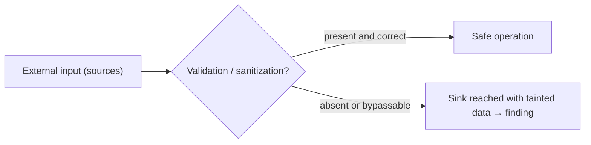

# 🔍 Whitebox Source-Code Review Methodology

> [!warning] Authorized review only
> Source-code review is performed under a clear authorization scope (usually a signed assessment agreement that specifies which repositories may be accessed). Access to source code is not an implicit license to deploy findings — validate every discovery against the running application with a safe, canary-based proof of concept, and do not access code outside the agreed scope.

## Parent Learning Order
OWASP Web Testing Methodology -> Whitebox Source-Code Review Methodology

## Reading the Application the Way a Compiler Does

> *You have full source-code access. A black-box tester would send payloads hoping to hit a sink. What should you do instead?*
>
> Hold your answer — the section below is the response.

Black-box testing sends inputs and watches outputs. Whitebox review does the
opposite: it starts from the **sink** — the dangerous function call — and walks
*backwards* to every path that can reach it with attacker-controlled data. One
review pass, done systematically, surfaces every instance of a vulnerability
class rather than the one or two that happen to respond to a payload.

This is the discipline OSWE is built on, and it has a name: **source-to-sink
analysis** (also called taint tracking). A **source** is any point where
attacker-controlled data enters the application — a request parameter, a cookie,
a JSON body field, a file upload name, a header. A **sink** is any function call
where that data could cause harm — a SQL query builder, a shell exec, a
deserialization call, a template renderer, a file path construction. The
question the entire review answers is: *can data from any source reach any sink
without sufficient sanitization or parameterization?*

> [!tip] The analogy, and where it breaks
> Taint tracking is like tracing a dye through a pipe network: inject colour at
> every inlet (source), watch where it appears at the outlets (sinks), and flag
> every outlet that receives colour — regardless of how many bends the pipe has.
> The analogy breaks on branching: a dye flows down every branch equally, but
> data flows only down code paths the runtime actually takes, so a sanitizer on
> one branch does not protect data that arrives via a different branch. The
> review must follow *all* the branches that attacker data could take, not just
> the happy path.

**Prerequisites:** [[OWASP Web Testing Methodology]] (what to look for), the
application's framework/language basics, and the specific injection and
serialization notes for the vulnerability classes you will triage.

## Phase 1: Orient — build the mental model before reading code

A code review that starts by opening random files wastes the most valuable
thing code access provides: the full picture. Before touching a source file,
build three models:

**1. Entry-point inventory.** List every place the application receives external
input: route handlers (HTTP), message consumers (queues), scheduled tasks
(cron/worker), file processors, WebSocket handlers, and any RPC endpoints.
Framework routing tables and directory structure usually expose these in minutes.

**2. Trust boundary map.** Identify what the application trusts and what it
validates. Frameworks often provide a clear boundary (a middleware layer, a
`@Validated` annotation, a sanitizer call); your job is to find where inputs
cross the trust boundary *without* validation.

**3. Sensitive operation catalogue.** List every function in the codebase that
touches a dangerous operation — database queries, shell invocations, file I/O
with computed paths, deserialization calls, template rendering, redirect targets,
cryptographic operations. These are your sinks. A grep pass builds this list in
minutes; the frameworks section below has the patterns.



## Phase 2: Grep-first triage — high-signal patterns per language

A structured grep pass finds the dangerous sinks before reading a line of logic,
prioritises the review, and ensures nothing in the codebase is missed by skipping
a file. Run these against the source tree before reading any implementation.

**Generic dangerous patterns (language-agnostic):**

```bash
# SQL sinks: string concatenation into queries rather than parameterization
grep -rn "execute\|query\|rawQuery\|cursor" src/ | grep -v "?"

# Shell execution
grep -rn "exec\|popen\|subprocess\|Runtime.exec\|shell_exec\|os.system" src/

# Deserialization
grep -rn "unserialize\|pickle.loads\|yaml.load\|ObjectInputStream\|JSON.parse" src/

# Template rendering with user data
grep -rn "render\|template\|Jinja\|Twig\|Mustache\|eval\|Function(" src/

# File path construction
grep -rn "open(\|fopen\|readFile\|include\|require\|path.join" src/

# Redirect targets
grep -rn "redirect\|Location\|header(" src/
```

**Framework-specific sink catalogues:**

| Framework | Dangerous sinks to grep | Notes |
|---|---|---|
| **PHP** | `system()`, `exec()`, `shell_exec()`, `eval()`, `unserialize()`, `include`/`require` + variable, `mysqli_query()` without prepared statement | `$_GET`/`$_POST`/`$_COOKIE` are the canonical sources |
| **Java (Spring)** | `Runtime.exec()`, `ProcessBuilder`, `Statement.execute()`, `ObjectInputStream`, `XPathExpression.evaluate()`, `ScriptEngine.eval()` | `@RequestParam`, `@PathVariable`, `@RequestBody` are sources |
| **Python (Django/Flask)** | `os.system()`, `subprocess.*`, `eval()`, `pickle.loads()`, `yaml.load()` (not `safe_load`), raw ORM `.raw()` queries | `request.GET`/`request.POST`/`request.json` are sources |
| **Node.js (Express)** | `child_process.exec()`, `eval()`, `Function()`, `vm.runInNewContext()`, `exec()` on template engines, `__proto__` in merges | `req.query`/`req.body`/`req.params` are sources |
| **Ruby (Rails)** | `system()`, `exec()`, `%x{}`, `send()`, `constantize()`, `YAML.load()`, raw `ActiveRecord.find_by_sql` | `params[]` is the source; `constantize` is especially dangerous |

## Phase 3: Trace — follow the data from source to sink

Once grep identifies candidate sinks, trace *backwards* to determine whether any
source can reach them:

```text
Sink found:   cursor.execute("SELECT * FROM orders WHERE id=" + request.args["id"])
Trace back:   request.args["id"] → no sanitizer on this path → reaches the sink directly
Finding:      SQL injection, unauthenticated route /orders
```

The trace has three possible outcomes:

1. **Direct reach** — source reaches sink with no sanitization. Classic finding.
2. **Conditional reach** — source reaches sink via one code path but not others.
   Check whether the protective branch can be bypassed (authentication bypass,
   parameter tampering, encoding trick).
3. **Sanitized** — a sanitizer or parameterized query stands between source and
   sink. Audit the sanitizer itself: is it correct? Is it applied on all
   branches? Is it bypassable with an encoding or type conversion?

When following a trace, treat **type conversions and encoding steps as potential
bypass points**: a string cast to an integer then used in a format string, a
double-URL-decode before a path join, a JSON property that becomes a different
type in different parsing paths.

## Phase 4: Diff-augmented review — black-box finding meets source truth

A black-box finding tells you a vulnerability class exists; the source tells you
*every* location it occurs. The combination is the most efficient workflow:

```text
1. Black-box: identify a reflected XSS in /search?q=
2. Whitebox: grep for the template rendering the query param
3. Trace the exact variable from request → template context → output
4. Search the codebase for every other template that uses the same pattern
5. Result: one finding becomes five — the black-box tool found the entry; source review found the full blast radius
```

The reverse direction is equally valuable: grep the dangerous pattern first,
then build a black-box PoC only for the instances that survive the trace to a
reachable source.

## Phase 5: PoC under the scope constraint

A whitebox PoC starts from the source trace, not from payload guessing:

```text
Source:   POST /api/orders — body.supplier_id (user-controlled, no validation)
Sink:     db.query("SELECT * FROM suppliers WHERE id=" + supplier_id)
PoC:      POST /api/orders with body {"supplier_id":"1 UNION SELECT 1,username,password,1 FROM users-- -"}
Expected: response contains users table content — canary row "test_canary_sqli" added to users first
```

The PoC proves exploitability against the *specific sink the trace identified*,
uses a canary row to avoid touching real data, and captures the raw request/
response for the report. Whitebox review without a PoC is hypothesis, not a
finding.

## Worked Example: tracing a PHP command injection

The full source-to-sink cycle in a deliberately vulnerable PHP endpoint — a
pattern that appears in real assessments.

**The entry point (source):**

```php
// route: GET /api/report?format=pdf
$format = $_GET['format'];   // attacker-controlled, no validation
```

**The sink — command execution via an intermediate call:**

```bash
# grep for shell execution in the codebase
grep -rn "shell_exec\|exec\|system\|passthru" src/
# src/ReportGenerator.php:42:  $output = shell_exec("convert report.html report." . $format);
```

**The trace connects them:**

```text
$_GET['format']                             # source: external input
  → ReportGenerator::generate($format)     # passed to a helper
    → shell_exec("convert ... ." . $format) # sink: string concat into shell
```

No sanitization on any branch. The trace is direct, and the PoC writes itself:

```shell-session
analyst@lab:/tmp/wb-lab$ curl -s \
  "http://app.meridian.test/api/report?format=pdf;id>/tmp/canary_cmdi.txt"
# confirm execution side-effect:
analyst@lab:/tmp/wb-lab$ cat /tmp/canary_cmdi.txt
uid=33(www-data) gid=33(www-data) groups=33(www-data)
```

The canary file proves execution as `www-data` — the finding is RCE via OS command
injection. The report entry: route, source variable, sink function, trace, raw
request, canary evidence, and a remediation (parameterized conversion call with
a strict allowlist of accepted format strings).

## The grep-everything trap

- **Grep-found ≠ vulnerable.** A grep hit is a candidate, not a finding. Every
  candidate needs a trace to a reachable source before it becomes reportable —
  a sink called only with hardcoded data is not exploitable.
- **Missing one branch.** A sanitizer on the happy path does not protect code
  that reaches the sink via an error path, an async callback, or a middleware
  that was bypassed. Trace all branches, not just the primary one.
- **Type confusion as a bypass.** A strict string comparison that is safe
  against injection may become unsafe when the input is parsed as a different
  type (array, object, integer). Review how the framework handles unexpected
  types at each stage of the pipeline.
- **Crypto auditing is not the same.** Reviewing cryptographic code requires
  domain knowledge beyond sink patterns — algorithm choice, key management, IV
  reuse — and is a separate discipline from taint tracking.
- **PoC scope creep.** A PoC that exfiltrates real data, modifies production
  records, or executes commands outside the agreed scenario violates the
  authorization, even if the finding is valid. Use canary data you inserted, and
  clean up.

**The deliberate break:** finding the sink pattern in a grep pass reads as
finding the vulnerability.

A grep hit identifies a *candidate sink*. It becomes a finding only when the
trace from the source to the sink is complete and continuous. An unsanitized
shell exec that is only ever called with a hardcoded argument is not exploitable;
the grep pass alone cannot tell the difference. The discipline of the review is
the trace — the systematic, branch-aware walk from every attacker-controlled
input to every dangerous function — and skipping the trace produces a list of
candidates, not a report.

**How you'd spot a complete trace:** you can write the PoC from the trace alone,
without fuzzing or guessing. If you need to fuzz to find the working payload,
the trace is not finished.

## Security Implications — the Developer's View

- **Parameterize all sinks:** the universal fix for injection — SQL, LDAP, shell,
  XPath, template — is separating code from data via parameterization or
  allow-listing. String concatenation into any dangerous sink is always the root
  cause.
- **Validate at the trust boundary, not inside the sink:** a sanitizer deep in
  the call chain may be bypassed by a caller that doesn't call it; centralized
  input validation at the entry point — the route handler or the framework's
  validation layer — is the structural fix.
- **Static analysis automation:** commercial SAST tools (Semgrep, Checkmarx,
  CodeQL) automate taint tracking at scale and catch patterns the manual grep
  pass would miss — but they also produce false positives that require the same
  trace-verification step. Treat SAST output as a prioritised candidate list,
  not a verified finding list.
- **Code review in the SDLC:** building source-review checkpoints into the merge
  request process (automated SAST gate + manual review for security-sensitive
  changes) finds vulnerabilities before they reach production, when the fix cost
  is lowest.

## Summary

You should now be able to:

- Explain the source-to-sink model — what sources and sinks are, why taint tracking finds every instance of a class rather than one — and contrast it with black-box payload-based testing.
- Run a grep-first triage pass (language-specific sink patterns) to prioritise candidates, then trace from each candidate sink backwards to a reachable attacker-controlled source, identifying whether sanitization is absent, partial, or bypassable.
- Build a PoC from the completed trace using a canary (not real data), and explain why a grep hit without a complete trace is a candidate rather than a finding.

---
> 🔼 Up: [[Web Application Penetration Testing]]
