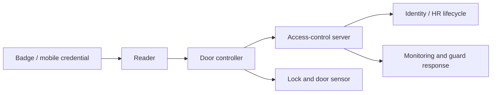

# RFID & Physical Access Testing

> [!abstract] Enterprise methodology
> Physical-access testing evaluates badge technology, enrollment, reader/controller trust, anti-passback, visitor handling, tailgating resistance, alarm response, and how facility access connects to logical identity. Cloning tests use synthetic badges only.

> [!danger] Safety and legality
> Never copy employee credentials, enter unapproved areas, interfere with life-safety systems, or test emergency exits without facility authorization. Assign an escort, stop word, approved doors, synthetic badges, and emergency contacts.

## Parent Learning Order
WPA2 Security Testing -> WPA3 Security Testing -> Rogue Access Points & Wireless Trust -> RFID & Physical Access Testing

## Access-control architecture

> *A badge is presented and a door opens. How many components had to agree?*
>
> Hold your answer — the section below is the response.



## Technology model

| Technology | Typical security concern |
|---|---|
| Low-frequency proximity | Static identifier, easy replay/cloning in weak deployments |
| High-frequency smart card | Security depends on mutual authentication and key management |
| NFC/mobile credential | Device trust, app lifecycle, relay resistance, backend authorization |
| Barcode/magnetic stripe | Copyability and weak visual/reader validation |
| Biometric factor | Template protection, liveness, fallback and privacy |

The visible card format does not prove the protocol or cryptography. Inventory reader model, credential family, frequency, controller, backend, and key-management ownership.

## Synthetic badge assessment

Create badges expressly for testing:

```text
Badge A: standard employee, building only
Badge B: contractor, weekdays 08:00–18:00
Badge C: revoked test identity
Badge D: privileged lab-zone access
```

Test enrollment, duplication detection, revocation latency, lost-card workflow, expiration, PIN/biometric combinations, and whether a copied identifier is sufficient without cryptographic authentication.

Representative reader evidence:

```text
2026-07-30T20:14:02Z Door=LAB-2 Badge=AUDIT-C Result=DENIED Reason=REVOKED
2026-07-30T20:14:17Z Door=LOBBY Badge=AUDIT-A Result=GRANTED
2026-07-30T20:15:03Z Door=LAB-2 Badge=AUDIT-A Result=DENIED Reason=NO_ACCESS
```

## Cloning and replay methodology

Only clone a synthetic test credential. The objective is to determine whether the system authenticates a static identifier or performs cryptographic challenge-response. If a duplicate is accepted, test whether backend analytics detect impossible travel, simultaneous use, or duplicate identifiers.

```mermaid
sequenceDiagram
    participant B as Test badge
    participant R as Reader
    participant C as Controller
    B->>R: Identifier or cryptographic response
    R->>C: Credential + reader + event
    C-->>R: Grant / deny
    Note over B,C: Static identifiers can be replayed; mutual authentication resists copying
```

## Physical-process testing

- Tailgating and piggybacking using approved scenarios.
- Reception identity verification and visitor badges.
- Door-held-open and forced-door alarms.
- Anti-passback and occupancy logic.
- Contractor/offboarding revocation.
- Server-room, network-closet, loading-dock, and roof access.
- Badge plus workstation identity correlation.
- Guard escalation and evidence preservation.

Never exploit politeness with uninformed vulnerable individuals. Use trained participants or approved broad exercises with safety controls.

## Findings and remediation

```text
Condition: revoked synthetic badge remained active for 47 minutes
Expected: revocation propagated within five minutes
Impact: offboarded identity could retain facility access
Root cause: branch controller sync interval and offline cache
Remediation: reduce sync interval; alert on stale controller; verify revocation SLA
```

Prefer cryptographic credentials, diversified keys, secure enrollment, rapid revocation, anti-passback, controller hardening, monitored door sensors, and lifecycle integration with HR/identity systems.

## Credential-system model

Map credential technology, frequency, identifier/authentication mechanism, reader, controller, panel, door hardware, request-to-exit, alarm contacts, anti-passback, access rules, management server, logging, and identity lifecycle. A badge number is not the entire security system.

Legacy low-frequency identifiers may transmit static IDs; higher-frequency smartcards can provide mutual authentication and diversified keys when correctly deployed. Technology name alone does not prove secure configuration.

## Safe assessment workflow

Inventory approved test credentials/readers, record facility and life-safety exclusions, observe normal transactions, identify technology without transmitting where possible, test only canary credentials, demonstrate at a noncritical test reader, and reconcile controller logs. Never interfere with emergency egress, fire systems, elevators, medical areas, or occupied secure spaces.

```text
Canary credential: FACILITY-TEST-0042
Reader: LAB-DOOR-03
Authorized window: 10:00–11:00 UTC
Expected result: access granted once, anti-passback on replay
Observed: two grants; replay protection absent at controller workflow
```

**The deliberate break:** upgrading the badge technology reads as fixing the cloning problem — move to a credential with real cryptography and the exposure is closed.

The credential is one component in a chain of five: badge, reader, controller, access server, and the identity lifecycle behind them. Most real findings live in the last of those and in the boundaries between them — a badge never revoked after someone left, a revocation that takes days to reach the readers, a door controller reachable from the ordinary office network, a mechanical bypass on the door itself. **Better cryptography on the card touches none of those**, which is why a technology upgrade so often changes the finding's wording and not its severity.

**How you'd spot it:** test the lifecycle rather than the card. Whether a revoked badge actually stops opening doors, how long revocation takes to propagate, whether contractor credentials expire with the contract, and whether the controller's management interface answers from a user segment are each directly testable — and each is more likely to be the finding than the credential technology anybody is arguing about.

## Defense-in-depth

Use cryptographic credentials, diversified keys, secure enrollment, rapid revocation, anti-passback where appropriate, PIN/biometric for high-risk zones, reader tamper monitoring, encrypted panel communication, segmented management, camera/alarm correlation, and physical-key governance. Reader replacement alone does not fix weak controller rules or identity lifecycle.

## Summary

You should now be able to:

- Explain why a 125 kHz proximity badge that transmits only a static ID is trivially cloneable.
- Demonstrate badge-cloning risk in an authorised test using a synthetic credential, without cloning a real employee's badge.
- Contrast low-frequency 125 kHz cards with 13.56 MHz smartcards (e.g. DESFire): explain which uses cryptographic challenge-response and why that defeats simple UID replay.

---
> 🔼 Up: [[Wireless & Physical Penetration Testing]]
