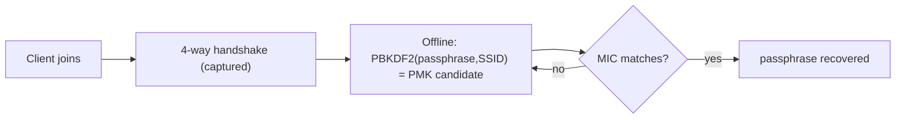

# WPA2 Security Testing

> [!warning] Authorized simulation only
> Test only wireless networks you own or are explicitly authorized to assess. The lab below runs entirely offline against a passphrase you choose — it captures no live traffic and touches no third-party network.

## Parent Learning Order
WPA2 Security Testing -> WPA3 Security Testing -> Rogue Access Points & Wireless Trust -> RFID & Physical Access Testing

## Why WPA2-PSK Is Offline-Crackable

> *You captured the handshake and the passphrase did not crack in twelve hours. What do you report?*
>
> Hold your answer — the section below is the response.

WPA2 with a pre-shared key (the home/small-office mode) protects traffic with keys derived from the Wi-Fi passphrase. Crucially, everything an attacker needs to *test a passphrase guess* is exposed during the **4-way handshake** that happens whenever a client joins. Capture that handshake once and the attacker can guess passphrases **offline**, at full CPU/GPU speed, with no further contact with the network. The only thing standing between a captured handshake and the key is the passphrase's entropy.

The chain: `passphrase + SSID → PMK → (with handshake nonces/MACs) → PTK → MIC`. Because the PMK depends only on the passphrase and the (public) SSID, a dictionary attack derives a candidate PMK per guess and checks it against the captured handshake.

**The deliberate break:** the test is capturing the handshake. Get the four-way exchange and the assessment is done — the rest is just running hashcat.

The capture is the easy part and proves nothing on its own. Every WPA2-PSK network in range will hand you a handshake; that is not a finding, it is a property of the protocol. The finding is **whether the passphrase falls**, and how fast, against a realistic wordlist and rule set — because that is the number that describes the client's actual exposure.

Which makes the reporting consequence unusual for offensive work: **a crack that fails is a positive result and must be written up as one.** "Handshake captured; passphrase resisted 12 hours against a 14GB wordlist with rules" tells the client their WPA2-Personal deployment is doing its job. Omitting it because nothing was compromised throws away the most useful thing the test learned.

**How you'd spot the real exposure:** ask who knows the passphrase and when it last changed. WPA2-Personal has one shared secret for every device and every person who ever had it — this is the **Shared Secret, No Per-Party Binding** pattern, and it is why the enterprise variant exists.

## The Key Derivation

The Pairwise Master Key is `PBKDF2-HMAC-SHA1(passphrase, SSID, 4096, 32)`. The 4096 iterations are a deliberate cost to slow guessing — but they only add a constant factor. A weak or human-memorable passphrase falls quickly; a long random one does not. The SSID acts as a salt, which is why per-SSID rainbow tables exist for common names like `linksys` but not for unique ones.



## Worked Example: WPA2 Is Not Broken — Weak Passphrases Are

The offline half of a WPA2-PSK attack can be reproduced with no radio at all,
because once a handshake is captured the rest is pure computation: derive the key
the passphrase would produce and compare. Doing it against two passphrases —
weak, then strong — isolates the one variable that actually decides the outcome.

**The derivation** is WPA2's own key schedule: PBKDF2-HMAC-SHA1, the SSID as salt,
4096 iterations:

```python
def pmk(p):
    return hashlib.pbkdf2_hmac("sha1", p.encode(), SSID.encode(), 4096, 32)

target = pmk("Summer2024")           # the PMK a captured handshake reveals
for w in ["password", "letmein", "CorpWiFi123", "Summer2024", "Winter2025"]:
    print(w, "CRACKED" if pmk(w) == target else "")
```

**Against a weak passphrase**, a five-word list finds it:

```shell-session
analyst@lab:~$ python3 wpa2crack.py
SSID=CorpWiFi  target_PMK=bb818e7aa8d415e4dc318bd0...
  try password       -> c0f87d25fd9c8bd0...
  try letmein        -> 6fa4e4fd0342dfce...
  try CorpWiFi123    -> dd33e41b1fae09b2...
  try Summer2024     -> bb818e7aa8d415e4...  <-- CRACKED
  try Winter2025     -> 16f0df498c03ee95...
```

`Summer2024` was in the list, so its PMK matched and the passphrase fell. On a
real engagement the wordlist is millions of entries and the compute is a GPU, but
the loop is identical: derive, compare, repeat. The capture cost nothing to attack
once obtained, because the guessing happens entirely offline with no further
contact with the network.

**Against a high-entropy passphrase**, the same code and the same effort produce
nothing:

```shell-session
analyst@lab:~$ python3 wpa2crack.py --target-strong
now targeting a HIGH-ENTROPY passphrase:
  dictionary EXHAUSTED -> not cracked
```

Nothing about the algorithm changed. The iteration count, the salt, the hash, the
attacker's effort — all identical. The only variable that moved is the passphrase's
entropy, and it moved the result from "cracked in five tries" to "not in the
dictionary at all." That is the entire lesson, and it corrects a common
misstatement: WPA2-PSK is not a broken protocol, and capturing a handshake is not
the same as recovering a key. A long, random passphrase makes the offline attack
computationally hopeless while a captured handshake sits uselessly on the
attacker's disk.

It is also exactly what WPA3 changes. Its SAE handshake makes each guess require
interaction with the network rather than offline computation, so an attacker can
no longer capture once and grind forever — which removes the dependence on
passphrase entropy that this example isolates.

## Summary

You should now be able to:

- Explain why an attacker can keep guessing a Wi-Fi passphrase without remaining near the network.
- State what determines whether a 4-way handshake captured in an authorised test yields the passphrase, and what to report when it does not.
- Explain how the 4096-iteration PBKDF2 count and the SSID-as-salt affect attack cost, and why WPA3's SAE removes the offline attack entirely.

---
> 🔼 Up: [[Wireless & Physical Penetration Testing]]
