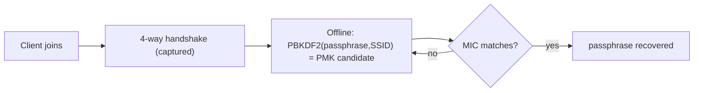

# WPA2 Security Testing

> [!warning] Authorized simulation only
> Test only wireless networks you own or are explicitly authorized to assess. The lab below runs entirely offline against a passphrase you choose — it captures no live traffic and touches no third-party network.

## Parent Learning Order
WPA2 Security Testing -> WPA3 Security Testing -> Rogue Access Points & Wireless Trust -> RFID & Physical Access Testing

## Crook — Why WPA2-PSK Is Offline-Crackable

WPA2 with a pre-shared key (the home/small-office mode) protects traffic with keys derived from the Wi-Fi passphrase. Crucially, everything an attacker needs to *test a passphrase guess* is exposed during the **4-way handshake** that happens whenever a client joins. Capture that handshake once and the attacker can guess passphrases **offline**, at full CPU/GPU speed, with no further contact with the network. The only thing standing between a captured handshake and the key is the passphrase's entropy.

The chain: `passphrase + SSID → PMK → (with handshake nonces/MACs) → PTK → MIC`. Because the PMK depends only on the passphrase and the (public) SSID, a dictionary attack derives a candidate PMK per guess and checks it against the captured handshake.

## Operator — The Key Derivation

The Pairwise Master Key is `PBKDF2-HMAC-SHA1(passphrase, SSID, 4096, 32)`. The 4096 iterations are a deliberate cost to slow guessing — but they only add a constant factor. A weak or human-memorable passphrase falls quickly; a long random one does not. The SSID acts as a salt, which is why per-SSID rainbow tables exist for common names like `linksys` but not for unique ones.



## Root — Runnable Lab (one machine, Python, no radio)

This lab reproduces the *offline* half of the attack — the PBKDF2 dictionary guess — against a passphrase you set, so it needs no wireless hardware or capture.

**Step 1 — the PMK dictionary attack (`wpa2crack.py`).**

```python
import hashlib, binascii
SSID="CorpWiFi"
def pmk(p): return hashlib.pbkdf2_hmac("sha1", p.encode(), SSID.encode(), 4096, 32)
target = pmk("Summer2024")                       # PMK of the (weak) real passphrase
for w in ["password","letmein","CorpWiFi123","Summer2024","Winter2025"]:
    hit = "  <-- CRACKED" if pmk(w)==target else ""
    print(f"  try {w:14} -> {binascii.hexlify(pmk(w)).decode()[:16]}...{hit}")
```

**Step 2 — run it.**

```console
$ python3 wpa2crack.py
SSID=CorpWiFi  target_PMK=bb818e7aa8d415e4dc318bd0...
  try password       -> c0f87d25fd9c8bd0...
  try letmein        -> 6fa4e4fd0342dfce...
  try CorpWiFi123    -> dd33e41b1fae09b2...
  try Summer2024     -> bb818e7aa8d415e4...  <-- CRACKED
  try Winter2025     -> 16f0df498c03ee95...
```

**Step 3 — the deliberate failure (the whole point).** Repeat with a high-entropy passphrase as the target:

```console
now target a HIGH-ENTROPY passphrase:
  dictionary EXHAUSTED -> not cracked (entropy defeats the offline attack)
```

Same algorithm, same effort — the *only* variable that changed is passphrase entropy. WPA2-PSK is not "broken"; weak passphrases are.

**Step 4 — cleanup:** pure computation — no cleanup required.

**What you should now be able to do:** explain why a captured handshake enables offline guessing, derive a PMK, and articulate that passphrase entropy — not the protocol — is the deciding factor (which is exactly what WPA3 changes next).

## Crook → Operator → Root Checkpoint

- **Crook:** Why can an attacker keep guessing your Wi-Fi password without staying near your network?
- **Operator:** You capture a 4-way handshake in an authorized test. What determines whether you recover the passphrase, and what do you report if you can't?
- **Root:** Explain how the 4096-iteration PBKDF2 count and the SSID-as-salt affect attack cost, and why WPA3's SAE removes the offline attack entirely.

---
> 🔼 Up: [[Wireless & Physical Penetration Testing]]
