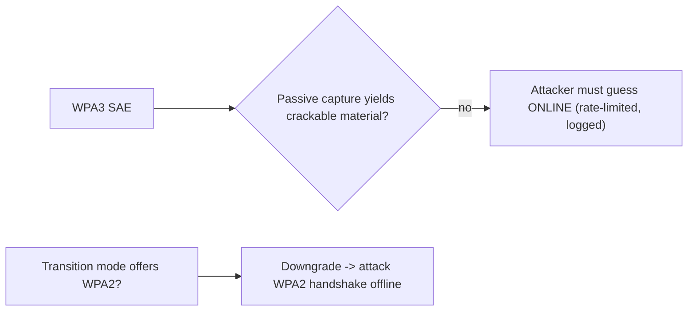

# WPA3 Security Testing

> [!warning] Authorized simulation only
> Assess only networks you own or are authorized to test. The lab is an offline demonstration of *why* the WPA2 attack no longer applies — it captures nothing and contacts no network.

## Parent Learning Order
WPA2 Security Testing -> WPA3 Security Testing -> Rogue Access Points & Wireless Trust -> RFID & Physical Access Testing

## Crook — WPA3 Removes the Offline Target

WPA2's weakness (see the previous leaf) is that a captured handshake lets an attacker guess passphrases **offline**, forever, at full speed. WPA3-Personal replaces that handshake with **SAE (Simultaneous Authentication of Equals)**, a *password-authenticated key exchange* (PAKE) also called **Dragonfly**. Its defining property: a passive observer captures **no material that lets them test a passphrase guess offline**. Each guess now requires a *fresh, live interaction* with the access point — which the AP can rate-limit and log.

The consequence for a tester: the WPA2 "capture once, crack forever" model is gone. Attacks shift to **online guessing** (slow, detectable), **downgrade** (forcing a WPA2 fallback), and **implementation flaws** (the Dragonblood side-channels).

## Operator — What You Actually Test on WPA3

| Target | Why it matters |
|---|---|
| **Transition mode** | If the SSID also offers WPA2 for old clients, an attacker forces the WPA2 handshake and attacks *that* — the network is only as strong as its weakest mode |
| **Online guessing rate** | SAE guesses are online; the AP should rate-limit and alert. Test whether it does |
| **Dragonblood side-channels** | Early SAE implementations leaked password info via timing/cache; test for patched firmware |
| **Management Frame Protection** | WPA3 mandates PMF, which blocks the deauth flood that WPA2 rogue/evil-twin attacks rely on |

The invariant SAE provides: offline passphrase testing is infeasible from a passive capture. Any finding that *reintroduces* offline testing (a downgrade to WPA2, a side-channel leak) is the whole game.



## Root — Runnable Lab (one machine, Python, no radio)

The point of this lab is a *contrast*: the WPA2 attack works because `PMK = f(passphrase, SSID)` is derivable by the attacker alone. SAE mixes in a **fresh per-exchange secret** from both parties, so the equivalent offline function does not exist. This lab models that difference.

**Step 1 — model both derivations (`wpa3_contrast.py`).**

```python
import hashlib, os
SSID="CorpWiFi"
def wpa2_pmk(p):           # attacker can compute this alone -> offline dictionary works
    return hashlib.pbkdf2_hmac("sha1", p.encode(), SSID.encode(), 4096, 32)
def sae_key(p, ap_secret): # needs the AP's fresh secret -> no offline guess from a capture
    return hashlib.sha256(p.encode()+ap_secret).digest()
print("WPA2: attacker derives PMK for a guess with NO network contact:")
print("  ", wpa2_pmk("Summer2024").hex()[:16], "(computable offline)")
print("WPA3/SAE: the same guess needs a live per-exchange AP secret:")
capture = b""                     # what a passive sniffer actually has
try:
    sae_key("Summer2024", capture) if capture else (_ for _ in ()).throw(ValueError("no AP secret in a passive capture"))
except ValueError as e:
    print("   offline guess ->", e)
print("   => each guess must go ONLINE to the AP (rate-limited, logged)")
```

**Step 2 — run it.**

```console
$ python3 wpa3_contrast.py
WPA2: attacker derives PMK for a guess with NO network contact:
   bb818e7aa8d415e4 (computable offline)
WPA3/SAE: the same guess needs a live per-exchange AP secret:
   offline guess -> no AP secret in a passive capture
   => each guess must go ONLINE to the AP (rate-limited, logged)
```

**Step 3 — the deliberate insight.** The WPA2 line prints a key; the WPA3 line *cannot*, because a passive capture contains no per-exchange secret. That missing input is exactly why SAE defeats offline dictionary attacks — and why WPA3 testing pivots to transition-mode downgrade and implementation flaws.

**Step 4 — cleanup:** pure computation — no cleanup required.

**What you should now be able to do:** explain why SAE removes the offline attack, identify transition mode as the practical weak point, and name PMF and rate-limiting as the controls WPA3 adds.

## Crook → Operator → Root Checkpoint

- **Crook:** Why can't you "capture once, crack forever" against WPA3 the way you can against WPA2?
- **Operator:** A WPA3 network runs transition mode for legacy devices. What do you test, and what is the realistic finding?
- **Root:** Summarise the Dragonblood class of flaws and explain why a PAKE's security still depends on a constant-time implementation.

---
> 🔼 Up: [[Wireless & Physical Penetration Testing]]
