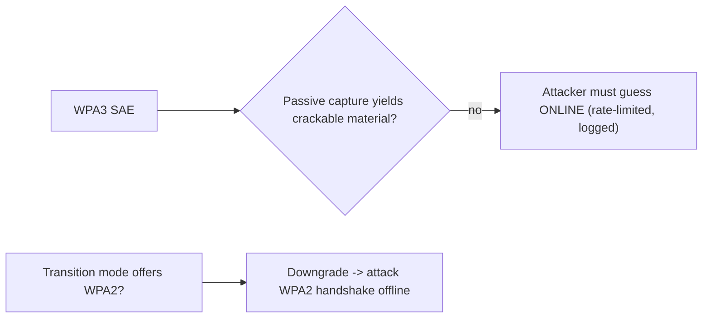

# WPA3 Security Testing

> [!warning] Authorized simulation only
> Assess only networks you own or are authorized to test. The lab is an offline demonstration of *why* the WPA2 attack no longer applies — it captures nothing and contacts no network.

## Parent Learning Order
WPA2 Security Testing -> WPA3 Security Testing -> Rogue Access Points & Wireless Trust -> RFID & Physical Access Testing

## WPA3 Removes the Offline Target

> *The network advertises WPA3, which has no offline dictionary attack. Is there anything left to test?*
>
> Hold your answer — the section below is the response.

WPA2's weakness (see the previous leaf) is that a captured handshake lets an attacker guess passphrases **offline**, forever, at full speed. WPA3-Personal replaces that handshake with **SAE (Simultaneous Authentication of Equals)**, a *password-authenticated key exchange* (PAKE) also called **Dragonfly**. Its defining property: a passive observer captures **no material that lets them test a passphrase guess offline**. Each guess now requires a *fresh, live interaction* with the access point — which the AP can rate-limit and log.

The consequence for a tester: the WPA2 "capture once, crack forever" model is gone. Attacks shift to **online guessing** (slow, detectable), **downgrade** (forcing a WPA2 fallback), and **implementation flaws** (the Dragonblood side-channels).

**The deliberate break:** WPA3 replaced the four-way handshake with SAE, which removes the offline dictionary attack. So a WPA3 network has nothing left to test.

SAE does what it claims — you cannot capture a value and grind it offline, and that is a genuine advance. What it does not do is remove the network's other exposures, and one of them undoes the whole benefit: **transition mode**. A network advertising WPA3 *and* WPA2 for compatibility with older clients still accepts the WPA2 association, which still produces a crackable handshake. The upgrade is present, announced, and bypassed by asking politely for the old protocol.

So the WPA3 test is not "can I crack it" but "**can I avoid it**" — transition mode, downgrade, whether Protected Management Frames are enforced or merely available, and what happens to a client that claims not to support SAE.

**How you'd spot it:** read the advertised authentication suites in the beacon. Both SAE and PSK present means transition mode, and the WPA2 attack from the previous note applies unchanged.

## What You Actually Test on WPA3

| Target | Why it matters |
|---|---|
| **Transition mode** | If the SSID also offers WPA2 for old clients, an attacker forces the WPA2 handshake and attacks *that* — the network is only as strong as its weakest mode |
| **Online guessing rate** | SAE guesses are online; the AP should rate-limit and alert. Test whether it does |
| **Dragonblood side-channels** | Early SAE implementations leaked password info via timing/cache; test for patched firmware |
| **Management Frame Protection** | WPA3 mandates PMF, which blocks the deauth flood that WPA2 rogue/evil-twin attacks rely on |

The invariant SAE provides: offline passphrase testing is infeasible from a passive capture. Any finding that *reintroduces* offline testing (a downgrade to WPA2, a side-channel leak) is the whole game.



## Worked Example: The Only Way Back to Offline Cracking Is a Downgrade

WPA3's SAE handshake removes the offline attack that defeats WPA2 — a passive
capture yields nothing to grind. So the tester's highest-value question is not "can
I crack the SAE handshake" but "can I make the client speak WPA2 instead", and the
answer is visible in what the network advertises.

> [!note] Representative output
> Reconstructed to match the fields `iw`/`hostapd` report for a transition-mode
> BSS; SSID and addresses are synthetic. The AKM suite numbers are the real ones.

**A transition-mode network advertises both handshakes at once:**

```shell-session
analyst@lab:~$ sudo iw dev wlan0 scan | grep -A8 'corp-wifi'
    SSID: corp-wifi
    RSN:  * Version: 1
          * Authentication suites: PSK SAE
          * Group cipher: CCMP
          * Pairwise ciphers: CCMP
          * Capabilities: MFP-capable (0x0080)
```

`Authentication suites: PSK SAE` is the finding. `SAE` is WPA3; `PSK` is the WPA2
fallback offered so older clients can still join. The two coexist under one SSID,
and that coexistence is the vulnerability — the network is only as strong as its
weakest accepted handshake, and `PSK` is the weak one.

**The downgrade** does not break SAE; it avoids it. An attacker stands up a rogue
BSS for the same SSID advertising *only* `PSK`, and a transition-capable client that
prefers availability will complete the WPA2 handshake there — which is exactly the
handshake WPA2's offline attack needs. From that point the sibling WPA2 example
applies unchanged: capture the four-way handshake, grind the PBKDF2 dictionary
offline, and passphrase entropy is once again the only thing standing in the way.

**What a pure-WPA3 network gives instead** is the reason to eliminate transition
mode:

```shell-session
analyst@lab:~$ sudo iw dev wlan0 scan | grep -A6 'corp-wifi-6'
    SSID: corp-wifi-6
    RSN:  * Authentication suites: SAE
          * Capabilities: MFP-required (0x00c0)
```

`SAE` alone, and `MFP-required` — Protected Management Frames are mandatory, not
merely capable. That second detail closes the other WPA2 attack: the deauthentication
flood that evil-twin and rogue-AP attacks use to force a client off its real AP is a
forged management frame, and PMF rejects it. A network in this state has removed both
the offline-cracking target and the deauth primitive, which is why the WPA3
engagement's core recommendations are "disable transition mode once legacy clients
are gone" and "require, not merely permit, PMF."

The remaining attack surface is genuinely narrower and genuinely harder: online
guessing, which SAE forces to be live and which the AP should rate-limit and log,
and implementation flaws in early SAE code — the Dragonblood timing and cache
side-channels — which are a firmware-version question rather than a protocol one.

## Summary

You should now be able to:

- Why can't you "capture once, crack forever" against WPA3 the way you can against WPA2?
- A WPA3 network runs transition mode for legacy devices. What do you test, and what is the realistic finding?
- Summarise the Dragonblood class of flaws and explain why a PAKE's security still depends on a constant-time implementation.

---
> 🔼 Up: [[Wireless & Physical Penetration Testing]]
