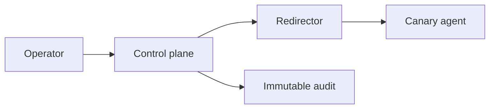

# C2 Infrastructure & Operational Security

## 🗺️ Zero-to-Mastery Learning Path

1. [[C2 Infrastructure & Redirectors]]
2. [[Operational Security, Anti-Forensics & Teardown]]

---
> 🔼 Up: [[Red Team Operations]]
