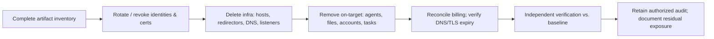

# 🧹 Operational Security, Anti-Forensics & Teardown

> [!danger] Authorized exercise / IR training only
> Red team OpSec protects the *client's data and the exercise boundary* — it is not evading client defenders outside the agreed scenario. Anti-forensics testing is **incident-response training**: it requires explicit authorization, disposable canary data, **off-host evidence preservation**, an immutable activity ledger, and a full restoration plan. Never alter production evidence needed for legal, regulatory, or operational investigations.

## Parent Learning Order
C2 Infrastructure & Redirectors -> Operational Security, Anti-Forensics & Teardown

## Start at Zero: Protecting the Exercise, and Leaving No Trace but the Report

Two responsibilities close out every red team operation. **Operational security (OpSec)** protects what the exercise touches — client data, operator identities, and the infrastructure you built — and keeps the operation inside its authorized boundary. **Teardown** removes every artifact the operation created (domains, certs, hosts, accounts, agents, listeners) so the client is left exactly as before. This note pairs them with **anti-forensics** — deliberately, because anti-forensics is studied here *as a blue-team training tool*: by testing whether log manipulation and artifact removal defeat the client's detection and IR, you reveal gaps in their forensic readiness. Every anti-forensic technique is presented with the detection/preservation that beats it.

The professional framing throughout: **you cannot clean up (or safely test anti-forensics) what you did not track.** A complete, immutable artifact inventory is the foundation of both teardown and honest anti-forensics testing.

> [!tip] The analogy, and where it breaks
> Teardown is like a film crew striking a set: an authorized production leaves the location *exactly* as they found it, working from a detailed inventory of everything they brought in. Anti-forensics testing is then like deliberately scuffing one marked prop to check whether the location's inspector notices — a controlled test of their vigilance. The analogy breaks on evidence: a film crew's scuff is cosmetic, whereas anti-forensics touches *forensic records*, so it demands off-host preservation and an immutable ledger — you test whether tampering is *detected*, never actually destroying the client's real evidence.

**Prerequisites:** **C2 Infrastructure & Redirectors** (the infrastructure you tear down), **Data Collection & Post-Exploitation Cleanup** (artifact-tracking discipline), and the Defensive domain's logging/monitoring.

## Operational Security: What You Protect and Track

Red team OpSec is inventory-driven. You continuously track **every** artifact so nothing is orphaned:

| Artifact class | Examples |
|---|---|
| **Infrastructure** | Domains, certificates, hosts, redirectors, listeners |
| **Identities** | Operator accounts, test identities, API keys, secrets |
| **On-target** | Agents, dropped files, created accounts, scheduled tasks, routes |
| **Data** | Collected client data (encrypted, minimized, scheduled for destruction) |

OpSec also means **monitoring the operation** (health, unexpected reach, third-party contact) and holding a **kill switch**. The recurring failure is an *untracked* artifact — a forgotten domain, an un-revoked cert, a leftover agent — which becomes real residual exposure.

## Teardown: Reverse Everything, Verify Independently



Teardown is a **checklist reversal of the inventory**, followed by *independent verification* (a second person, or the client's telemetry, confirms nothing remains) — never claim cleanup because a command returned success. The teardown must survive an operator outage: anyone on the team should be able to execute it from the inventory alone.

## Anti-Forensics — Studied as IR Training

Anti-forensics techniques attack the *forensic record*: **log manipulation** (deleting/altering/timestomping entries), **artifact removal** (wiping dropped files, clearing shell history), **timeline tampering**, and **evidence hiding**. Studied defensively, each maps to a detection/preservation control:

| Technique | The control that beats it |
|---|---|
| Log deletion/edit | **Real-time off-host log forwarding** (the record left the host before tampering) |
| Timestomping | File-system journaling, forwarded events with server-side timestamps |
| History/artifact wipe | EDR process/file telemetry (already shipped), integrity monitoring |
| Timeline gaps | Correlation across sources; a *gap itself* is a signal |

> [!note] ShadowStep
> The vault's **ShadowStep** tool (log manipulation, data shredding, network-identity masking) is the reference anti-forensics CLI — each of its actions is deliberately paired with its detection in the Defensive domain's advanced-defenses material. Anti-forensics is only ever run here against **canary data with off-host evidence preserved first**.

## Failure Modes and Interpretation

- **Untracked artifact = residual backdoor.** A forgotten domain/cert/agent is real exposure you created; only a complete inventory prevents it.
- **"Cleanup" without verification.** A command succeeding is not proof; independent/telemetry verification is required.
- **Anti-forensics without preservation.** Testing log tampering *without* an off-host immutable copy first can destroy real evidence — the cardinal ethical violation.
- **OpSec confused with evading the client.** Red team OpSec protects the *exercise and client data*, not concealment from defenders beyond the scenario — that would defeat the measurement purpose.
- **No teardown-under-outage plan.** If only one operator can tear down, an outage leaves infrastructure live — the inventory must make teardown reproducible by anyone.

## Security Implications — the Defender's View

- **Forward logs off-host in real time:** the single most important anti-forensics defense — once an event is shipped to an immutable store, on-host tampering cannot erase it.
- **Integrity monitoring & EDR:** file/registry integrity monitoring and always-on EDR telemetry mean artifact wipes and timestomps are detectable (the record already left).
- **Detect the gaps:** a missing log window, cleared history, or timeline discontinuity is itself a high-signal indicator — absence of data is data.
- **Post-engagement baseline audit:** the client verifies the environment against baseline to confirm the red team's teardown was complete — catching anything untracked.
- **Anti-forensics testing improves IR:** deliberately testing whether tampering is caught hardens the forensic-readiness the blue team relies on.

## Authorized Lab: Inventory-Driven Teardown + Detect Log Tampering

> [!info] Runs on one Linux machine — track artifacts and tear them down from the inventory, then show that off-host log preservation detects timestamp tampering
> All artifacts/logs are canaries. Step 5 removes everything.

### Step 1 — Track operation artifacts in an inventory

```bash
mkdir -p /tmp/rt-lab && cd /tmp/rt-lab
touch agent.sock listener.pid redirector.conf         # stand-ins for real infra
printf 'agent.sock\nlistener.pid\nredirector.conf\n' > inventory.txt
echo "operation.log: 2026-08-09T10:00:00Z agent check-in (canary)" > operation.log
echo "inventory tracked:"; cat inventory.txt
```

```text
inventory tracked:
agent.sock
listener.pid
redirector.conf
```

### Step 2 — Preserve the log OFF-HOST first (the anti-forensics defense)

```bash
cd /tmp/rt-lab
sha256sum operation.log | tee offhost-evidence.sha256   # the "shipped" immutable record
echo "off-host copy hash recorded BEFORE any teardown/tampering"
```

```text
<sha256>  operation.log
off-host copy hash recorded BEFORE any teardown/tampering
```

### Step 3 — Simulate anti-forensic tampering, then detect it

```bash
cd /tmp/rt-lab
sed -i 's/10:00:00Z/03:00:00Z/' operation.log          # timestomp the on-host log
echo "$(cat offhost-evidence.sha256)" | sha256sum -c - 2>&1 | tail -1
echo "^ FAILED = the on-host log no longer matches the off-host record -> tampering DETECTED."
```

```text
operation.log: FAILED
^ FAILED = the on-host log no longer matches the off-host record -> tampering DETECTED.
```

### Step 4 — Teardown from the inventory + independent verification

```bash
cd /tmp/rt-lab
while read a; do rm -f "$a"; done < inventory.txt
echo "--- verify each inventory artifact is gone ---"
missing=0; while read a; do [ -e "$a" ] && { echo "STILL PRESENT: $a"; missing=1; }; done < inventory.txt
[ $missing -eq 0 ] && echo "teardown verified: 0 tracked artifacts remain"
```

```text
--- verify each inventory artifact is gone ---
teardown verified: 0 tracked artifacts remain
```

### Step 5 — Remove lab (retain evidence in a real op; here, teardown)

```bash
cd /; rm -rf /tmp/rt-lab; ls -d /tmp/rt-lab 2>&1 | tail -1
echo "Real op: operation.log + offhost-evidence.sha256 are DELIVERED, not deleted."
```

```text
ls: cannot access '/tmp/rt-lab': No such file or directory
Real op: operation.log + offhost-evidence.sha256 are DELIVERED, not deleted.
```

**What you should now be able to do:** track an operation's artifacts, execute an inventory-driven teardown with independent verification, explain anti-forensics techniques *and* their detections, and demonstrate why real-time off-host log preservation defeats log tampering.

## Crook → Operator → Root Checkpoint

- **Crook:** Explain why red team OpSec protects the client/exercise (not conceal from defenders) and why you can't clean up what you didn't track.
- **Operator:** Run an inventory-driven teardown with independent verification, and test log tampering safely with off-host preservation first.
- **Root:** Explain why real-time off-host logging is the decisive anti-forensics defense, how integrity monitoring/EDR/timeline-gap detection catch tampering, and why anti-forensics testing (with preservation) hardens the blue team's forensic readiness.

---
> 🔼 Up: [[C2 Infrastructure & Operational Security]]
