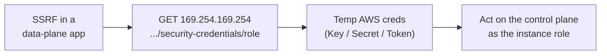

# Cloud Control Plane Operations

> [!warning] Authorized simulation only
> Run the metadata lab against the local mock only. Never query a real cloud metadata endpoint outside an authorized, scoped engagement, and never exfiltrate real session tokens.

## Parent Learning Order
Cloud Identity Operations -> Cloud Control Plane Operations -> Cloud Persistence Simulation -> Cloud Data Access Simulation

## Crook — Two Planes: Control and Data

A cloud resource has a **data plane** (the app serving requests) and a **control plane** (the APIs that create, configure, and grant access to resources). Compromising the data plane gets you one server; compromising the control plane gets you the *account* — the ability to spin up resources, read every bucket, and mint credentials.

The bridge between them is the **Instance Metadata Service (IMDS)** at the link-local address `169.254.169.254`. Any code on a cloud VM can ask IMDS for the temporary credentials of the role attached to that instance. That is convenient for the app — and catastrophic when a **server-side request forgery (SSRF)** bug lets an attacker make the server fetch that URL for them.

## Operator — SSRF Is the Classic Control-Plane Pivot

The attack chain is short and devastating:

1. Find an SSRF in a data-plane app (an "enter a URL to fetch" feature, a webhook, a PDF renderer).
2. Point it at `http://169.254.169.254/latest/meta-data/iam/security-credentials/<role>`.
3. Receive the instance role's temporary `AccessKeyId` / `SecretAccessKey` / `Token`.
4. Use those credentials against the **control plane** — now you enumerate and act as the instance's role.

IMDSv2 mitigates this by requiring a PUT-obtained session token (a header a naive SSRF can't set), which is why "enforce IMDSv2" is the headline control.

The pivot from one server to the whole account, read left to right:



## Root — Runnable Lab (one machine, Python)

This lab stands up a **local mock IMDS** and a vulnerable SSRF fetcher, then leaks canary credentials — the whole pivot, safely, on one machine.

**Step 1 — mock IMDS + vulnerable fetch (`imds.py`).**

```python
import http.server, threading, urllib.request, json, time
class IMDS(http.server.BaseHTTPRequestHandler):
    def log_message(self,*a): pass
    def do_GET(self):
        if self.path.endswith("/iam/security-credentials/app-role"):
            self.send_response(200); self.end_headers()
            self.wfile.write(json.dumps({"AccessKeyId":"ASIA-CANARY","SecretAccessKey":"c2r-secret",
                "Token":"canary-session-token"}).encode())
        else: self.send_response(404); self.end_headers()
srv=http.server.HTTPServer(("127.0.0.1",8199),IMDS)
threading.Thread(target=srv.serve_forever,daemon=True).start(); time.sleep(0.3)
def vulnerable_fetch(url): return urllib.request.urlopen(url,timeout=2).read().decode()  # SSRF
print("leaked:",vulnerable_fetch("http://127.0.0.1:8199/latest/meta-data/iam/security-credentials/app-role"))
srv.shutdown()
```

**Step 2 — run it.**

```console
$ python3 imds.py
SSRF request -> http://127.0.0.1:8199/latest/meta-data/iam/security-credentials/app-role
leaked: {"AccessKeyId": "ASIA-CANARY", "SecretAccessKey": "c2r-secret", "Token": "canary-session-token", ...}
impact: SSRF against the metadata endpoint yields the instance role's temporary AWS creds
```

**Step 3 — the deliberate break (the fix).** Change the fetch path to anything other than the credentials route and the mock returns `404` — modelling IMDSv2, where the credentials route requires a session-token header the SSRF cannot supply. The bug is unchanged; the control-plane blast radius is gone.

**Step 4 — cleanup:** the HTTP server is shut down in-script (`srv.shutdown()`); nothing persists — no cleanup required.

**What you should now be able to do:** explain the control-plane vs data-plane distinction, trace an SSRF→IMDS→credentials pivot, and name IMDSv2 + egress restrictions as the fixes.

## Crook → Operator → Root Checkpoint

- **Crook:** Why is stealing an instance's metadata credentials worse than compromising the app on it?
- **Operator:** You find an SSRF in a URL-preview feature. What exact request proves control-plane exposure with a canary?
- **Root:** Explain precisely how IMDSv2's session-token requirement blocks a basic SSRF, and what SSRF variant can still defeat it.

---
> 🔼 Up: [[Cloud Red Team Operations]]
