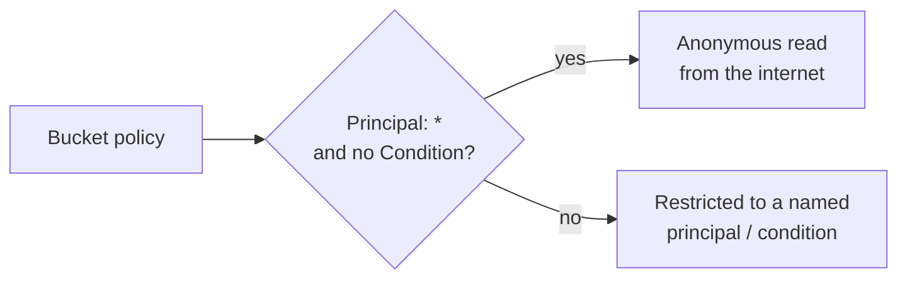

# Cloud Data Access Simulation

> [!warning] Authorized simulation only
> Evaluate storage exposure only against synthetic buckets and canary objects in a scoped account. Confirm reachability with a marker file — never read or exfiltrate real data.

## Parent Learning Order
Cloud Identity Operations -> Cloud Control Plane Operations -> Cloud Persistence Simulation -> Cloud Data Access Simulation

## The Data Is the Objective

Recon, identity escalation, and persistence are all in service of one thing: reaching the data. In the cloud, most data lives in **object storage** (S3, GCS, Azure Blob), and the most common breach is not a clever exploit — it is a **bucket exposed by policy**. Storage access is governed by a resource policy plus account-level "block public access" settings, and a single `Principal: "*"` with no condition turns a private store into a public one.

The skill is reading a bucket policy the way the cloud evaluator does: *who* is allowed *what*, and *under which conditions* — because the condition is often the only thing standing between "internal" and "the whole internet."

## How Storage Gets Exposed

| Misconfiguration | Effect |
|---|---|
| `Principal: "*"`, no `Condition` | Anonymous read (or write) from anywhere |
| Overly broad `aws:PrincipalOrgID` missing | Any AWS account, not just yours |
| Presigned URL with long expiry | Time-boxed access that outlives its need |
| ACL `AllUsers` / `AuthenticatedUsers` | Legacy public grants that bypass policy review |
| Bucket policy allows, "Block Public Access" off | The account-level backstop is disabled |

The invariant: an object should be reachable only by an explicitly named principal, or by a principal satisfying a network/org condition. "Allow `*`" without a condition violates it by definition.

The whole exposure decision hinges on one question the evaluator asks:



## Worked Example: A Bucket That Answers to Anyone

The most common cloud data breach is not an exploit — it is a storage policy that
names `*` as a principal. Reading a bucket policy the way the cloud evaluator does,
then confirming the exposure anonymously, is the whole skill.

> [!note] Representative output
> Reconstructed to match the AWS CLI's real output shapes rather than captured from one account; identifiers are synthetic. The field names, error strings and command structure are what a live account returns.

**The policy says who is allowed what** — and this one says everyone:

```shell-session
$ aws s3api get-bucket-policy --bucket acme-customer-exports --query Policy --output text | python3 -m json.tool
{
    "Statement": [
        {
            "Effect": "Allow",
            "Principal": "*",
            "Action": "s3:GetObject",
            "Resource": "arn:aws:s3:::acme-customer-exports/*"
        }
    ]
}
```

Read it as the evaluator does: `Effect: Allow`, `Principal: *`, and — the decisive
absence — no `Condition` block. There is nothing restricting *who* the `*`
includes, so it includes anonymous requests from the public internet. A policy
with the same `Allow` but a `Condition` limiting it to a VPC endpoint or an
organisation ID would be restricted; this one is not.

**The account-level backstop is the second thing to check**, because it can
override a bad policy:

```shell-session
$ aws s3api get-public-access-block --bucket acme-customer-exports
An error occurred (NoSuchPublicAccessBlockConfiguration) ... does not exist
```

The error is the finding. "Block Public Access" is the switch that makes a
`Principal: *` policy inert regardless of what the policy says, and here it is not
configured — so the policy stands unopposed.

**Confirm it anonymously**, with credentials explicitly disabled:

```shell-session
$ aws s3 ls s3://acme-customer-exports/ --no-sign-request
2026-07-14 03:22:10   4881232 customers-2026-q2.csv
$ aws s3 cp s3://acme-customer-exports/customers-2026-q2.csv - --no-sign-request | head -1
id,email,full_name,plan,mrr
```

`--no-sign-request` sends no credentials at all, and the object still returns. That
is the proof: not "an authorised user can read this" but "anyone on the internet
can", demonstrated by reading a header line and stopping. On a real engagement the
restraint matters — establishing the first row is reachable is the finding, and
pulling the full customer file is neither necessary nor authorised.

The invariant this violates is simple to state: an object should be reachable only
by a named principal or one satisfying a network or organisation condition. `Allow
*` with no condition breaks it by definition, and the fix is equally direct — a
principal or condition on the policy, and Block Public Access enabled as the
account-wide backstop that catches the next mistake.

## Summary

You should now be able to:

- Why is `Principal: "*"` with no condition the classic cloud data breach?
- You suspect a bucket is public. What single canary-object check proves it without reading real data?
- Explain the evaluation order of account "Block Public Access", bucket policy, and object ACL, and how a conflict resolves.

---
> 🔼 Up: [[Cloud Red Team Operations]]
