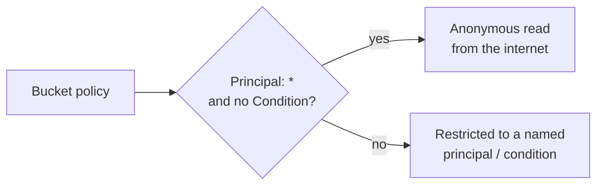

# Cloud Data Access Simulation

> [!warning] Authorized simulation only
> Evaluate storage exposure only against synthetic buckets and canary objects in a scoped account. Confirm reachability with a marker file — never read or exfiltrate real data.

## Parent Learning Order
Cloud Identity Operations -> Cloud Control Plane Operations -> Cloud Persistence Simulation -> Cloud Data Access Simulation

## Crook — The Data Is the Objective

Recon, identity escalation, and persistence are all in service of one thing: reaching the data. In the cloud, most data lives in **object storage** (S3, GCS, Azure Blob), and the most common breach is not a clever exploit — it is a **bucket exposed by policy**. Storage access is governed by a resource policy plus account-level "block public access" settings, and a single `Principal: "*"` with no condition turns a private store into a public one.

The skill is reading a bucket policy the way the cloud evaluator does: *who* is allowed *what*, and *under which conditions* — because the condition is often the only thing standing between "internal" and "the whole internet."

## Operator — How Storage Gets Exposed

| Misconfiguration | Effect |
|---|---|
| `Principal: "*"`, no `Condition` | Anonymous read (or write) from anywhere |
| Overly broad `aws:PrincipalOrgID` missing | Any AWS account, not just yours |
| Presigned URL with long expiry | Time-boxed access that outlives its need |
| ACL `AllUsers` / `AuthenticatedUsers` | Legacy public grants that bypass policy review |
| Bucket policy allows, "Block Public Access" off | The account-level backstop is disabled |

The invariant: an object should be reachable only by an explicitly named principal, or by a principal satisfying a network/org condition. "Allow `*`" without a condition violates it by definition.

The whole exposure decision hinges on one question the evaluator asks:



## Root — Runnable Lab (one machine, Python)

This lab evaluates a bucket policy for public exposure the way the cloud would, with no account.

**Step 1 — the exposure evaluator (`bucket_policy.py`).**

```python
policy={"Statement":[{"Effect":"Allow","Principal":"*","Action":"s3:GetObject",
        "Resource":"arn:aws:s3:::c2r-canary-bucket/*"}]}
def is_public(p):
    for s in p["Statement"]:
        if s["Effect"]=="Allow" and s["Principal"]=="*" and "Condition" not in s:
            return True, s["Action"]
    return False, None
print("public read?:", is_public(policy))
```

**Step 2 — run it.**

```console
$ python3 bucket_policy.py
bucket policy Principal: *
public read?: True (s3:GetObject)
fix: set Principal to a specific account/role, or add aws:SourceVpce / aws:PrincipalOrgID condition
```

**Step 3 — the deliberate break (the fix).** Add a `Condition` (e.g. `{"StringEquals":{"aws:PrincipalOrgID":"o-abc123"}}`) to the statement and re-run: `is_public` returns `False`. The permission is unchanged — the *condition* is what re-privatises the data. That is precisely the line reviewers must check, not just the `Action`.

**Step 4 — cleanup:** static policy evaluation — no cleanup required. (In a live lab, delete the canary object and re-run a public-read check expecting `AccessDenied`.)

**What you should now be able to do:** read a bucket policy for `Principal`/`Condition` exposure, explain why "Block Public Access" is the account-level backstop, and prove reachability with a canary object instead of real data.

## Crook → Operator → Root Checkpoint

- **Crook:** Why is `Principal: "*"` with no condition the classic cloud data breach?
- **Operator:** You suspect a bucket is public. What single canary-object check proves it without reading real data?
- **Root:** Explain the evaluation order of account "Block Public Access", bucket policy, and object ACL, and how a conflict resolves.

---
> 🔼 Up: [[Cloud Red Team Operations]]
