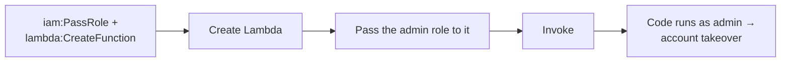

# Cloud Identity Operations

> [!warning] Authorized simulation only
> Model IAM escalation only against synthetic policies in a scoped lab account. Prove the *path* with a canary role — never assume real admin or touch production identities.

## Parent Learning Order
Cloud Identity Operations -> Cloud Control Plane Operations -> Cloud Persistence Simulation -> Cloud Data Access Simulation

## Crook — In the Cloud, Identity Is the Perimeter

There is no network edge to breach in a cloud account — every action is an API call authorized by an **IAM policy**. Attacking the cloud is therefore mostly attacking identity: finding a principal (user, role, or service) whose permissions let it *grant itself more* permissions. This is **privilege escalation by policy**, and it rarely needs an exploit — just an over-permissive combination of allowed actions.

The canonical example is `iam:PassRole`. On its own it is harmless. Combined with a service that *runs code with a role you pass it* — Lambda, EC2, Glue — it becomes: "create a function, pass it the admin role, invoke it, and now your code runs as admin."

## Operator — Dangerous Permission Combinations

| Combination | Why it escalates |
|---|---|
| `iam:PassRole` + `lambda:CreateFunction` + `lambda:InvokeFunction` | Run attacker code under any passable role |
| `iam:CreatePolicyVersion` (on your own attached policy) | Rewrite your permissions to `*` |
| `iam:AttachUserPolicy` | Attach `AdministratorAccess` to yourself |
| `sts:AssumeRole` on an over-trusting role | Become a more-privileged principal |
| `iam:CreateAccessKey` (on another user) | Mint long-lived creds for a privileged user |

The security invariant: a principal should never be able to reach permissions it was not explicitly granted. Escalation is a *transitive* property — you must evaluate not just direct permissions but what those permissions let you *become*.

The escalation is a chain of individually-innocuous permissions, read left to right:



## Root — Runnable Lab (one machine, Python)

This lab evaluates a principal's allowed actions for the `PassRole` escalation, with no cloud account.

**Step 1 — the escalation checker (`iam_privesc.py`).**

```python
principal_actions={"iam:PassRole","lambda:CreateFunction","lambda:InvokeFunction"}
def can_escalate(actions):
    return {"iam:PassRole","lambda:CreateFunction"}.issubset(actions)
print("PassRole + CreateFunction present:", can_escalate(principal_actions))
```

**Step 2 — run it.**

```console
$ python3 iam_privesc.py
principal can: ['iam:PassRole', 'lambda:CreateFunction', 'lambda:InvokeFunction']
PassRole + CreateFunction present: True
ESCALATION: create a Lambda, PASS 'lambda-admin-role' (AdministratorAccess) to it,
            invoke it -> code runs with admin -> full account takeover
least-privilege fix: remove iam:PassRole, or constrain it with a Resource/PermissionsBoundary
```

**Step 3 — the deliberate break.** Remove `lambda:CreateFunction` from the set and re-run: the check returns `False`. Neither permission is dangerous alone — the escalation is an emergent property of the *combination*, which is exactly what single-permission reviews miss.

**Step 4 — cleanup:** static policy evaluation — no cleanup required.

**What you should now be able to do:** read an IAM policy for escalation *combinations* (not just wildcards), explain the `PassRole` path, and name permission boundaries as the structural fix.

## Crook → Operator → Root Checkpoint

- **Crook:** Why is "identity is the perimeter" true in a cloud account with no network edge?
- **Operator:** Given a role with `iam:PassRole` and `ec2:RunInstances`, describe the escalation and the canary that proves it safely.
- **Root:** Explain how a permissions boundary or SCP stops `PassRole` escalation even when the principal's own policy allows it.

---
> 🔼 Up: [[Cloud Red Team Operations]]
