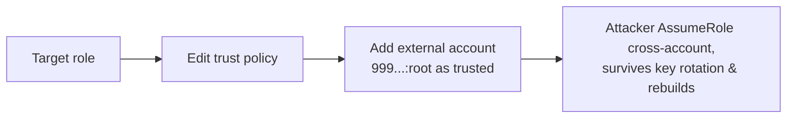

# Cloud Persistence Simulation

> [!warning] Authorized simulation only
> Simulate persistence only in a scoped lab account with canary principals, and remove every artifact you create. The finding is *whether the change is detected*, not standing covert access.

## Parent Learning Order
Cloud Identity Operations -> Cloud Control Plane Operations -> Cloud Persistence Simulation -> Cloud Data Access Simulation

## Crook — Persistence Without Malware

On a server, persistence means a backdoor process or a cron job. In the cloud there is often no server to touch — persistence means a **quiet change to identity configuration** that survives the defender rotating passwords and rebuilding instances. Because these are legitimate API calls, they blend into normal administration; the whole skill is knowing which config change is a backdoor.

The most durable technique targets **role trust policies**. A role's trust policy declares *who is allowed to assume it*. Add an attacker-controlled AWS account as a trusted principal, and that account can assume the role at will — from outside, forever, with no credentials stored anywhere the defender can find.

## Operator — Cloud Persistence Techniques

| Technique | What it leaves behind |
|---|---|
| Add external account to a **role trust policy** | Cross-account `AssumeRole` from attacker's account |
| Create a second **access key** for a privileged user | Long-lived credentials, easy to miss |
| Add a **Lambda** triggered on a schedule/event | Code that re-creates access if removed |
| Register an **identity-provider / OIDC trust** | Federated login the defender doesn't recognise |
| Leave a **login profile** on a service account | Console access on a non-human identity |

The invariant defenders rely on: the set of principals able to assume a role, and the set of credentials for each identity, should change only through change control. Persistence is any *unaccounted* addition to those sets.

The backdoor is a single added statement in a trust policy — invisible to host-based defense:



## Root — Runnable Lab (one machine, Python)

This lab diffs a role trust policy before and after a simulated backdoor, surfacing the added external principal — exactly what a detection rule must catch.

**Step 1 — the trust-policy diff (`trust_diff.py`).**

```python
before={"Statement":[{"Principal":{"AWS":"arn:aws:iam::111111111111:root"},"Action":"sts:AssumeRole"}]}
after ={"Statement":[{"Principal":{"AWS":"arn:aws:iam::111111111111:root"},"Action":"sts:AssumeRole"},
                     {"Principal":{"AWS":"arn:aws:iam::999999999999:root"},"Action":"sts:AssumeRole"}]}
b={s["Principal"]["AWS"] for s in before["Statement"]}
a={s["Principal"]["AWS"] for s in after["Statement"]}
print("ADDED (persistence backdoor):", sorted(a-b))
```

**Step 2 — run it.**

```console
$ python3 trust_diff.py
trusted principals before: ['arn:aws:iam::111111111111:root']
trusted principals after : ['arn:aws:iam::111111111111:root', 'arn:aws:iam::999999999999:root']
ADDED (persistence backdoor): ['arn:aws:iam::999999999999:root']
detection: alarm on any change to a role trust policy adding an external account
```

**Step 3 — the deliberate insight.** The backdoor is *one extra statement* — no malware, no process, nothing on any disk. It survives credential rotation and instance rebuilds because it lives in the account's identity configuration. Detection must be **config-drift monitoring** (CloudTrail on `UpdateAssumeRolePolicy`), not endpoint scanning.

**Step 4 — cleanup:** static diff of two policy documents — no cleanup required. (In a live lab, the real cleanup is reverting the trust policy and confirming the external principal is gone.)

**What you should now be able to do:** name the cloud persistence techniques that survive rebuilds, explain why a trust-policy edit is invisible to host-based defense, and identify the control-plane audit event that detects it.

## Crook → Operator → Root Checkpoint

- **Crook:** Why doesn't rotating passwords remove a role-trust-policy backdoor?
- **Operator:** You simulate persistence in a lab account. Which CloudTrail events must fire, and how do you verify full cleanup?
- **Root:** Compare an added access key, a trust-policy edit, and an OIDC federation backdoor by detectability and durability, and justify the ranking.

---
> 🔼 Up: [[Cloud Red Team Operations]]
