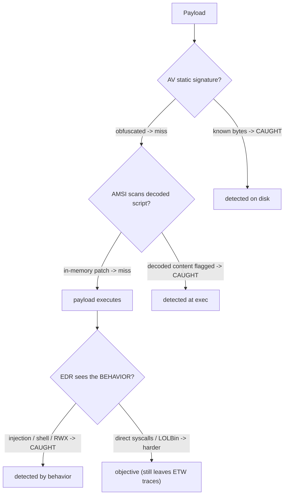

# 🛡️ AV, EDR & Telemetry Evasion Testing

> [!warning] Authorized adversary emulation only
> Evasion testing measures *what the client's endpoint stack detects* — it is done under authorization, with canary payloads, to produce a detection-coverage outcome. The goal is improving the blue team's visibility, not defeating protection on systems you don't own.

## Parent Learning Order
AV, EDR & Telemetry Evasion Testing -> Payload Engineering & Obfuscation -> Process Injection & Direct Syscalls

## Knowing What the Endpoint Can See

Modern endpoints run a layered defense stack, and a red team's job is to *test what each layer actually catches*. Four layers dominate, and understanding what each one observes is the whole subject:

- **Antivirus (AV)** — mostly **static signatures**: pattern-matches files/bytes on disk.
- **EDR (Endpoint Detection & Response)** — **behavioral**: hooks APIs and watches process/file/network *behavior* at runtime.
- **AMSI (Antimalware Scan Interface)** — a Windows hook that lets AV/EDR scan **script content at execution time** (PowerShell, JScript, VBA), even if it was obfuscated on disk.
- **ETW (Event Tracing for Windows)** — the **telemetry pipeline** EDR relies on for events (process creation, image loads, etc.).

Evasion testing measures which layer catches which behavior, so the blue team learns its blind spots. The unifying insight: **static signatures are easy to evade; behavioral and telemetry-based detection are not** — because you can change how a payload *looks* far more easily than what it *does*.

> [!tip] The analogy, and where it breaks
> The endpoint stack is like airport security in layers: AV is the watchlist of known faces (change your disguise and you pass), AMSI is the checkpoint that re-scans you *after* you take off the disguise (obfuscation on disk doesn't help once the script is decoded to run), EDR is the behavior analyst watching for suspicious *actions*, and ETW is the CCTV feed the analyst watches. The analogy breaks on the CCTV: a real analyst can't unplug the cameras, whereas advanced attackers try to blind ETW itself — which is why *tampering with the telemetry pipeline* is such a high-signal event when it's detected.

**Prerequisites:** the OS Internals Windows security/logging leaves, **Payload Engineering & Obfuscation**, and basic detection concepts.

## What Each Layer Sees — and How Testing Measures It

| Layer | Observes | Typical evasion tested | Why it's limited |
|---|---|---|---|
| **AV (static)** | Bytes on disk | Obfuscation, encryption, packing | Doesn't see runtime behavior |
| **AMSI** | Script content at exec | In-memory patching, non-scanned languages | Only covers hooked script hosts |
| **EDR (behavioral)** | API calls, process lineage | Direct syscalls, injection, LOLBins | Behavior is hard to hide |
| **ETW** | Event telemetry | ETW patching/blinding | Tampering is itself detectable |

**The key finding evasion testing surfaces:** a payload can sail past AV (obfuscated) yet be caught by EDR the instant it *acts* (spawns a shell, injects, allocates RWX). A mature endpoint stack therefore does not rely on AV alone — and the test proves whether the client's behavioral/telemetry layers actually fire.



## Worked Example: A Coverage Matrix Across Two Detection Layers

Evasion testing produces one deliverable above all others: a matrix of which
payload variant each defensive layer catches. Two miniature detectors — one static
like classic AV, one behavioural like an EDR — turn that abstract claim into a
table the client can act on.

**Static detection against the raw payload** — a signature is a literal match:

```shell-session
operator@lab:/tmp/av-lab$ ./av_static.sh payload.sh
AV: SIGNATURE MATCH -> blocked
```

The raw payload contains the string the signature looks for, so the static layer
stops it. This is the case AV was built for and handles well: known-bad bytes,
recognised on sight.

**Static detection against an obfuscated payload** — same behaviour, new bytes:

```shell-session
operator@lab:/tmp/av-lab$ ./av_static.sh payload_obf.sh
AV: no signature match -> allowed
```

Base64-encoding the payload changed every byte the signature keyed on, and the
static layer waves it through. On its own, that is the well-known limitation of
signature matching — and where an evasion test would stop if the client only ran
AV.

**Behavioural detection against the same obfuscated payload:**

```shell-session
operator@lab:/tmp/av-lab$ ./edr_behavioral.sh payload_obf.sh
EDR: BEHAVIOR MATCH (decode->shell) -> detected
```

The obfuscation that defeated the signature is itself the behavioural signal — a
decode piped straight into a shell. The bytes changed; the action did not; the
behavioural layer watches the action.

**The matrix is the finding**, and it is what the client's report should contain:

| Variant | Static (AV) | Behavioural (EDR) |
|:--|:--|:--|
| Raw payload | caught | caught |
| Obfuscated | **missed** | caught |

Read across the obfuscated row: the organisation is protected here only because a
behavioural layer exists. An environment running signature AV alone has a hole in
the exact place attackers operate, and the recommendation follows directly — the
controls that hold are behavioural detection, plus the platform telemetry that
feeds it. On Windows those are named: AMSI, which hands the *decoded* script back
to the scanner so obfuscation no longer helps, and ETW, which surfaces the process
and syscall behaviour the signature never sees. The value of the exercise is not
"we evaded the AV" — it is the per-layer coverage map that tells the defender which
control is load-bearing and which is theatre.

## Beating static AV and calling it evasion

- **Testing only AV.** Concluding "we evaded the endpoint" after beating static AV is wrong — the behavioral layer usually catches the *action*; test all layers.
- **Assuming AMSI covers everything.** AMSI only instruments hooked script hosts; a compiled binary or non-instrumented language bypasses it — know its scope.
- **ETW blinding is loud.** Patching/disabling ETW may stop some telemetry but is itself a strong detection signal on a mature stack — a "successful" evasion that trips a bigger alarm.
- **Signature whack-a-mole.** Evading one product's signature says nothing about another's behavioral engine; report *what was tested against what*.
- **Confusing evasion with impact.** The deliverable is a detection-coverage map (which layer caught which behavior), not a trophy for slipping past AV.

## Security Implications — the Defender's View

- **Don't rely on static AV:** the test's core lesson is that behavioral EDR + telemetry is what catches modern payloads — invest there, and ensure AMSI is enabled for all script hosts.
- **Protect the telemetry pipeline:** monitor for ETW tampering, AMSI patching, and EDR-hook removal — these *evasion attempts themselves* are high-fidelity alerts.
- **Behavioral rules over signatures:** detections keyed on actions (RWX allocation, injection, child-shell-from-service, LOLBin abuse) survive obfuscation that defeats file signatures.
- **Coverage mapping:** run purple-team test cards (see the reporting leaf) per evasion technique to know exactly which layer fires — turning the red team's evasion into measured blue-team improvement.

## Summary

You should now be able to:

- Explain the difference between static AV and behavioral EDR, and what AMSI and ETW do.
- Test a payload against static vs behavioral detection and show obfuscation evades the signature but not the behavior.
- Explain why ETW/AMSI tampering is itself a high-signal detection, why behavioral rules survive obfuscation, and how evasion testing produces a per-layer detection-coverage map for the blue team.

---
> 🔼 Up: [[Evasion & Endpoint Tradecraft]]
