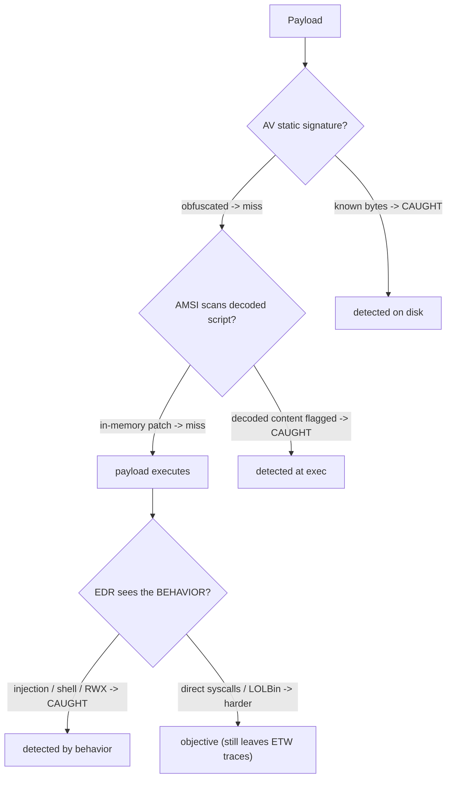

# 🛡️ AV, EDR & Telemetry Evasion Testing

> [!warning] Authorized adversary emulation only
> Evasion testing measures *what the client's endpoint stack detects* — it is done under authorization, with canary payloads, to produce a detection-coverage outcome. The goal is improving the blue team's visibility, not defeating protection on systems you don't own.

## Parent Learning Order
AV, EDR & Telemetry Evasion Testing -> Payload Engineering & Obfuscation -> Process Injection & Direct Syscalls

## Start at Zero: Knowing What the Endpoint Can See

Modern endpoints run a layered defense stack, and a red team's job is to *test what each layer actually catches*. Four layers dominate, and understanding what each one observes is the whole subject:

- **Antivirus (AV)** — mostly **static signatures**: pattern-matches files/bytes on disk.
- **EDR (Endpoint Detection & Response)** — **behavioral**: hooks APIs and watches process/file/network *behavior* at runtime.
- **AMSI (Antimalware Scan Interface)** — a Windows hook that lets AV/EDR scan **script content at execution time** (PowerShell, JScript, VBA), even if it was obfuscated on disk.
- **ETW (Event Tracing for Windows)** — the **telemetry pipeline** EDR relies on for events (process creation, image loads, etc.).

Evasion testing measures which layer catches which behavior, so the blue team learns its blind spots. The unifying insight: **static signatures are easy to evade; behavioral and telemetry-based detection are not** — because you can change how a payload *looks* far more easily than what it *does*.

> [!tip] The analogy, and where it breaks
> The endpoint stack is like airport security in layers: AV is the watchlist of known faces (change your disguise and you pass), AMSI is the checkpoint that re-scans you *after* you take off the disguise (obfuscation on disk doesn't help once the script is decoded to run), EDR is the behavior analyst watching for suspicious *actions*, and ETW is the CCTV feed the analyst watches. The analogy breaks on the CCTV: a real analyst can't unplug the cameras, whereas advanced attackers try to blind ETW itself — which is why *tampering with the telemetry pipeline* is such a high-signal event when it's detected.

**Prerequisites:** the OS Internals Windows security/logging leaves, **Payload Engineering & Obfuscation**, and basic detection concepts.

## What Each Layer Sees — and How Testing Measures It

| Layer | Observes | Typical evasion tested | Why it's limited |
|---|---|---|---|
| **AV (static)** | Bytes on disk | Obfuscation, encryption, packing | Doesn't see runtime behavior |
| **AMSI** | Script content at exec | In-memory patching, non-scanned languages | Only covers hooked script hosts |
| **EDR (behavioral)** | API calls, process lineage | Direct syscalls, injection, LOLBins | Behavior is hard to hide |
| **ETW** | Event telemetry | ETW patching/blinding | Tampering is itself detectable |

**The key finding evasion testing surfaces:** a payload can sail past AV (obfuscated) yet be caught by EDR the instant it *acts* (spawns a shell, injects, allocates RWX). A mature endpoint stack therefore does not rely on AV alone — and the test proves whether the client's behavioral/telemetry layers actually fire.



## Failure Modes and Interpretation

- **Testing only AV.** Concluding "we evaded the endpoint" after beating static AV is wrong — the behavioral layer usually catches the *action*; test all layers.
- **Assuming AMSI covers everything.** AMSI only instruments hooked script hosts; a compiled binary or non-instrumented language bypasses it — know its scope.
- **ETW blinding is loud.** Patching/disabling ETW may stop some telemetry but is itself a strong detection signal on a mature stack — a "successful" evasion that trips a bigger alarm.
- **Signature whack-a-mole.** Evading one product's signature says nothing about another's behavioral engine; report *what was tested against what*.
- **Confusing evasion with impact.** The deliverable is a detection-coverage map (which layer caught which behavior), not a trophy for slipping past AV.

## Security Implications — the Defender's View

- **Don't rely on static AV:** the test's core lesson is that behavioral EDR + telemetry is what catches modern payloads — invest there, and ensure AMSI is enabled for all script hosts.
- **Protect the telemetry pipeline:** monitor for ETW tampering, AMSI patching, and EDR-hook removal — these *evasion attempts themselves* are high-fidelity alerts.
- **Behavioral rules over signatures:** detections keyed on actions (RWX allocation, injection, child-shell-from-service, LOLBin abuse) survive obfuscation that defeats file signatures.
- **Coverage mapping:** run purple-team test cards (see the reporting leaf) per evasion technique to know exactly which layer fires — turning the red team's evasion into measured blue-team improvement.

## Authorized Lab: Signature vs. Behavioral Detection

> [!info] Runs on one Linux machine — build a mini two-layer detector (static signature + behavioral) and show a payload that evades the signature but not the behavior
> Uses the industry-standard benign EICAR-style test concept and a canary payload. Step 5 cleans up.

### Step 1 — A canary "malicious" payload and a static-signature scanner

```bash
mkdir -p /tmp/av-lab && cd /tmp/av-lab
echo 'bash -c "echo C2R-CANARY-PAYLOAD-RAN"' > payload.sh          # benign canary "malware"
cat > av_static.sh <<'EOF'
#!/bin/bash
# a mini "AV": static signature = the literal suspicious string
grep -q 'echo C2R-CANARY-PAYLOAD-RAN' "$1" && echo "AV: SIGNATURE MATCH -> blocked" || echo "AV: no signature match -> allowed"
EOF
chmod +x av_static.sh
./av_static.sh payload.sh
```

```text
AV: SIGNATURE MATCH -> blocked
```

### Step 2 — Obfuscate the payload: it evades the static signature

```bash
cd /tmp/av-lab
B64=$(base64 -w0 payload.sh)
echo "echo $B64 | base64 -d | bash" > payload_obf.sh              # same behavior, different bytes
./av_static.sh payload_obf.sh
```

```text
AV: no signature match -> allowed
```

The obfuscated variant does the *exact same thing* but no longer contains the signature string — classic static-AV evasion. This is why AV alone is insufficient.

### Step 3 — A behavioral detector catches it anyway (it decodes/acts)

```bash
cd /tmp/av-lab
cat > edr_behavioral.sh <<'EOF'
#!/bin/bash
# a mini "EDR": watch what the script DOES — flag base64-decode-piped-to-shell behavior
if grep -qE 'base64 -d\s*\|\s*(bash|sh)' "$1"; then echo "EDR: BEHAVIOR MATCH (decode->shell) -> detected"; else echo "EDR: no suspicious behavior"; fi
EOF
chmod +x edr_behavioral.sh
./edr_behavioral.sh payload_obf.sh
```

```text
EDR: BEHAVIOR MATCH (decode->shell) -> detected
```

Obfuscation changed the bytes but not the *behavior* (decode → pipe to shell), so the behavioral layer catches what the signature missed — the central lesson of evasion testing.

### Step 4 — State the coverage outcome

```bash
cd /tmp/av-lab
echo "Coverage: raw payload -> AV catches; obfuscated -> AV MISS, EDR/behavioral CATCH."
echo "Finding for the client: static AV is evadable; behavioral detection + AMSI (decoded-script scanning) + ETW telemetry are what hold."
```

```text
Coverage: raw payload -> AV catches; obfuscated -> AV MISS, EDR/behavioral CATCH.
Finding for the client: static AV is evadable; behavioral detection + AMSI (decoded-script scanning) + ETW telemetry are what hold.
```

### Step 5 — Cleanup

```bash
cd /; rm -rf /tmp/av-lab; ls -d /tmp/av-lab 2>&1 | tail -1
```

```text
ls: cannot access '/tmp/av-lab': No such file or directory
```

**What you should now be able to do:** explain what AV/AMSI/EDR/ETW each observe, why static signatures are evadable while behavior is not, test which layer catches which technique, and articulate why behavioral detection + telemetry-integrity monitoring is the durable defense.

## Crook → Operator → Root Checkpoint

- **Crook:** Explain the difference between static AV and behavioral EDR, and what AMSI and ETW do.
- **Operator:** Test a payload against static vs behavioral detection and show obfuscation evades the signature but not the behavior.
- **Root:** Explain why ETW/AMSI tampering is itself a high-signal detection, why behavioral rules survive obfuscation, and how evasion testing produces a per-layer detection-coverage map for the blue team.

---
> 🔼 Up: [[Evasion & Endpoint Tradecraft]]
