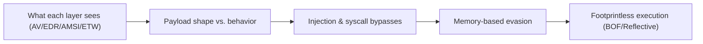

# Evasion & Endpoint Tradecraft

## 🗺️ Zero-to-Mastery Learning Path

1. [[AV, EDR & Telemetry Evasion Testing]]
2. [[Payload Engineering & Obfuscation]]
3. [[Process Injection & Direct Syscalls]]
4. [[In-Memory Evasion — Unhooking, Sleep Masking & Call-Stack Spoofing]]
5. [[In-Memory Execution — Reflective Loading & Beacon Object Files]]

---
> 🔼 Up: [[Red Team Operations]]
