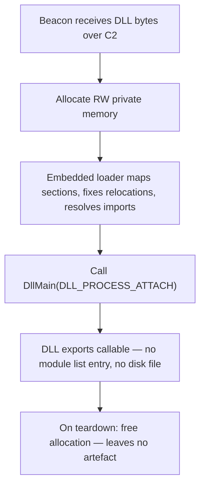

# 📦 In-Memory Execution — Reflective Loading & Beacon Object Files

> [!warning] Authorized adversary emulation only
> Reflective loading and BOF execution are post-exploitation primitives used to extend a beacon's capability after initial access is established under authorization. Study them to understand the execution surface they create — and the detection gaps they close — never to run capability outside an agreed engagement.

## Parent Learning Order
AV, EDR & Telemetry Evasion Testing -> Payload Engineering & Obfuscation -> Process Injection & Direct Syscalls -> In-Memory Evasion — Unhooking, Sleep Masking & Call-Stack Spoofing -> In-Memory Execution — Reflective Loading & Beacon Object Files

## Running Code with No File, No New Process, No New Thread

> *You have a beacon on a host. You want to run a post-exploitation module. What happens to the host's process list, module list, and disk the moment you load it?*
>
> Hold your answer — the section below is the response.

[[In-Memory Evasion — Unhooking, Sleep Masking & Call-Stack Spoofing]] established
that the beacon's own memory is the detection surface. The next question is how
new *capability* reaches the beacon: a module that does credential harvesting,
lateral movement, or reconnaissance has to execute somehow. The naïve answer —
drop a DLL or EXE to disk and launch it — creates every observable that EDR looks
for: a new file, a new process, and a module load event. This note covers the two
techniques that avoid those observables entirely.

**Reflective DLL injection** loads a DLL from a byte buffer in memory, using a
loader embedded in the DLL itself, without ever calling `LoadLibrary` — so the
DLL appears in no module list and touches no disk. **Beacon Object Files (BOFs)**
go further: they are COFF object files executed *inside the beacon's own thread*,
with no new process, no new DLL, and no new memory allocation beyond what the
object file needs. Together they define the post-exploitation execution model that
leaves the smallest footprint: extend capability without extending the observable
surface.

> [!tip] The analogy, and where it breaks
> Reflective loading is like a magician who produces a full assistant from an
> envelope — the assistant appears, acts, and disappears without ever entering
> through a door the security cameras watch. BOFs are tighter: the magician
> *becomes* the assistant for thirty seconds (runs the capability in their own
> body), then goes back to normal — no second person, no extra footprint at all.
> The analogy breaks on what the audience can still see: the magician's hands move,
> the envelope was opened, and the act itself is visible, even if the expected
> entrance is not. The footprint is smaller; it is not zero.

**Prerequisites:** [[Process Injection & Direct Syscalls]], [[In-Memory Evasion — Unhooking, Sleep Masking & Call-Stack Spoofing]] (the memory model they hide inside), and the OS Internals PE-loader and COFF-format leaves.

## Reflective DLL Injection: a self-loading module

`LoadLibrary` does several things an attacker does not want: it requires a path
on disk, it registers the DLL in the process's module list (visible to
`EnumProcessModules`, `CreateToolhelp32Snapshot`, and every EDR), and it generates
an `IMAGE_LOAD` ETW event that tools like Sysmon record. Reflective loading
replaces the OS loader with **a loader inside the DLL itself**.

The embedded loader must do everything `LoadLibrary` does, from a byte buffer:

| Step | What it does |
|---|---|
| **Find itself** | Locate the DLL's own base address from a known export or relative offset |
| **Map sections** | Allocate RW memory, copy PE sections respecting `SizeOfRawData`/`VirtualSize` |
| **Fix relocations** | Apply the base-relocation table (`.reloc`) because the DLL isn't at its preferred base |
| **Resolve imports** | Walk the import directory, call `GetProcAddress` for each dependency |
| **Call `DllMain`** | Invoke the entry point with `DLL_PROCESS_ATTACH` |

After this sequence the DLL is fully functional — its exports are callable, its
thread-local storage is initialized, its imports are resolved — but it exists
only as a private allocation in memory. No module list entry. No disk file. No
`IMAGE_LOAD` event (unless ETW Threat Intelligence captures the private alloc).



The visible tells: the private allocation is executable and large enough to hold
a PE, it has an `MZ`/`PE` header at its base (if the implant doesn't scrub it),
and `GetProcAddress`/`LdrGetProcedureAddress` is called for each imported
function at an unusual time.

## Beacon Object Files: capability inside the beacon's thread

A BOF is a **COFF object file** — the intermediate format a C compiler produces
before the linker builds a PE. It has no PE header, no section alignment to page
boundaries, and no entry point; it is raw compiled code with relocation tables
and a symbol table pointing to a well-known API (the Beacon API). Cobalt Strike's
Beacon (and compatible frameworks) link and execute a BOF *inside the current
thread*:

```text
1. Operator sends BOF bytes to beacon over C2
2. Beacon allocates RWX memory for BOF sections
3. Beacon resolves relocations against its own Beacon API symbols
4. Beacon calls the BOF's entry function (e.g. go()) in the current thread
5. BOF executes, returns results via BeaconOutput()
6. Beacon frees the allocation — total lifetime: seconds
```

Compared to reflective DLL injection, a BOF is smaller still: no new thread
(`CreateThread` event), no new module (not a DLL), typically kilobytes not
megabytes, and a lifetime measured in seconds not minutes.

| | Classic injection | Reflective DLL | BOF |
|---|---|---|---|
| **New process?** | Often | No | No |
| **New thread?** | Yes (remote) | Optional (local) | No |
| **Module list entry?** | Depends | No | No |
| **Disk artefact?** | Often | No | No |
| **Memory lifetime** | Hours | Minutes–hours | Seconds |
| **Private RWX alloc?** | Yes | Yes | Yes (briefly) |
| **ETW IMAGE_LOAD?** | Yes | No (bypass) | No |

The shared limitation across all three columns: a private RWX allocation that
does not correspond to a module on disk is always anomalous, and its lifetime
is the only parameter an attacker controls.

## Worked Example: what the host sees and doesn't see

The comparison below is from the *host's* perspective — the observables a defender
or EDR can record — for three ways to run a credential-dumping capability.

**Naïve execution: drop-and-run.**

```shell-session
# On the host (defender's view)
operator@lab:/tmp/exec-lab$ ls -la /tmp/cred_dump.exe   # file on disk
-rwxr-xr-x 1 operator operator 192384 Sep 04 11:22 /tmp/cred_dump.exe

operator@lab:/tmp/exec-lab$ ps aux | grep cred_dump      # new process
operator  38201  0.8  0.1  cred_dump.exe ...

# In an EDR alert log: new file write + process creation + IMAGE_LOAD
```

Three observable events: file creation, process spawn, image load.

**Reflective DLL: no file, no new process.**

```shell-session
# On the host (defender's view)
operator@lab:/tmp/exec-lab$ ls /tmp/*.dll 2>/dev/null    # no file on disk
# (empty)

operator@lab:/tmp/exec-lab$ ps aux | grep notepad        # beacon process unchanged
operator  20100  0.0  0.0  notepad.exe ...

# In /proc/20100/maps equivalent (Windows: VirtualQuery):
# 7fc3a2000000-7fc3a2030000 rwxp  <anonymous> <- the loaded DLL lives here
# no module name; no IMAGE_LOAD event
```

No file, no new process. The DLL's capability runs inside the beacon's existing
process. A memory scan that looks for PE headers in anonymous RWX regions would
find it.

**BOF: seconds-long anonymous allocation.**

```shell-session
# On the host during the three-second BOF window:
# VirtualQuery shows a small anonymous RWX region (the BOF code)
# 7fc3a3000000-7fc3a3004000 rwxp  <anonymous>  # 16 KB, BOF .text section

# Three seconds later, when BOF has returned:
# VirtualQuery: that region is gone — freed after execution

# Net artefact on disk: none
# Net new thread: none
# Net module list change: none
# EDR has: one brief private RWX alloc that appeared and disappeared
```

The BOF window is the detection window: if the EDR's scan cycle is longer than
the BOF's lifetime, the allocation appears and vanishes between scans. The event
is the allocation itself — ETW's `ETW-TI` and kernel callbacks do record private
RWX allocations — but the window for content-based scanning is seconds.

## The post-exploitation footprint trade-off

- **BOF instability is real.** A BOF runs inside the beacon's thread: a bug, an
  unhandled exception, or an incompatible function call kills the *beacon*, not a
  child process. Crashing the only implant on a host ends the operation.
- **Reflective loaders have PE-header tells.** An `MZ`/`PE` magic at the base of
  an anonymous RWX region is immediately flagged by memory-forensics tools — erase
  the header after loading, but doing so breaks PE-walking tools the implant itself
  might use.
- **Private RWX is always anomalous.** Neither technique removes the core tell:
  both require executable private memory with no backing file. Module stomping
  addresses this at the cost of a different indicator (live module with wrong
  content).
- **Beacon API surface limits BOFs.** BOFs can only call Beacon-provided API
  wrappers and resolve other symbols at load time; arbitrary Windows API calls
  need explicit import resolution, which is itself a tell.
- **ETW-TI sees private allocs regardless.** `ETW Threat Intelligence` records
  `NtAllocateVirtualMemory` calls with execute permission — the allocation event
  fires whether or not there is a subsequent `IMAGE_LOAD`. The content of the
  allocation may be unknown, but the allocation itself is recorded.

**The deliberate break:** the minimum footprint technique reads as invisible — no
file, no new process, no module list entry.

The allocation event, the permission flags on that allocation, and the timing of
when it appears and disappears all remain. Detection does not require knowing
*what* the allocation contains; knowing that a private executable allocation
appeared inside a long-lived process and was never backed by a mapped file is
enough to warrant inspection. The attacker's advantage is the *brevity* of the
BOF window; the defender's advantage is that the allocation event is not
optional — it fires whenever memory is made executable, regardless of how the
content got there.

**How you'd spot it:** `pe-sieve` and `Moneta` scan all process memory for PE
headers in non-module-backed regions; they find reflectively loaded DLLs even
after the loader ran. ETW-TI `EtwTiLogAllocExec` events record every `NtAllocateVirtualMemory`
with execute protection — BOF allocations appear there for their entire lifetime.
Combining both gives: the allocation event for BOFs, and the PE-header content
for reflective loads.

## Security Implications — the Defender's View

- **Scan for PE headers in anonymous memory:** a DLL-shaped allocation with no
  backing file is a reflective load; `pe-sieve`, `Moneta`, and `Get-InjectedThread`
  all look here — this survives the loader's existence.
- **ETW-TI for allocation events:** `EtwTiLogAllocExec` records executable
  private allocations regardless of subsequent content — BOF windows are short,
  but the event fires at allocation, before any content.
- **Anomalous `GetProcAddress` calls:** resolving large numbers of API addresses
  immediately after a suspicious allocation is a reflective-loader pattern — EDR
  behavioral rules can key on call sequence, not just call target.
- **Thread call-stack depth:** a BOF runs in the beacon's thread; at the moment
  it calls a sensitive API, the stack's deepest frame is inside the anonymous
  allocation — the same unbacked-frame indicator from [[In-Memory Evasion — Unhooking, Sleep Masking & Call-Stack Spoofing]].
- **Execution-only memory:** preventing `RWX` allocations (enforcing `W^X`)
  forces attackers to use two allocations (write then protect), doubling the
  observable events; this is a meaningful structural control.

## Summary

You should now be able to:

- Explain what reflective DLL injection does (self-mapping from a byte buffer without `LoadLibrary`, leaving no module list entry or disk artefact) and contrast it with classic DLL injection.
- Explain what a BOF is (COFF object file executed inside the beacon's own thread, seconds-long RWX allocation) and why it has a smaller footprint than reflective loading.
- Explain the shared tell that neither technique removes (private executable memory with no backing file), and describe the detection approaches — PE-header scanning, ETW-TI allocation events, unbacked stack frames — that engage the technique rather than its content.

---
> 🔼 Up: [[Evasion & Endpoint Tradecraft]]
