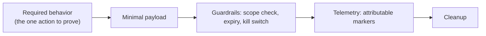

# 🧬 Payload Engineering & Obfuscation

> [!warning] Authorized adversary emulation only
> Authorized payloads are minimal, attributable, bounded, reversible, and built for *control measurement*. The lab uses a benign canary payload. Obfuscation is studied to understand detection limits — never to attack systems you don't own.

## Parent Learning Order
AV, EDR & Telemetry Evasion Testing -> Payload Engineering & Obfuscation -> Process Injection & Direct Syscalls

## Start at Zero: Building the Thing That Runs

The previous leaf measured what the endpoint *detects*; this one is the attacker's side — **engineering the payload** that carries the operation's action, and **obfuscating** it to test static detection. A red team payload is not "malware" in the criminal sense: it is minimal, attributable, guard-railed, reversible, and instrumented, because its purpose is to *measure a control*, not to cause harm. Obfuscation (encoding, encryption, packing, string transformation, staging) is the craft of changing how a payload *looks* so static signatures miss it — and its single most important lesson is a limitation: **obfuscation changes appearance, not behavior**, so it defeats signatures but not behavioral detection.

The professional discipline: an authorized payload carries **guardrails** (scope checks, expiry, kill switch), emits **telemetry**, and cleans up — the opposite of untraceable malware.

> [!tip] The analogy, and where it breaks
> Obfuscating a payload is like translating a suspicious letter into a rare language and sealing it in an innocent-looking envelope: the mail scanner (static AV) that only reads English waves it through. The analogy breaks at the destination: the recipient still has to *open and act on* the letter in plain language, and a guard watching the recipient's *actions* (behavioral EDR) sees the same suspicious deed regardless of what language it arrived in — so obfuscation buys delivery, never immunity.

**Prerequisites:** **AV, EDR & Telemetry Evasion Testing** (what detects payloads), **Shellcode Engineering** (bad chars/encoders), and scripting basics.

## Payload Engineering Principles

An authorized payload is designed backward from the *required behavior*:



- **Minimal** — do only what the objective needs (a canary action), nothing more.
- **Attributable & bounded** — carries markers so the blue team can tell it's the exercise; scoped so it can't run outside authorization.
- **Reversible + instrumented** — logs what it did and cleans up.

This is what separates a red team payload from real malware: **guardrails and attributability by design.**

## Obfuscation Techniques and Their One Limit

| Technique | Changes | Defeats | Does NOT defeat |
|---|---|---|---|
| **Encoding** (base64/hex) | Byte appearance | Naive string signatures | Decoded-content scanning (AMSI), behavior |
| **Encryption + stub** | All static content | Static signatures | Behavior; the decrypt stub itself can be signatured |
| **Packing** | On-disk form | File signatures | Runtime unpacking behavior (RWX, self-modify) |
| **String/API obfuscation** | Recognizable names | String/import signatures | Behavioral API monitoring |
| **Staging** | Payload size on disk | Size/content signatures | The network fetch + execution behavior |

Every row has the same right-hand column: **behavior**. This is the durable truth of payload engineering — you can always make a payload *look* different, but making it *behave* differently means it no longer does the job. Hence obfuscation is an arms race against *signatures*, which behavioral defense sidesteps.

## Failure Modes and Interpretation

- **Obfuscation ≠ evasion of EDR.** Beating static AV with encoding does nothing against behavioral detection — the most common misconception; test behavior separately.
- **The decoder/stub is signaturable.** A packer's unpack stub or a common encoder is itself a signature; "obfuscated" can still be caught by the *wrapper's* pattern.
- **Over-engineered payloads.** A huge, feature-rich payload has more behavior to detect and more to go wrong; minimal payloads are both stealthier and safer.
- **No guardrails = real malware.** A payload without scope checks/expiry/kill switch/attribution is indistinguishable from malicious code and is unsafe/unethical.
- **AMSI defeats disk obfuscation.** For scripts, on-disk encoding is scanned again *after decoding at runtime* — so disk obfuscation alone doesn't beat AMSI.

## Security Implications — the Defender's View

- **Behavioral detection is obfuscation-proof:** rules keyed on actions (decode-then-execute, RWX allocation, unusual child processes, staged fetches) catch payloads regardless of encoding — the strategic investment.
- **Signature the wrappers:** detecting common encoders, packers, and decoder stubs catches a large fraction of commodity obfuscation cheaply.
- **AMSI + script-block logging:** scanning decoded script content and logging full script blocks defeats on-disk script obfuscation.
- **Application allow-listing:** only approved binaries run, so a novel packed payload never executes — a strong structural control.
- **Detection tie-in:** entropy analysis (packed/encrypted files have high entropy) and staged-download patterns are additional signals.

## Authorized Lab: Obfuscate to Beat a Signature — but Not the Behavior

> [!info] Runs on one Linux machine — take a canary payload through encoding layers, prove each defeats a static signature while behavior (and a behavioral detector) is unchanged
> Benign canary throughout. Step 5 cleans up.

### Step 1 — A canary payload and its static signature

```bash
mkdir -p /tmp/pe-lab && cd /tmp/pe-lab
cat > payload.sh <<'EOF'
#!/bin/bash
echo "C2R-CANARY-PAYLOAD-EXECUTED"
EOF
chmod +x payload.sh
SIG='C2R-CANARY-PAYLOAD-EXECUTED'
grep -q "$SIG" payload.sh && echo "static-sig: DETECTED in raw payload"
```

```text
static-sig: DETECTED in raw payload
```

### Step 2 — Layer 1: base64 encode -> evades the static signature

```bash
cd /tmp/pe-lab
B64=$(base64 -w0 payload.sh)
printf 'echo %s | base64 -d | bash\n' "$B64" > stage_b64.sh
grep -q 'C2R-CANARY-PAYLOAD-EXECUTED' stage_b64.sh && echo "static-sig: DETECTED" || echo "static-sig: MISS (obfuscated)"
```

```text
static-sig: MISS (obfuscated)
```

### Step 3 — Layer 2: XOR-encrypt with a stub -> still evades static, stub is the tell

```bash
cd /tmp/pe-lab
python3 - <<'PY'
data=open('payload.sh','rb').read(); key=0x5a
enc=bytes(b^key for b in data).hex()
open('stage_xor.sh','w').write(
 'python3 -c "import sys;'
 'd=bytes.fromhex(\'%s\');'
 'open(\'/tmp/pe-lab/dec.sh\',\'wb\').write(bytes(b^0x5a for b in d))";'
 'bash /tmp/pe-lab/dec.sh\n' % enc)
print("static-sig in stage_xor.sh:", "DETECTED" if b"C2R-CANARY-PAYLOAD-EXECUTED" in open('stage_xor.sh','rb').read() else "MISS (encrypted)")
PY
```

```text
static-sig in stage_xor.sh: MISS (encrypted)
```

### Step 4 — Behavior is unchanged: it still runs, and a behavioral rule still catches it

```bash
cd /tmp/pe-lab
echo "--- both obfuscated variants still DO the same thing ---"
bash stage_b64.sh
echo "--- behavioral detector: decode/decrypt-then-execute pattern ---"
for f in stage_b64.sh stage_xor.sh; do
  grep -qE '(base64 -d|fromhex).*\|?.*(bash|exec|open)' "$f" && echo "$f: BEHAVIOR MATCH (decode->run) -> detected"
done
```

```text
--- both obfuscated variants still DO the same thing ---
C2R-CANARY-PAYLOAD-EXECUTED
--- behavioral detector: decode/decrypt-then-execute pattern ---
stage_b64.sh: BEHAVIOR MATCH (decode->run) -> detected
stage_xor.sh: BEHAVIOR MATCH (decode->run) -> detected
```

Every layer defeated the *static signature*, yet each still executed the canary **and** was caught by a behavioral rule keyed on "decode-then-execute" — the core, unavoidable limit of obfuscation.

### Step 5 — Cleanup

```bash
cd /; rm -rf /tmp/pe-lab; ls -d /tmp/pe-lab 2>&1 | tail -1
```

```text
ls: cannot access '/tmp/pe-lab': No such file or directory
```

**What you should now be able to do:** design a minimal, guard-railed, attributable authorized payload; apply encoding/encryption/packing/staging to defeat static signatures; and explain and demonstrate why obfuscation never changes behavior — so behavioral detection, AMSI, and allow-listing are the durable defenses.

## Crook → Operator → Root Checkpoint

- **Crook:** Explain what makes an authorized payload (minimal/attributable/guard-railed) different from malware, and what obfuscation does.
- **Operator:** Obfuscate a canary payload through encoding/encryption to beat a static signature, and show its behavior (and a behavioral detector) is unchanged.
- **Root:** Explain why obfuscation defeats signatures but never behavior, why decoder stubs/packers are themselves signaturable, and how behavioral detection, AMSI, entropy analysis, and allow-listing defend against engineered payloads.

---
> 🔼 Up: [[Evasion & Endpoint Tradecraft]]
