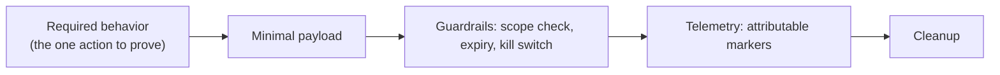

# 🧬 Payload Engineering & Obfuscation

> [!warning] Authorized adversary emulation only
> Authorized payloads are minimal, attributable, bounded, reversible, and built for *control measurement*. The lab uses a benign canary payload. Obfuscation is studied to understand detection limits — never to attack systems you don't own.

## Parent Learning Order
AV, EDR & Telemetry Evasion Testing -> Payload Engineering & Obfuscation -> Process Injection & Direct Syscalls

## Building the Thing That Runs

> *A red team payload and criminal malware perform the same actions. What makes one of them acceptable?*
>
> Hold your answer — the section below is the response.

The previous leaf measured what the endpoint *detects*; this one is the attacker's side — **engineering the payload** that carries the operation's action, and **obfuscating** it to test static detection. A red team payload is not "malware" in the criminal sense: it is minimal, attributable, guard-railed, reversible, and instrumented, because its purpose is to *measure a control*, not to cause harm. Obfuscation (encoding, encryption, packing, string transformation, staging) is the craft of changing how a payload *looks* so static signatures miss it — and its single most important lesson is a limitation: **obfuscation changes appearance, not behavior**, so it defeats signatures but not behavioral detection.

The professional discipline: an authorized payload carries **guardrails** (scope checks, expiry, kill switch), emits **telemetry**, and cleans up — the opposite of untraceable malware.

> [!tip] The analogy, and where it breaks
> Obfuscating a payload is like translating a suspicious letter into a rare language and sealing it in an innocent-looking envelope: the mail scanner (static AV) that only reads English waves it through. The analogy breaks at the destination: the recipient still has to *open and act on* the letter in plain language, and a guard watching the recipient's *actions* (behavioral EDR) sees the same suspicious deed regardless of what language it arrived in — so obfuscation buys delivery, never immunity.

**Prerequisites:** **AV, EDR & Telemetry Evasion Testing** (what detects payloads), **Shellcode Engineering** (bad chars/encoders), and scripting basics.

## Payload Engineering Principles

An authorized payload is designed backward from the *required behavior*:



- **Minimal** — do only what the objective needs (a canary action), nothing more.
- **Attributable & bounded** — carries markers so the blue team can tell it's the exercise; scoped so it can't run outside authorization.
- **Reversible + instrumented** — logs what it did and cleans up.

This is what separates a red team payload from real malware: **guardrails and attributability by design.**

## Obfuscation Techniques and Their One Limit

| Technique | Changes | Defeats | Does NOT defeat |
|---|---|---|---|
| **Encoding** (base64/hex) | Byte appearance | Naive string signatures | Decoded-content scanning (AMSI), behavior |
| **Encryption + stub** | All static content | Static signatures | Behavior; the decrypt stub itself can be signatured |
| **Packing** | On-disk form | File signatures | Runtime unpacking behavior (RWX, self-modify) |
| **String/API obfuscation** | Recognizable names | String/import signatures | Behavioral API monitoring |
| **Staging** | Payload size on disk | Size/content signatures | The network fetch + execution behavior |

Every row has the same right-hand column: **behavior**. This is the durable truth of payload engineering — you can always make a payload *look* different, but making it *behave* differently means it no longer does the job. Hence obfuscation is an arms race against *signatures*, which behavioral defense sidesteps.

## Worked Example: Obfuscation Defeats Signatures, Not Behaviour

The central limit of payload obfuscation is easy to state and easy to
demonstrate: you can change what a payload *looks like* freely, but not what it
*does*, and detection eventually keys on the latter.

**A payload and its signature.** The canary string is the thing a static scanner
matches:

```shell-session
analyst@lab:/tmp/pe-lab$ grep -q 'PAYLOAD-EXECUTED' payload.sh && echo "static sig: DETECTED"
static sig: DETECTED
```

**Layer 1 — base64.** The string is gone from the file:

```shell-session
analyst@lab:/tmp/pe-lab$ printf 'echo %s | base64 -d | bash\n' "$(base64 -w0 payload.sh)" > stage_b64.sh
analyst@lab:/tmp/pe-lab$ grep -q 'PAYLOAD-EXECUTED' stage_b64.sh && echo DETECTED || echo "MISS (encoded)"
MISS (encoded)
```

**Layer 2 — XOR with a decrypt stub.** Gone again, and this time not even
present as a decodable substring:

```shell-session
analyst@lab:/tmp/pe-lab$ grep -q 'PAYLOAD-EXECUTED' stage_xor.sh && echo DETECTED || echo "MISS (encrypted)"
MISS (encrypted)
```

Both layers defeat the signature completely. If detection stopped at "does the
sample contain the bad string", the attacker would have won at layer 1.

**But the behaviour is invariant**, because both variants must still do the
thing, and a rule keyed on the doing catches both:

```shell-session
analyst@lab:/tmp/pe-lab$ bash stage_b64.sh
PAYLOAD-EXECUTED
analyst@lab:/tmp/pe-lab$ for f in stage_b64.sh stage_xor.sh; do
>   grep -qE '(base64 -d|fromhex).*(bash|exec|open)' "$f" && echo "$f: decode-then-execute -> detected"
> done
stage_b64.sh: decode-then-execute -> detected
stage_xor.sh: decode-then-execute -> detected
```

Each layer added a decode step, and the decode-then-execute shape is itself the
signature — one that no amount of further encoding removes, because removing it
would remove the payload's ability to run. This is why detection engineering
migrated from content signatures to behavioural ones, and why an obfuscation-only
evasion strategy has a ceiling. The stub that unpacks the payload is the tell, and
every additional layer makes the file look less like data and more like a
decoder, which is itself anomalous.

The honest lesson for both sides: obfuscation buys time against static analysis
and nothing against a behavioural rule that watches what the payload does when it
runs.

## Why obfuscation does nothing to behavioural detection

- **Obfuscation ≠ evasion of EDR.** Beating static AV with encoding does nothing against behavioral detection — the most common misconception; test behavior separately.
- **The decoder/stub is signaturable.** A packer's unpack stub or a common encoder is itself a signature; "obfuscated" can still be caught by the *wrapper's* pattern.
- **Over-engineered payloads.** A huge, feature-rich payload has more behavior to detect and more to go wrong; minimal payloads are both stealthier and safer.
- **No guardrails = real malware.** A payload without scope checks/expiry/kill switch/attribution is indistinguishable from malicious code and is unsafe/unethical.
- **AMSI defeats disk obfuscation.** For scripts, on-disk encoding is scanned again *after decoding at runtime* — so disk obfuscation alone doesn't beat AMSI.

## Security Implications — the Defender's View

- **Behavioral detection is obfuscation-proof:** rules keyed on actions (decode-then-execute, RWX allocation, unusual child processes, staged fetches) catch payloads regardless of encoding — the strategic investment.
- **Signature the wrappers:** detecting common encoders, packers, and decoder stubs catches a large fraction of commodity obfuscation cheaply.
- **AMSI + script-block logging:** scanning decoded script content and logging full script blocks defeats on-disk script obfuscation.
- **Application allow-listing:** only approved binaries run, so a novel packed payload never executes — a strong structural control.
- **Detection tie-in:** entropy analysis (packed/encrypted files have high entropy) and staged-download patterns are additional signals.

## Summary

You should now be able to:

- Explain what makes an authorized payload (minimal/attributable/guard-railed) different from malware, and what obfuscation does.
- Obfuscate a canary payload through encoding/encryption to beat a static signature, and show its behavior (and a behavioral detector) is unchanged.
- Explain why obfuscation defeats signatures but never behavior, why decoder stubs/packers are themselves signaturable, and how behavioral detection, AMSI, entropy analysis, and allow-listing defend against engineered payloads.

---
> 🔼 Up: [[Evasion & Endpoint Tradecraft]]
