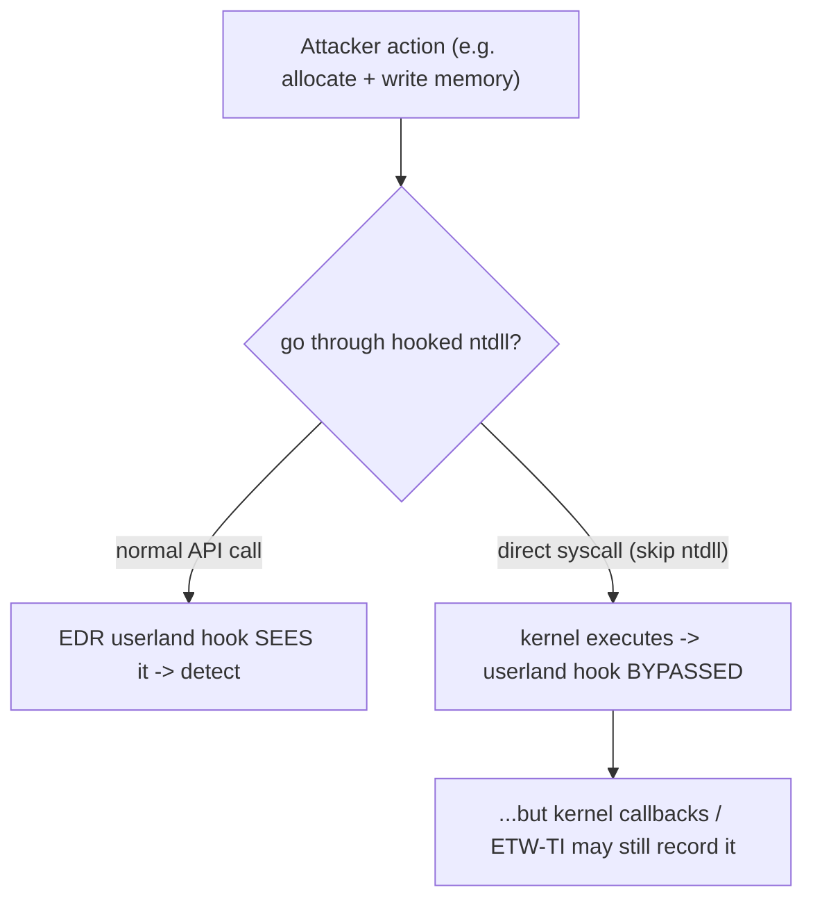

# 💉 Process Injection & Direct Syscalls

> [!warning] Authorized adversary emulation only
> The lab injects a benign `write` into a process *you started* using the same primitive (ptrace) a debugger uses. Injection and syscall tradecraft are studied to test EDR visibility — never applied to processes or systems you don't own.

## Parent Learning Order
AV, EDR & Telemetry Evasion Testing -> Payload Engineering & Obfuscation -> Process Injection & Direct Syscalls

## Start at Zero: Running Code Inside Another Process, Quietly

Two tradecraft techniques let attackers *act while evading behavioral detection*, and they are tightly linked. **Process injection** runs your code inside *another, trusted process* (explorer.exe, a browser) so the malicious activity appears to come from a legitimate program — evading process-lineage detection and blending in. **Direct syscalls** call the kernel *directly*, skipping the userland library functions that EDR **hooks** — so the EDR's inline instrumentation never sees the call. Together they are the heart of modern evasion tradecraft, and testing them measures whether the client's EDR sees past the disguise.

The unifying idea: **EDR mostly watches userland — the API calls and process relationships.** Injection changes *whose* process does the action; direct syscalls change *whether the watched API layer is involved at all*. Both aim to make malicious behavior invisible to a defense that's looking in the wrong place.

> [!tip] The analogy, and where it breaks
> Process injection is like a burglar wearing a delivery uniform and operating out of a trusted courier's van — the actions look like the courier's, not an intruder's. Direct syscalls are like bypassing the building's front desk (which logs every visitor) and using a service tunnel straight to the vault. The analogy breaks on the vault's own cameras: even if you skip the front desk (userland hooks), the *kernel* and its telemetry (ETW/kernel callbacks) can still record the deed — so direct syscalls evade the *hook*, not necessarily the kernel-level record.

**Prerequisites:** the OS Internals process/memory and Windows-internals leaves, **CPU, Assembly & the ABI** (syscalls), and **AV, EDR & Telemetry Evasion Testing** (what EDR hooks).

## Process Injection: Techniques

Injection means writing code/data into another process and getting it to execute:

| Technique | Mechanism (Windows) | Linux analogue |
|---|---|---|
| **Remote thread** | `VirtualAllocEx` + `WriteProcessMemory` + `CreateRemoteThread` | `ptrace` + write to `/proc/pid/mem` |
| **DLL injection** | Load a malicious DLL into the target | `LD_PRELOAD` / `dlopen` in target |
| **Process hollowing** | Start a legit process suspended, replace its image | replace mapping before exec |
| **APC injection** | Queue an async procedure call to a thread | signal/handler abuse |

The point of all of them: **the malicious action now runs under a trusted process's identity**, defeating detections based on "which process did this." Process hollowing is especially deceptive — the process *is* the legitimate one by name and path, but its code was swapped.

## Direct Syscalls: Bypassing the Hook

EDR commonly instruments by **hooking** functions in `ntdll.dll` (Windows) — it rewrites the start of `NtAllocateVirtualMemory`, etc., to jump into the EDR first. A **direct syscall** skips the hooked function and issues the `syscall` instruction itself (with the right syscall number in a register), so the EDR's userland hook is never traversed.



The arms race: EDR moved to **kernel callbacks** and **ETW Threat Intelligence** precisely because userland hooks are bypassable — so direct syscalls evade the hook but not necessarily the kernel-level telemetry.

## Failure Modes and Interpretation

- **Injection still leaves signals.** `CreateRemoteThread`/cross-process writes and ptrace-attach are themselves suspicious events on a good EDR — injection blends the *action* but the *injection act* is detectable.
- **Direct syscalls ≠ invisible.** They bypass userland hooks, but kernel callbacks, ETW-TI, and the *anomaly of a non-ntdll syscall* can still catch them.
- **Version/offset fragility.** Direct-syscall stubs need correct syscall numbers (which change across OS versions); process-hollowing needs exact image layout — brittle across targets.
- **Target-process stability.** Injecting into a critical process can crash it (and the machine); choose targets carefully in a lab.
- **ptrace/permissions.** On Linux, `ptrace_scope` may block attaching to non-child processes; injection needs the right privileges.

## Security Implications — the Defender's View

- **Watch the injection primitives:** cross-process memory writes, remote thread creation, `ptrace` attaches, and suspended-process image swaps are high-fidelity signals — detecting the *act of injecting* beats trying to spot the injected code.
- **Kernel-level telemetry over userland hooks:** because hooks are bypassable, mature EDR uses kernel callbacks + ETW-TI, which direct syscalls don't evade — invest there.
- **Detect syscall anomalies:** a `syscall` instruction originating outside `ntdll` (Windows) or unusual direct syscalls is itself an indicator.
- **Process integrity & CFG/CET:** control-flow integrity and protected processes make hollowing/injection harder; least privilege limits what a foothold can inject into.

## Authorized Lab: Inject a Benign Action into a Running Process (ptrace)

> [!info] Runs on one Linux machine with gcc + gdb — inject a benign `write` into a process YOU started, using ptrace (the same primitive a debugger and an injector use)
> Requires permission to ptrace your own child (default). Step 5 cleans up.

### Step 1 — Start a benign long-running target with a captured stdout

```bash
mkdir -p /tmp/inj-lab && cd /tmp/inj-lab
cat > target.c <<'EOF'
#include <unistd.h>
int main(void){ for(;;) pause(); return 0; }   // idle; does nothing on its own
EOF
gcc target.c -o target
./target > out.txt 2>&1 & TPID=$!
echo "target running as PID $TPID; its stdout -> out.txt (currently empty)"
sleep 1; echo "out.txt so far: [$(cat out.txt)]"
```

```text
target running as PID <pid>; its stdout -> out.txt (currently empty)
out.txt so far: []
```

### Step 2 — Inject a benign write() into the target via ptrace (gdb)

```bash
cd /tmp/inj-lab
gdb -q -p "$TPID" -batch \
  -ex 'call (int)write(1, "C2R-CANARY-INJECTED\n", 20)' \
  -ex detach 2>/dev/null
echo "injection issued"
```

```text
injection issued
```

### Step 3 — Prove the code ran INSIDE the target process

```bash
cd /tmp/inj-lab
sleep 1; echo "target's own stdout now contains: [$(cat out.txt)]"
```

```text
target's own stdout now contains: [C2R-CANARY-INJECTED]
```

The `target` process — which only calls `pause()` and never writes anything itself — emitted the canary, because we made *its* thread execute `write()` via ptrace. The action came from a trusted process's identity: that is process injection. (`ptrace(PTRACE_ATTACH)` is exactly the signal a Linux EDR watches, just as `CreateRemoteThread` is on Windows.)

### Step 4 — Direct syscall vs library call (the hook-bypass idea)

```bash
cd /tmp/inj-lab
echo "EDR hooks the LIBRARY layer (ntdll/libc). Compare where a call is visible:"
strace -f -e trace=write bash -c 'echo via-libc >/dev/null' 2>&1 | grep -m1 write
echo "^ a normal write() traverses libc (hookable). A DIRECT 'syscall' instruction with rax=1 would hit the kernel"
echo "  without calling libc's write() at all -> a userland EDR hook on write() never fires (but kernel/ETW-TI may still see it)."
```

```text
write(1, "via-libc\n", 9)               = 9
^ a normal write() traverses libc (hookable). A DIRECT 'syscall' instruction with rax=1 would hit the kernel
  without calling libc's write() at all -> a userland EDR hook on write() never fires (but kernel/ETW-TI may still see it).
```

### Step 5 — Cleanup

```bash
cd /tmp/inj-lab; kill "$TPID" 2>/dev/null
cd /; rm -rf /tmp/inj-lab; ls -d /tmp/inj-lab 2>&1 | tail -1
```

```text
ls: cannot access '/tmp/inj-lab': No such file or directory
```

**What you should now be able to do:** explain the process-injection techniques and why they blend malicious action into a trusted process, demonstrate cross-process code execution via ptrace, explain how direct syscalls bypass userland EDR hooks (and why kernel telemetry still sees them), and name the injection-primitive and kernel-telemetry defenses.

## Crook → Operator → Root Checkpoint

- **Crook:** Explain why running code inside another process evades process-lineage detection, and what a syscall is.
- **Operator:** Inject a benign action into a running process via ptrace, and explain how direct syscalls skip userland EDR hooks.
- **Root:** Explain why the injection *act* (remote thread/ptrace/hollowing) is itself detectable, why EDR moved to kernel callbacks/ETW-TI because userland hooks are bypassable, and how CFI/protected-processes/least-privilege defend against injection.

---
> 🔼 Up: [[Evasion & Endpoint Tradecraft]]
