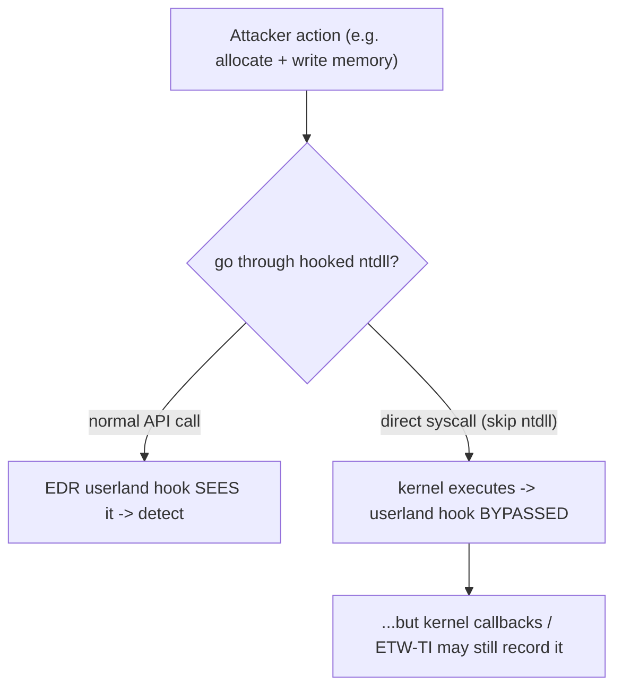

# 💉 Process Injection & Direct Syscalls

> [!warning] Authorized adversary emulation only
> The lab injects a benign `write` into a process *you started* using the same primitive (ptrace) a debugger uses. Injection and syscall tradecraft are studied to test EDR visibility — never applied to processes or systems you don't own.

## Parent Learning Order
AV, EDR & Telemetry Evasion Testing -> Payload Engineering & Obfuscation -> Process Injection & Direct Syscalls

## Running Code Inside Another Process, Quietly

Two tradecraft techniques let attackers *act while evading behavioral detection*, and they are tightly linked. **Process injection** runs your code inside *another, trusted process* (explorer.exe, a browser) so the malicious activity appears to come from a legitimate program — evading process-lineage detection and blending in. **Direct syscalls** call the kernel *directly*, skipping the userland library functions that EDR **hooks** — so the EDR's inline instrumentation never sees the call. Together they are the heart of modern evasion tradecraft, and testing them measures whether the client's EDR sees past the disguise.

The unifying idea: **EDR mostly watches userland — the API calls and process relationships.** Injection changes *whose* process does the action; direct syscalls change *whether the watched API layer is involved at all*. Both aim to make malicious behavior invisible to a defense that's looking in the wrong place.

> [!tip] The analogy, and where it breaks
> Process injection is like a burglar wearing a delivery uniform and operating out of a trusted courier's van — the actions look like the courier's, not an intruder's. Direct syscalls are like bypassing the building's front desk (which logs every visitor) and using a service tunnel straight to the vault. The analogy breaks on the vault's own cameras: even if you skip the front desk (userland hooks), the *kernel* and its telemetry (ETW/kernel callbacks) can still record the deed — so direct syscalls evade the *hook*, not necessarily the kernel-level record.

**Prerequisites:** the OS Internals process/memory and Windows-internals leaves, **CPU, Assembly & the ABI** (syscalls), and **AV, EDR & Telemetry Evasion Testing** (what EDR hooks).

## Process Injection: Techniques

Injection means writing code/data into another process and getting it to execute:

| Technique | Mechanism (Windows) | Linux analogue |
|---|---|---|
| **Remote thread** | `VirtualAllocEx` + `WriteProcessMemory` + `CreateRemoteThread` | `ptrace` + write to `/proc/pid/mem` |
| **DLL injection** | Load a malicious DLL into the target | `LD_PRELOAD` / `dlopen` in target |
| **Process hollowing** | Start a legit process suspended, replace its image | replace mapping before exec |
| **APC injection** | Queue an async procedure call to a thread | signal/handler abuse |

The point of all of them: **the malicious action now runs under a trusted process's identity**, defeating detections based on "which process did this." Process hollowing is especially deceptive — the process *is* the legitimate one by name and path, but its code was swapped.

## Direct Syscalls: Bypassing the Hook

EDR commonly instruments by **hooking** functions in `ntdll.dll` (Windows) — it rewrites the start of `NtAllocateVirtualMemory`, etc., to jump into the EDR first. A **direct syscall** skips the hooked function and issues the `syscall` instruction itself (with the right syscall number in a register), so the EDR's userland hook is never traversed.



The arms race: EDR moved to **kernel callbacks** and **ETW Threat Intelligence** precisely because userland hooks are bypassable — so direct syscalls evade the hook but not necessarily the kernel-level telemetry.

## Worked Example: Making Another Process Do the Work

Process injection is valuable to an attacker for one reason: the action then
carries a trusted process's identity, not the attacker's. A benign demonstration
with `ptrace` shows the mechanism without any malware.

**The target does nothing on its own** — it idles in `pause()` and never writes
anything:

```c
#include <unistd.h>
int main(void){ for(;;) pause(); return 0; }
```

```shell-session
analyst@lab:/tmp/inj-lab$ ./target > out.txt 2>&1 & echo "PID $!"
PID 20481
analyst@lab:/tmp/inj-lab$ cat out.txt
```

`out.txt` is empty, and will stay empty for as long as the process runs itself.

**The injection** attaches to the running process and makes *its* thread call
`write`:

```shell-session
analyst@lab:/tmp/inj-lab$ gdb -q -p 20481 -batch \
    -ex 'call (int)write(1, "INJECTED\n", 9)' -ex detach
analyst@lab:/tmp/inj-lab$ cat out.txt
INJECTED
```

The string appeared on `target`'s own stdout. `target` has no `write` in its
source and never called one — the byte came out of its file descriptor because
its thread was made to execute the call. That is the whole idea: to any monitor
watching outputs, the write came from `target`, a process with its own history,
parentage and reputation, not from `gdb` or the attacker.

`ptrace(PTRACE_ATTACH)` is the Linux primitive here, and it is exactly the signal
a Linux EDR watches for — as `CreateRemoteThread`, `QueueUserAPC` and
`WriteProcessMemory` are on Windows. The technique is not quiet; its value is the
borrowed identity, paid for with a very noisy syscall.

**Direct syscalls** are the response to that noise, and the reason they work is a
layering fact:

```shell-session
analyst@lab:/tmp/inj-lab$ strace -f -e trace=write bash -c 'echo hi >/dev/null'
write(1, "hi\n", 3)                     = 3
```

A normal `write` travels through libc (on Windows, through `ntdll`), and that
library layer is precisely where a userland EDR installs its hooks. An attacker
who instead emits the raw `syscall` instruction with the write number in `rax`
reaches the kernel without ever calling the hooked function, so a userland hook
on `write` never fires. The catch, and the reason this is an arms race rather than
a win, is that the kernel still sees the syscall — kernel callbacks and, on
Windows, ETW Threat Intelligence observe the transition the userland hook missed.

## Injection blends the action, not the act

- **Injection still leaves signals.** `CreateRemoteThread`/cross-process writes and ptrace-attach are themselves suspicious events on a good EDR — injection blends the *action* but the *injection act* is detectable.
- **Direct syscalls ≠ invisible.** They bypass userland hooks, but kernel callbacks, ETW-TI, and the *anomaly of a non-ntdll syscall* can still catch them.
- **Version/offset fragility.** Direct-syscall stubs need correct syscall numbers (which change across OS versions); process-hollowing needs exact image layout — brittle across targets.
- **Target-process stability.** Injecting into a critical process can crash it (and the machine); choose targets carefully in a lab.
- **ptrace/permissions.** On Linux, `ptrace_scope` may block attaching to non-child processes; injection needs the right privileges.

## Security Implications — the Defender's View

- **Watch the injection primitives:** cross-process memory writes, remote thread creation, `ptrace` attaches, and suspended-process image swaps are high-fidelity signals — detecting the *act of injecting* beats trying to spot the injected code.
- **Kernel-level telemetry over userland hooks:** because hooks are bypassable, mature EDR uses kernel callbacks + ETW-TI, which direct syscalls don't evade — invest there.
- **Detect syscall anomalies:** a `syscall` instruction originating outside `ntdll` (Windows) or unusual direct syscalls is itself an indicator.
- **Process integrity & CFG/CET:** control-flow integrity and protected processes make hollowing/injection harder; least privilege limits what a foothold can inject into.

## Summary

You should now be able to:

- Explain why running code inside another process evades process-lineage detection, and what a syscall is.
- Inject a benign action into a running process via ptrace, and explain how direct syscalls skip userland EDR hooks.
- Explain why the injection *act* (remote thread/ptrace/hollowing) is itself detectable, why EDR moved to kernel callbacks/ETW-TI because userland hooks are bypassable, and how CFI/protected-processes/least-privilege defend against injection.

---
> 🔼 Up: [[Evasion & Endpoint Tradecraft]]
