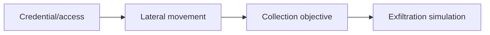

# Lateral Operations & Objectives

## 🗺️ Zero-to-Mastery Learning Path

1. [[Red Team Credential Access & Lateral Movement]]
2. [[Data Collection & Exfiltration Simulation]]

---
> 🔼 Up: [[Red Team Operations]]
