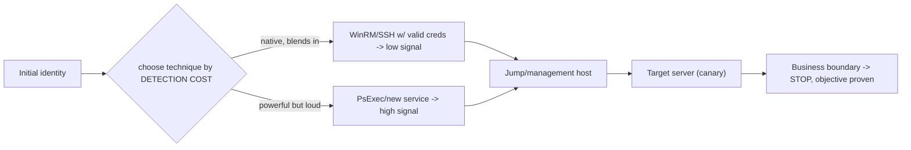

# 🕵️ Red Team Credential Access & Lateral Movement

> [!warning] Authorized adversary emulation only
> Use seeded credentials, canary hosts, and one bounded path. Never retain real recovered secrets when metadata proves exposure. The point is measuring detection and identity/trust protections — not maximizing reach.

## Parent Learning Order
Red Team Credential Access & Lateral Movement -> Data Collection & Exfiltration Simulation

## The Same Moves as Post-Ex, but Measured for Stealth

A red team's mid-operation work is credential access (harvest keys to the next system) and lateral movement (use them to get there) — the same *actions* as the pentest **Credential Access & Secret Hunting** and **Pivoting & Tunneling** leaves. What makes this a distinct, red-team note is the **objective**: here you don't just prove the path exists, you measure *whether the blue team detects it* and *how much noise each technique makes*. A pentest maximizes coverage; a red team operates like a real adversary — quiet, targeted, living off the land — precisely so the exercise tests the SOC's ability to catch a *stealthy* actor.

The defining idea: **every credential-access and lateral-movement technique has a detection cost**, and red team tradecraft is choosing the technique that achieves the objective with the least, most-plausible telemetry — turning the operation into a test of detection sensitivity.

> [!tip] The analogy, and where it breaks
> Pentest credential/lateral work is like a locksmith testing every door and logging which open; the red team version is a cat burglar who *already knows* a door opens and instead measures whether the guards notice them slip through at 3 a.m. The analogy breaks on cooperation: a real burglar hides their success forever, whereas the red team *reveals* the quiet path to the blue team afterward — the stealth exists to prove the guards' blind spot, then hand them the fix.

**Prerequisites:** the Post-Ex **Credential Access & Secret Hunting** and **Pivoting & Tunneling** leaves (the mechanics), **Kerberos & NTLM Attacks** (PtH/tokens), and **AV, EDR & Telemetry Evasion Testing** (detection layers).

## Credential Access, Measured

Red team credential access validates memory/vault/file/token/service-account/cloud/directory protections *and* their telemetry:

| Access path | Loud version | Quiet version |
|---|---|---|
| Files/config | Mass filesystem grep | Targeted read of a known path |
| Memory (LSASS) | Full LSASS dump | Selective/handle-minimizing access |
| Tokens | Broad enumeration | Reuse an existing token |
| Directory | Bulk LDAP pull | Narrow, scoped query |

You **measure**: access prevention, sensor telemetry generated, identity-provider signals, and time-to-detect — then hand the blue team both the *path* and the *detection gap*. Recovered secrets are noted for rotation, not retained.

## Lateral Movement, Measured

Lateral movement validates identity and management-trust using approved protocols against canary hosts, **one bounded path at a time**:



Techniques (SMB, WinRM, RDP, SSH, remote service/task, app administration, cloud management) differ in authentication, authorization, and — crucially — **detectability**. Preferring **native, authenticated administration** (living off the land) over noisy tools (a new service, PsExec) is the red-team choice, because it blends into legitimate admin traffic and tests whether the SOC can tell them apart.

## Worked Example: The Same Objective, Loud and Quiet

In a red-team operation, reaching the objective is rarely the hard part — reaching
it without generating the telemetry that ends the engagement is. The difference
between a loud and a quiet approach to the same credential is measurable, and a
small file tree with an access log makes it so. One file holds the objective; the
rest are decoys.

**The loud approach** sweeps for anything that looks like a secret:

```shell-session
operator@lab:/tmp/rtcl-lab$ grep -rl 'password\|note' . | while read f; do echo "access $f" >> access.log; done
operator@lab:/tmp/rtcl-lab$ grep -c '^access' access.log
6
```

Six file reads to find one credential. The sweep works — it will find the target —
but it touches every sensitive-looking file in the tree, and each read is an event
some monitor can see. On a real host this is `find / -name '*.conf'` and its
relatives: comprehensive, and exactly the pattern detection is tuned for.

**The quiet approach** reads only the path the operator already identified:

```shell-session
operator@lab:/tmp/rtcl-lab$ cat opt/config.ini >/dev/null; echo "access opt/config.ini" >> access.log
operator@lab:/tmp/rtcl-lab$ grep -c '^access' access.log
1
```

One read. Same credential obtained. The prerequisite — knowing where to look —
was paid earlier, in reconnaissance, so the acquisition itself is a single
in-context file access indistinguishable from normal use.

**What a simple detector does with each** is the whole point:

```shell-session
operator@lab:/tmp/rtcl-lab$ echo "rule: >3 sensitive reads in a short window = credential-sweep alert"
operator@lab:/tmp/rtcl-lab$ # loud run: 6 reads -> ALERT ;  quiet run: 1 read -> under threshold -> silent
```

The loud sweep trips a volume threshold; the quiet read stays under it. That gap
is the finding, and note which direction it points: the alert exists and works
against the noisy technique, and the deficiency is the *absence* of low-volume
detection — a single anomalous read of a credential file by a process that has no
business opening it. The report's value to the defender is not "we got the
password" but "the noisy path is caught and the targeted one is not; here is the
low-and-slow behaviour your detection does not cover." That framing turns an
attack into a detection-engineering requirement, which is what a mature red team
delivers.

## Why the red team takes the quiet path, not every path

- **Optimizing reach over measurement.** Grabbing every credential and hopping everywhere is pentest behavior; the red team picks the quiet path to test detection, then stops at the objective.
- **Loud techniques when quiet ones suffice.** Dumping all of LSASS or spraying broadly generates high-signal telemetry unnecessarily — match the technique to the objective and the detection question.
- **Retaining real secrets.** Note exposure with metadata; do not keep real recovered credentials — rotation is the client's follow-up.
- **Ignoring identity telemetry.** Lateral movement leaves authentication trails (unusual logon types, source hosts); a technique "worked" is not the same as "undetected" — capture the blue-team timeline.
- **Unbounded paths.** Multiple simultaneous lateral paths make the exercise noisy and hard to score; one bounded path per objective.

## Security Implications — the Defender's View

- **Identity is the battleground:** unusual logon types, service-account interactive logons, PtH patterns (NTLM where Kerberos is expected), and impossible-travel/unusual-source authentications are the highest-value detections.
- **Least privilege + tiering** limit what any harvested credential can reach — the structural defense that makes each quiet move buy less.
- **Credential hygiene:** LAPS (unique local admin), managed/gMSA service accounts, and Credential Guard remove the reusable secrets lateral movement depends on.
- **LOTL detection:** because red teams prefer native tools, detections must distinguish *malicious* WinRM/SSH/admin use from legitimate — behavioral baselining and just-in-time admin help.
- **The exercise's deliverable:** a per-technique detection-coverage outcome (which credential-access and lateral moves were caught, and how fast) that directly drives detection engineering.

## Summary

You should now be able to:

- Explain why the red team version of credential access/lateral movement optimizes stealth and measurement, not reach.
- Choose credential-access and lateral techniques by detection cost, take one bounded path, and capture the loud-vs-quiet telemetry difference.
- Explain why identity telemetry (logon types, PtH, unusual sources) is the key detection, how least privilege/tiering/credential-hygiene limit reach, and why LOTL forces behavioral (not signature) detection.

---
> 🔼 Up: [[Lateral Operations & Objectives]]
