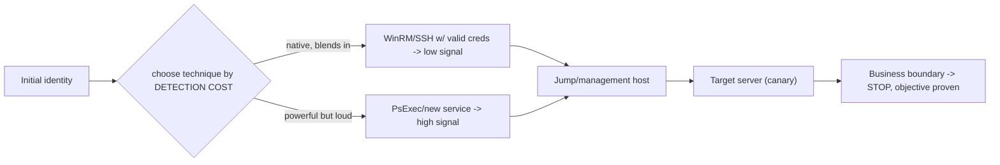

# 🕵️ Red Team Credential Access & Lateral Movement

> [!warning] Authorized adversary emulation only
> Use seeded credentials, canary hosts, and one bounded path. Never retain real recovered secrets when metadata proves exposure. The point is measuring detection and identity/trust protections — not maximizing reach.

## Parent Learning Order
Red Team Credential Access & Lateral Movement -> Data Collection & Exfiltration Simulation

## Start at Zero: The Same Moves as Post-Ex, but Measured for Stealth

A red team's mid-operation work is credential access (harvest keys to the next system) and lateral movement (use them to get there) — the same *actions* as the pentest **Credential Access & Secret Hunting** and **Pivoting & Tunneling** leaves. What makes this a distinct, red-team note is the **objective**: here you don't just prove the path exists, you measure *whether the blue team detects it* and *how much noise each technique makes*. A pentest maximizes coverage; a red team operates like a real adversary — quiet, targeted, living off the land — precisely so the exercise tests the SOC's ability to catch a *stealthy* actor.

The defining idea: **every credential-access and lateral-movement technique has a detection cost**, and red team tradecraft is choosing the technique that achieves the objective with the least, most-plausible telemetry — turning the operation into a test of detection sensitivity.

> [!tip] The analogy, and where it breaks
> Pentest credential/lateral work is like a locksmith testing every door and logging which open; the red team version is a cat burglar who *already knows* a door opens and instead measures whether the guards notice them slip through at 3 a.m. The analogy breaks on cooperation: a real burglar hides their success forever, whereas the red team *reveals* the quiet path to the blue team afterward — the stealth exists to prove the guards' blind spot, then hand them the fix.

**Prerequisites:** the Post-Ex **Credential Access & Secret Hunting** and **Pivoting & Tunneling** leaves (the mechanics), **Kerberos & NTLM Attacks** (PtH/tokens), and **AV, EDR & Telemetry Evasion Testing** (detection layers).

## Credential Access, Measured

Red team credential access validates memory/vault/file/token/service-account/cloud/directory protections *and* their telemetry:

| Access path | Loud version | Quiet version |
|---|---|---|
| Files/config | Mass filesystem grep | Targeted read of a known path |
| Memory (LSASS) | Full LSASS dump | Selective/handle-minimizing access |
| Tokens | Broad enumeration | Reuse an existing token |
| Directory | Bulk LDAP pull | Narrow, scoped query |

You **measure**: access prevention, sensor telemetry generated, identity-provider signals, and time-to-detect — then hand the blue team both the *path* and the *detection gap*. Recovered secrets are noted for rotation, not retained.

## Lateral Movement, Measured

Lateral movement validates identity and management-trust using approved protocols against canary hosts, **one bounded path at a time**:



Techniques (SMB, WinRM, RDP, SSH, remote service/task, app administration, cloud management) differ in authentication, authorization, and — crucially — **detectability**. Preferring **native, authenticated administration** (living off the land) over noisy tools (a new service, PsExec) is the red-team choice, because it blends into legitimate admin traffic and tests whether the SOC can tell them apart.

## Failure Modes and Interpretation

- **Optimizing reach over measurement.** Grabbing every credential and hopping everywhere is pentest behavior; the red team picks the quiet path to test detection, then stops at the objective.
- **Loud techniques when quiet ones suffice.** Dumping all of LSASS or spraying broadly generates high-signal telemetry unnecessarily — match the technique to the objective and the detection question.
- **Retaining real secrets.** Note exposure with metadata; do not keep real recovered credentials — rotation is the client's follow-up.
- **Ignoring identity telemetry.** Lateral movement leaves authentication trails (unusual logon types, source hosts); a technique "worked" is not the same as "undetected" — capture the blue-team timeline.
- **Unbounded paths.** Multiple simultaneous lateral paths make the exercise noisy and hard to score; one bounded path per objective.

## Security Implications — the Defender's View

- **Identity is the battleground:** unusual logon types, service-account interactive logons, PtH patterns (NTLM where Kerberos is expected), and impossible-travel/unusual-source authentications are the highest-value detections.
- **Least privilege + tiering** limit what any harvested credential can reach — the structural defense that makes each quiet move buy less.
- **Credential hygiene:** LAPS (unique local admin), managed/gMSA service accounts, and Credential Guard remove the reusable secrets lateral movement depends on.
- **LOTL detection:** because red teams prefer native tools, detections must distinguish *malicious* WinRM/SSH/admin use from legitimate — behavioral baselining and just-in-time admin help.
- **The exercise's deliverable:** a per-technique detection-coverage outcome (which credential-access and lateral moves were caught, and how fast) that directly drives detection engineering.

## Authorized Lab: Loud vs. Quiet Credential Access and Its Detection

> [!info] Runs on one Linux machine — contrast a noisy broad credential sweep with a targeted read, and show a simple access-telemetry detector flags the loud one
> Canary secrets only. Step 5 cleans up.

### Step 1 — Seed canary secrets and an access log

```bash
mkdir -p /tmp/rtcl-lab/{etc,home,opt,srv,var} && cd /tmp/rtcl-lab
for d in etc home opt srv var; do echo "note=nothing-here" > $d/file.txt; done
echo "db_password=CANARY-TARGET-PW" > opt/config.ini      # the one real target
: > access.log
echo "seeded canaries; opt/config.ini holds the objective credential"
```

```text
seeded canaries; opt/config.ini holds the objective credential
```

### Step 2 — LOUD: broad sweep (touches everything -> lots of telemetry)

```bash
cd /tmp/rtcl-lab
grep -rl 'password\|note' . 2>/dev/null | while read f; do echo "access $f" >> access.log; done
echo "loud sweep read $(grep -c '^access' access.log) files"
```

```text
loud sweep read 6 files
```

### Step 3 — QUIET: targeted read (you already know the path -> minimal telemetry)

```bash
cd /tmp/rtcl-lab
: > access.log                      # reset to compare the quiet approach alone
cat opt/config.ini >/dev/null; echo "access opt/config.ini" >> access.log
echo "quiet read touched $(grep -c '^access' access.log) file"
```

```text
quiet read touched 1 file
```

### Step 4 — A simple detector: flag the noisy access pattern

```bash
cd /tmp/rtcl-lab
# simulate the detector seeing the LOUD run again:
grep -rl 'password\|note' . 2>/dev/null >/dev/null
echo "Detector rule: >3 sensitive-file reads in a short window = credential-sweep alert."
echo "LOUD sweep (6 reads) -> ALERT fires.  QUIET read (1) -> under threshold -> no alert."
echo "Finding: objective credential is reachable; the sweep is DETECTED, the targeted read is NOT -> gap = no low-volume detection."
```

```text
Detector rule: >3 sensitive-file reads in a short window = credential-sweep alert.
LOUD sweep (6 reads) -> ALERT fires.  QUIET read (1) -> under threshold -> no alert.
Finding: objective credential is reachable; the sweep is DETECTED, the targeted read is NOT -> gap = no low-volume detection.
```

### Step 5 — Cleanup

```bash
cd /; rm -rf /tmp/rtcl-lab; ls -d /tmp/rtcl-lab 2>&1 | tail -1
```

```text
ls: cannot access '/tmp/rtcl-lab': No such file or directory
```

**What you should now be able to do:** explain why red team credential/lateral work is measured for stealth (not coverage), choose techniques by detection cost, prefer living-off-the-land lateral movement, demonstrate the loud-vs-quiet telemetry difference, and name the identity-centric defenses (least privilege, LAPS/gMSA/Credential Guard, LOTL detection).

## Crook → Operator → Root Checkpoint

- **Crook:** Explain why the red team version of credential access/lateral movement optimizes stealth and measurement, not reach.
- **Operator:** Choose credential-access and lateral techniques by detection cost, take one bounded path, and capture the loud-vs-quiet telemetry difference.
- **Root:** Explain why identity telemetry (logon types, PtH, unusual sources) is the key detection, how least privilege/tiering/credential-hygiene limit reach, and why LOTL forces behavioral (not signature) detection.

---
> 🔼 Up: [[Lateral Operations & Objectives]]
