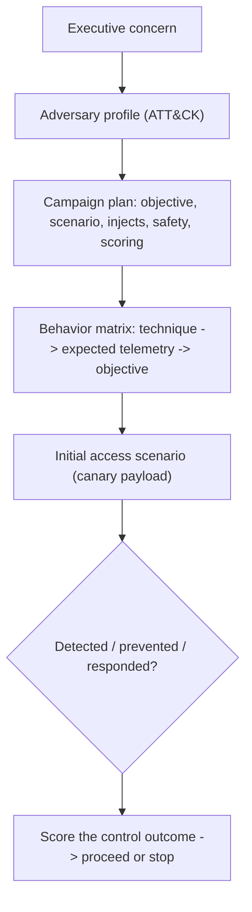

# 🎬 Red Team Campaign Planning & Initial Access

> [!warning] Authorized adversary emulation only
> A red team campaign runs under explicit authorization, a white team, deconfliction, and stop conditions. Initial access uses canary payloads and approved cohorts — never real malware or uncontrolled credential harvesting. Success is a *measured control outcome*, not merely getting in.

## Parent Learning Order
Red Team Campaign Planning & Initial Access -> C2 Infrastructure & Operational Security -> Evasion & Endpoint Tradecraft -> Lateral Operations & Objectives -> Cloud Red Team Operations

## Designing an Operation, Then Getting In

> *Your operation ran for three weeks and nobody detected a thing. Was it a success?*
>
> Hold your answer — the section below is the response.

A red team campaign is not "hack the client stealthily." It is a **planned, threat-informed operation** that tests whether the organization's detection and response can catch a *specific* adversary pursuing a *specific* objective. This note covers the two front-end disciplines: **campaign planning** (translating an executive concern into a scoped, safe, measurable operation) and **initial access** (the authorized, canary-based methods of establishing the first foothold). They belong together because the plan *defines* which initial-access scenario is in play, its safety rails, and how its outcome will be measured.

The defining principle, which separates a professional red team from a criminal: **everything is transparent to the white team and measured against the defenders' response** — the goal is to *exercise and improve the blue team*, not to win a game of hide-and-seek.

> [!tip] The analogy, and where it breaks
> A red team campaign is like a hospital running a surprise emergency drill: leadership authorizes it, a controller (white team) watches safely from the side, and the point is to measure whether the staff and alarms respond correctly — not to actually harm a patient. The analogy breaks on realism: a drill is obviously fake, whereas a red team's initial access must be *realistic enough to genuinely test controls* (a convincing phish, a real exposed service) while remaining perfectly safe — that tension, realistic-yet-harmless, is the whole craft.

**Prerequisites:** **Threat Modeling & MITRE ATT&CK** (choosing the adversary/behaviors), **Rules of Engagement & Scoping** (authorization/safety), and the **Guided Red Team & Purple Team Operation** walkthrough.

**The deliberate break:** a red team is a stealthier penetration test — same activity, better tradecraft, quieter tools.

They measure different things, and that changes what "success" means. A penetration test measures the **estate**: how many exploitable weaknesses exist, so they can be fixed. A red team measures the **defenders**: whether this organisation's people, process and tooling detect and respond to a realistic adversary. The deliverable is not a list of holes, it is a scored account of what was seen, when, by whom, and what happened next.

Which produces the counterintuitive rule: an operation optimised for *not getting caught* has failed at its purpose. If you evade everything and nobody ever notices, you have learned that one path was undetected and nothing about the response capability the client is paying to assess. The plan must therefore state, up front, which behaviours you will emit deliberately so the blue team has something to catch.

**How you'd spot a plan that has drifted:** it lists techniques and no expected detections. A campaign plan without a behaviour matrix — what we will do, where it should be seen — is a pentest wearing a red team's vocabulary.

## Campaign Planning: From Concern to Measurable Operation

A plan translates a business concern into a bounded, scored operation. The essential elements:

| Element | Purpose |
|---|---|
| **Objective** | The business question ("can contractor creds reach the code repo undetected?") |
| **Adversary profile** | The threat you emulate (ATT&CK-mapped behaviors) |
| **Assumed access / scenario** | Where the operation starts (external, assumed-breach, supplied creds) |
| **Injects** | Controlled events the white team introduces to test branches |
| **Safety & deconfliction** | Stop conditions, white-team contact, authenticated deconfliction phrase |
| **Scoring** | Prevention / detection / response metrics per behavior |
| **Teardown** | How every artifact is removed at the end |

The heart of the plan is a **behavior matrix**: each emulated behavior mapped to its ATT&CK technique, the *expected telemetry*, and the business objective it serves. That matrix is what turns "we did red team stuff" into "we tested these 12 techniques; the SOC caught 7."

## Initial Access: Realistic, Canary-Based Footholds

Initial access is *how the first foothold is established*, chosen to match the adversary profile:

| Scenario | Emulates |
|---|---|
| **Approved phishing** | Commodity/targeted email intrusion |
| **Exposed application** | External attacker over the perimeter |
| **Supplied credentials / assumed breach** | Insider or post-phish reality |
| **Partner / supply-chain trust** | Third-party compromise |
| **Remote access / cloud identity** | VPN/SSO abuse |
| **Physical delivery** | USB / on-site |

Every scenario uses **canary payloads** (benign markers, harmless landing pages, reversible test identities), defines user-safety and credential-handling rules, and has an **immediate revoke/cleanup**. The output is a *measured control outcome* (was the phish blocked? was the exposed app alerted on?), not a body count.

## Optimising for measurement, not for stealth

- **Planning for stealth instead of measurement.** If the plan optimizes "don't get caught" over "test whether they can catch this," it fails its purpose — the aim is a scored blue-team outcome.
- **Unrealistic adversary.** Emulating a nation-state for a small business (or vice versa) wastes the campaign; the profile must fit the client's real threat.
- **Unsafe initial access.** Real malware, live credential harvesting, or targeting excluded cohorts crosses ethical and legal lines — canaries and approved cohorts only.
- **No injects / single path.** A campaign with one scripted path tests little; injects and branches exercise the defenders' adaptability.
- **Skipping deconfliction.** Without an authenticated deconfliction channel, the SOC may treat the exercise as a real incident (or dismiss a real attack as the exercise).

## Security Implications — the Defender's View

- **The campaign is a gift to the blue team:** a threat-informed, ATT&CK-mapped operation produces a precise coverage map (which techniques were caught) — far more actionable than a vulnerability list.
- **Initial-access controls get validated end-to-end:** email filtering + user reporting + SOC triage are tested as a *system*, revealing where the chain actually breaks.
- **Deconfliction protects live detection:** the SOC keeps hunting real threats while the white team can distinguish exercise traffic.
- **Measured outcomes drive investment:** "phishing is blocked but installation isn't detected" tells leadership exactly where to spend — the campaign's real deliverable.

## Worked Mapping: A Campaign Plan and Its Behaviour Matrix

A red-team operation starts from two artifacts precise enough that the white team could
run it and the blue team could be scored from them alone. Here both are completed for one
scenario — a fintech worried about contractor-credential abuse — as the operation would
begin.

**The campaign plan:**

| Element | This operation |
|:--|:--|
| Objective (measurable) | Determine whether a contractor identity can reach `ENG-CANARY-REPO`, and whether the SOC detects the path within the exercise window |
| Adversary profile | Malicious contractor / supply-chain foothold |
| Initial access | Assumed breach — supplied contractor credentials |
| Safety rails | Canary payloads only; revoke plan for the test identity; excluded cohorts named; stop phrase agreed |
| Stop conditions | Authenticated stop phrase, white-team contact reachable, any real customer data touched halts the op |

**The behaviour matrix** — each emulated technique with its detection criterion:

| ATT&CK technique | Expected telemetry | Pass / detect criterion |
|:--|:--|:--|
| T1078 Valid Accounts (initial) | Contractor login from a new device/location | SOC flags anomalous contractor logon |
| T1087 Account Discovery | Directory/role enumeration by a contractor identity | Alert on enumeration volume |
| T1003 Credential Access | Attempt to read a secret store | EDR/DLP flags the access |
| T1021 Lateral Movement | Auth to a system outside contractor scope | Segmentation blocks or SOC detects |
| T1213 Collection | Access to `ENG-CANARY-REPO` | Canary-repo access fires a honeytoken alert |

The two artifacts together are the operation's contract. The plan fixes what "success"
means in advance — a specific canary reached, detection within a specific window — so the
result is a measured outcome rather than a story. The matrix turns each attacker action
into a testable question for the defenders: for every technique, what should the SOC have
seen, and did they. That is what makes a red-team engagement scoreable rather than merely
narrated, and it is why an operation planned this way produces a detection-coverage finding
the blue team can act on, exactly like the ATT&CK coverage map in the methodology branch.

## Summary

You should now be able to:

- Explain why a red team campaign measures the blue team rather than optimizing stealth, and why initial access uses canaries.
- Build a campaign plan (objective, adversary, scenario, safety, scoring) with an ATT&CK behavior matrix, and select a safe, realistic initial-access scenario.
- Explain why the campaign's deliverable is a detection-coverage outcome, how deconfliction protects live detection, and how injects/branches and threat-informed profiles make the exercise genuinely test response.

---
> 🔼 Up: [[Red Team Operations]]
