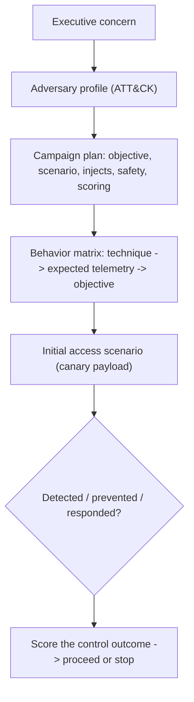

# 🎬 Red Team Campaign Planning & Initial Access

> [!warning] Authorized adversary emulation only
> A red team campaign runs under explicit authorization, a white team, deconfliction, and stop conditions. Initial access uses canary payloads and approved cohorts — never real malware or uncontrolled credential harvesting. Success is a *measured control outcome*, not merely getting in.

## Parent Learning Order
Red Team Campaign Planning & Initial Access -> C2 Infrastructure & Operational Security -> Evasion & Endpoint Tradecraft -> Lateral Operations & Objectives -> Cloud Red Team Operations

## Start at Zero: Designing an Operation, Then Getting In

A red team campaign is not "hack the client stealthily." It is a **planned, threat-informed operation** that tests whether the organization's detection and response can catch a *specific* adversary pursuing a *specific* objective. This note covers the two front-end disciplines: **campaign planning** (translating an executive concern into a scoped, safe, measurable operation) and **initial access** (the authorized, canary-based methods of establishing the first foothold). They belong together because the plan *defines* which initial-access scenario is in play, its safety rails, and how its outcome will be measured.

The defining principle, which separates a professional red team from a criminal: **everything is transparent to the white team and measured against the defenders' response** — the goal is to *exercise and improve the blue team*, not to win a game of hide-and-seek.

> [!tip] The analogy, and where it breaks
> A red team campaign is like a hospital running a surprise emergency drill: leadership authorizes it, a controller (white team) watches safely from the side, and the point is to measure whether the staff and alarms respond correctly — not to actually harm a patient. The analogy breaks on realism: a drill is obviously fake, whereas a red team's initial access must be *realistic enough to genuinely test controls* (a convincing phish, a real exposed service) while remaining perfectly safe — that tension, realistic-yet-harmless, is the whole craft.

**Prerequisites:** **Threat Modeling & MITRE ATT&CK** (choosing the adversary/behaviors), **Rules of Engagement & Scoping** (authorization/safety), and the **Guided Red Team & Purple Team Operation** walkthrough.

## Campaign Planning: From Concern to Measurable Operation

A plan translates a business concern into a bounded, scored operation. The essential elements:

| Element | Purpose |
|---|---|
| **Objective** | The business question ("can contractor creds reach the code repo undetected?") |
| **Adversary profile** | The threat you emulate (ATT&CK-mapped behaviors) |
| **Assumed access / scenario** | Where the operation starts (external, assumed-breach, supplied creds) |
| **Injects** | Controlled events the white team introduces to test branches |
| **Safety & deconfliction** | Stop conditions, white-team contact, authenticated deconfliction phrase |
| **Scoring** | Prevention / detection / response metrics per behavior |
| **Teardown** | How every artifact is removed at the end |

The heart of the plan is a **behavior matrix**: each emulated behavior mapped to its ATT&CK technique, the *expected telemetry*, and the business objective it serves. That matrix is what turns "we did red team stuff" into "we tested these 12 techniques; the SOC caught 7."

## Initial Access: Realistic, Canary-Based Footholds

Initial access is *how the first foothold is established*, chosen to match the adversary profile:

| Scenario | Emulates |
|---|---|
| **Approved phishing** | Commodity/targeted email intrusion |
| **Exposed application** | External attacker over the perimeter |
| **Supplied credentials / assumed breach** | Insider or post-phish reality |
| **Partner / supply-chain trust** | Third-party compromise |
| **Remote access / cloud identity** | VPN/SSO abuse |
| **Physical delivery** | USB / on-site |

Every scenario uses **canary payloads** (benign markers, harmless landing pages, reversible test identities), defines user-safety and credential-handling rules, and has an **immediate revoke/cleanup**. The output is a *measured control outcome* (was the phish blocked? was the exposed app alerted on?), not a body count.

## Failure Modes and Interpretation

- **Planning for stealth instead of measurement.** If the plan optimizes "don't get caught" over "test whether they can catch this," it fails its purpose — the aim is a scored blue-team outcome.
- **Unrealistic adversary.** Emulating a nation-state for a small business (or vice versa) wastes the campaign; the profile must fit the client's real threat.
- **Unsafe initial access.** Real malware, live credential harvesting, or targeting excluded cohorts crosses ethical and legal lines — canaries and approved cohorts only.
- **No injects / single path.** A campaign with one scripted path tests little; injects and branches exercise the defenders' adaptability.
- **Skipping deconfliction.** Without an authenticated deconfliction channel, the SOC may treat the exercise as a real incident (or dismiss a real attack as the exercise).

## Security Implications — the Defender's View

- **The campaign is a gift to the blue team:** a threat-informed, ATT&CK-mapped operation produces a precise coverage map (which techniques were caught) — far more actionable than a vulnerability list.
- **Initial-access controls get validated end-to-end:** email filtering + user reporting + SOC triage are tested as a *system*, revealing where the chain actually breaks.
- **Deconfliction protects live detection:** the SOC keeps hunting real threats while the white team can distinguish exercise traffic.
- **Measured outcomes drive investment:** "phishing is blocked but installation isn't detected" tells leadership exactly where to spend — the campaign's real deliverable.

## Practical Exercise: Plan a Campaign and Its Initial Access

> [!info] No shell — planning is a design skill. Produce the two artifacts a real operation starts from.

For a fintech worried about contractor-credential abuse:

1. **State the objective** in measurable terms (e.g. "determine whether a contractor identity can reach `ENG-CANARY-REPO` and whether the SOC detects the path within the exercise window").
2. **Pick the adversary profile** and list 5–8 ATT&CK techniques you will emulate (initial access → credential access → lateral → collection).
3. **Choose the initial-access scenario** (here: supplied contractor credentials = assumed breach) and its canary payload + safety rails (revoke plan, excluded cohorts).
4. **Write the behavior matrix**: for each technique, the expected telemetry and the pass/detect criterion.
5. **Define deconfliction + stop conditions**: the authenticated phrase, white-team contact, and what halts the op.

Deliverable: a one-page campaign plan + the behavior matrix. The mastery signal is that the white team could run the exercise, and the blue team could be scored, from your artifacts alone.

## Crook → Operator → Root Checkpoint

- **Crook:** Explain why a red team campaign measures the blue team rather than optimizing stealth, and why initial access uses canaries.
- **Operator:** Build a campaign plan (objective, adversary, scenario, safety, scoring) with an ATT&CK behavior matrix, and select a safe, realistic initial-access scenario.
- **Root:** Explain why the campaign's deliverable is a detection-coverage outcome, how deconfliction protects live detection, and how injects/branches and threat-informed profiles make the exercise genuinely test response.

---
> 🔼 Up: [[Red Team Operations]]
