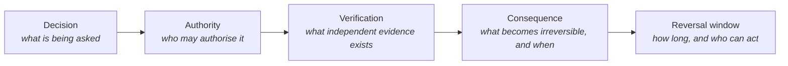

# 🧠 Influence, Decision-Making & Human Risk

> [!abstract] Note of [[Human Factors & Pretext Development]]
> Social engineering is usually explained as a story about gullible people. It is better explained as a story about processes that let one plausible message authorise an irreversible action. This note covers the decision shortcuts attackers rent, why they are adaptive rather than defective, how to map a workflow to find the point where speed and verification are in conflict, and what a system-level fix looks like.

## Parent Learning Order
Influence, Decision-Making & Human Risk -> OSINT-Driven Pretext Development

## From Cognitive Shortcut to Enterprise Risk

> *A well-trained employee still approved the request. Was the training wasted?*
>
> Hold your answer — the section below is the response.

The training was not the control. It was advice offered to a person standing at a decision point where the fast path and the safe path pointed in different directions, and advice loses to workload reliably.

People decide quickly by reading cues: the apparent authority of a sender, consistency with a conversation already in progress, urgency, evidence that others have complied, and the cost of delay. These shortcuts are not defects. A finance analyst who verified every routine request from first principles would clear a fraction of the day's work, and the organisation would replace the process within a week. The shortcuts are what makes the job possible.

Risk appears at a particular structural moment: when a business process allows **one plausible message to authorise a high-impact action**. That is a property of the workflow, not of the person standing in it. The same message reaching a desk with two-person approval produces a phone call; reaching a desk with single-person release, it produces a payment.

| Pressure cue | Unsafe process condition | Resilient control |
| --- | --- | --- |
| Executive urgency | One-person payment release | Independent approval inside the payment system |
| Familiar supplier | Bank changes accepted over email | Callback to the vendor-master number, plus a change hold |
| Help-desk empathy | Identity established from public facts | Strong recovery factors and supervisor escalation |
| Notification fatigue | Repeated prompts with no context | Number matching, device context, rate limits |
| Deadline pressure | Exception path faster than the normal path | Make the exception slower, and reviewable |

Read the third column carefully: not one of those controls asks a person to be more perceptive. Each removes the single point of authority, or moves the decision into a channel the attacker does not control.

**The deliberate break:** "the human is the weakest link" — the phrase that organises most awareness programmes, and the reason they underperform.

It misplaces the failure. The link that broke was the process that accepted a single unverified assertion as authorisation; the person was the last component in a chain that had already omitted its verification step. The framing has a measurable cost, too: it licenses individual blame, blame produces under-reporting, and under-reporting removes the earliest and cheapest detection signal an organisation has. Programmes that publish per-person click rates reliably see reports of *genuine* suspicious messages fall, because reporting starts to feel like self-incrimination. The same people are also the only component that ever detects a novel attack — which makes "weakest link" wrong about the direction of the effect as well as the location.

**How you'd spot it:** in the report. A finding phrased as "3 of 12 users failed" has diagnosed a person; the same event phrased as "the payment workflow released funds on single-channel authority" has diagnosed a control, and only the second version can be fixed. Look also at whether the awareness programme has a reporting button and whether reporting a *false alarm* is treated as a good outcome — if it is not, the telemetry is already suppressed.

## Mapping the Decision Instead of Counting the Clicks

The useful assessment traces four things through a workflow.



Walk it with the process owner, watch how exceptions are actually handled rather than how they are documented, and find the point where a member of staff must choose between delivering on time and verifying. That tension is the attack surface, and it is where an authorised scenario should be built.

```text
Decision:              approve a supplier bank change (Halvard Pallet Systems)
Authority claimed:     d.varga, CFO
Independent evidence:  vendor master record + number held on file
Irreversible point:    payment batch release, 16:00 daily
Reversal window:       ~40 minutes, treasury only, business hours
Required control:      two-person approval outside the requesting channel
```

Naming the irreversible point changes what the exercise measures. Before batch release, a mistake is a correction; after it, a mistake is a recovery operation involving two banks. A control placed anywhere after that line is documentation rather than defence.

## Which Layer Actually Intervened

When a scenario runs, record which layers engaged, in order. The list is longer than most reports acknowledge.

| Layer | What it contributes |
| --- | --- |
| Sender authentication (SPF, DKIM, DMARC) | Rejects domain forgery before a person is involved |
| External-sender labelling | Sets expectation before the message is read |
| Identity check at the desk | Tests the claim against something the caller does not control |
| Approval separation | Removes single-person authority over the irreversible step |
| User reporting | Surfaces the attempt, including the ones that were refused |
| Analyst triage | Connects one report to a campaign |
| Transaction reversal | Buys back the window when everything above failed |

An exercise that reports only the final outcome discards most of this. A message refused at the desk *and* reported within four minutes is a materially different result from one refused silently, because only the first gives the analyst a chance to find the other eleven recipients.

> [!tip] The analogy, and where it breaks
> Influence cues work like the visual shortcuts that make optical illusions effective: knowing the illusion does not stop you seeing it. The analogy breaks where it matters for defence — an illusion has no fix beyond awareness, whereas a workflow can be changed so the shortcut leads somewhere safe. That is the whole difference between training people to resist pressure and designing a process in which pressure has nowhere to go.

## Making the Safe Action the Easy Action

The design goal is narrow and testable: at the decision point, the verified path should be the fastest path available, and refusal should carry no social cost.

- **Verification must be quick.** A callback that takes ninety seconds gets used; one that requires an email to a shared mailbox and a wait does not, and staff route around it under deadline.
- **Refusal must be safe.** If declining an executive's request is career-relevant, the control fails on the days it matters. Written backing from the process owner — that no one is penalised for verifying — is a security control, not an HR nicety.
- **Exceptions must leave a trail.** Urgent exceptions cannot be abolished, so they should be slower, logged, and reviewed afterwards by someone other than the requester.
- **The prompt must carry context.** An approval request showing what, how much, to whom and from where lets a tired person decide well; a bare "Approve?" does not.

Mastery here means arriving at a design in which refusal is socially safe, verification is fast, and every urgent exception leaves a reviewable trail — and then confirming by exercise that the design survives contact with a real deadline.

## Summary

You should now be able to:

- Explain why decision shortcuts under workload are adaptive rather than defective, and locate risk in the workflow property that lets one plausible message authorise a high-impact action.
- Explain what "the human is the weakest link" gets wrong, and the mechanism by which individual blame reduces the organisation's detection capability.
- Map a workflow as decision → authority → verification → consequence → reversal window, identify the irreversible point, and explain why controls placed after it are documentation rather than defence.
- Rewrite a finding so it names a control rather than a person, and describe the four design properties that make the safe action the easy one.

---
> 🔼 Up: [[Human Factors & Pretext Development]]
