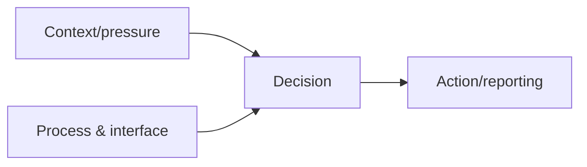

# Influence, Decision-Making & Human Risk

Social attacks exploit context, authority, urgency, reciprocity, familiarity, scarcity, fear, workload, and process ambiguity—not user stupidity.



Assess whether processes support verification, refusal, escalation, and reporting. Avoid shame and individual ranking. Mastery lab: redesign a high-pressure payment and password-reset process so secure behavior is the easiest behavior.

## Parent Learning Order
Influence, Decision-Making & Human Risk -> OSINT-Driven Pretext Development

## From cognitive shortcut to enterprise risk

> *A well-trained employee still approved the request. Was the training wasted?*
>
> Hold your answer — the section below is the response.

People make rapid decisions by using cues: the apparent authority of a sender, consistency with an existing conversation, urgency, social proof, and the cost of delaying work. These shortcuts are not defects; they are necessary under workload. Risk appears when a business process lets one plausible message authorize a high-impact action. A mature assessment therefore maps **decision → authority → verification → consequence**, rather than counting who clicked.

| Pressure cue | Unsafe process condition | Resilient control |
|---|---|---|
| Executive urgency | One-person payment release | Independent approval in the payment system |
| Familiar supplier | Bank changes accepted by email | Callback to a known number and change hold |
| Help-desk empathy | Identity established with public facts | Strong recovery factors and supervisor escalation |
| Notification fatigue | Repeated prompts without context | Number matching, device context, rate limits |

## Practical analysis

For an approved workflow, interview process owners, observe normal exceptions, and identify where staff must choose between delivery speed and verification. Build a harmless scenario around that tension. Record which technical and procedural layers intervene: sender authentication, warning banners, identity checks, approval separation, user reporting, analyst triage, and transaction reversal.

```text
Decision: approve supplier bank change
Authority claimed: finance director
Independent evidence available: vendor master record + known phone number
Irreversible point: payment batch release
Required control: two-person approval outside the message channel
```

Mastery means designing systems in which refusal is socially safe, verification is fast, and urgent exceptions leave a reviewable audit trail.

## Summary

You should now be able to:

- Why do attackers manufacture urgency and invoke authority?
- Two messages score identically. Why is *scoring* still less reliable than a process that makes the safe action the easy action?
- Explain why security awareness training that relies on individuals "spotting" pressure fails at scale, and what system-level control replaces it.

---
> 🔼 Up: [[Human Factors & Pretext Development]]
