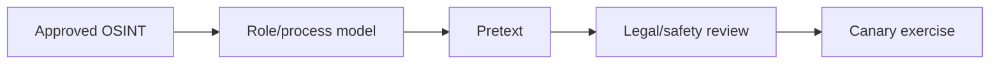

# OSINT-Driven Pretext Development

Pretexts use plausible business context while minimizing personal data and avoiding sensitive personal themes.



Define objective, target cohort, communication channel, claimed identity, expected verification process, prohibited themes, data handling, and exit. Mastery lab: create three pretexts from public corporate information and reject one for privacy or harm risk.

## Parent Learning Order
Influence, Decision-Making & Human Risk -> OSINT-Driven Pretext Development

## Controlled pretext engineering

Start from a business process, not a person. Public job descriptions, supplier portals, conference agendas, press releases, technology vacancies, support hours, and organizational naming patterns can reveal how work normally arrives. Minimize collection: record the process cue and source URL, not a dossier of unrelated personal facts.

```text
Objective: test external collaboration-invite verification
Public cue: organization announced a new design partner
Claimed role: partner project coordinator
Requested action: open a harmless canary workspace
Expected defense: external-user label + known-channel confirmation
Abort: personal information disclosed or recipient shows distress
```

Score a pretext for plausibility, relevance to the threat model, required deception, privacy impact, potential distress, and reversibility. Legal and safety reviewers should reject themes involving health, family emergencies, layoffs, immigration, protected characteristics, or real compensation. Use synthetic identities and organization-controlled infrastructure. During execution, record which process cues carried trust and which controls interrupted the scenario. Retire the identity, domain, number, and landing page at exercise end.

## Runnable Lab (one machine, Python)

A pretext is only convincing when it is *sourced* — role, location, and relationships assembled from public artifacts. This lab builds a pretext from a handle and public photo metadata, and models the hard stop that keeps it authorized.

**Step 1 — the profiler (`osint.py`).**

```python
handle="j.doe"
platforms={"corp-blog":True,"code-host":True,"social":False,"conf-cfp":True}
exif={"GPS":"37.33,-122.03 (HQ campus)","Author":"Jane Doe, IT Ops"}  # from a public conf photo
print("handle present on:",[p for p,v in platforms.items() if v])
for k,v in exif.items(): print(f"  {k}= {v}")
```

**Step 2 — run it.**

```console
$ python3 osint.py
handle 'j.doe' present on: ['corp-blog', 'code-host', 'conf-cfp']
pretext-relevant metadata harvested from public photo:
  GPS      = 37.33,-122.03 (HQ campus)
  Author   = Jane Doe, IT Ops
assembled pretext: 'IT Ops badge photo reshoot at HQ' — role+location sourced only from public data
STOP: no private accounts touched; profile built from public artifacts only
```

**Step 3 — the deliberate stop (the lesson).** The script *refuses* to go further — no login attempts, no private data. The discipline that separates authorized OSINT from stalking is the explicit stop at public artifacts.

**Step 4 — cleanup:** read-only over public data — no cleanup required.

**What you should now be able to do:** turn scattered public data into a role-anchored pretext, and state the bright line (public artifacts only) that keeps it authorized.

## Crook → Operator → Root Checkpoint

- **Crook:** What makes a pretext believable, and where does that raw material come from?
- **Operator:** Given a target's public photo, what three pretext-useful facts might its metadata leak, and how do you use them without crossing scope?
- **Root:** Explain how metadata minimisation and profile hygiene reduce an organisation's pretext attack surface — and why they can never eliminate it.

---
> 🔼 Up: [[Human Factors & Pretext Development]]
