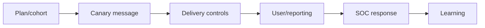

# Phishing & Spear-Phishing Methodology

Authorized phishing tests mail authentication, filtering, detonation, link/file controls, identity cues, user verification, reporting, SOC triage, and containment.



Use benign landing pages, no real credential collection, clear stop contacts, and rapid debrief. Metrics include delivery, control disposition, reporting rate/time, containment, and process gaps—not public click-rate shaming. Mastery lab: design broad and spear cohorts with equivalent safety and measurable controls.

## Parent Learning Order
Phishing & Spear-Phishing Methodology -> Smishing, QR & Collaboration-Platform Testing

## Campaign design

Define the threat behavior before drafting content. Broad phishing tests common delivery and reporting controls; spear-phishing tests whether business context and role targeting defeat them. Use controlled domains, authenticated mail where approved, unique campaign identifiers, a harmless destination, and an expiration mechanism. Seed indicators with the white cell so an accidental incident escalation can be deconflicted securely.

```text
Hypothesis: external file-share invitations bypass normal link inspection
Cohort: randomized, privacy-approved sample
Action ceiling: landing-page visit; no credential fields
Expected telemetry: gateway verdict, DNS, proxy, user report, SOC case
```

Analyze the full control chain: SPF/DKIM/DMARC alignment, reputation, content inspection, attachment detonation, URL rewriting, browser isolation, identity warnings, endpoint controls, reporting, triage, and containment. A blocked message is preventive-control evidence; a reported message is human-detection evidence. Preserve both. During debrief, teach the specific verification cue and reporting route. Remediate root causes such as weak supplier workflows or missing external labels, then retest with different language and timing.

## Runnable Lab (one machine, Python)

The most decisive phishing signal is **domain alignment**. SPF and DKIM can both report `pass` while the visible `From` is still spoofed, because they authenticate the envelope/signing domain — not the header the user reads. DMARC is the check that ties authentication back to the visible `From`. This lab evaluates a captured header block.

**Step 1 — the header analyzer (`emailauth.py`).**

```python
hdr={"From":"CEO <ceo@acme-corp.com>",
     "Return-Path":"<bounce@mailer.sketchy.example>",
     "Authentication-Results":"spf=pass dkim=pass header.d=sketchy.example dmarc=fail"}
from_dom=hdr["From"].split("@")[1].strip(">")
rp_dom=hdr["Return-Path"].split("@")[1].strip(">")
dkim_d=[t for t in hdr["Authentication-Results"].split() if t.startswith("header.d=")][0].split("=")[1]
print("From domain       :",from_dom)
print("SPF aligned?      :",from_dom==rp_dom)
print("DKIM aligned?     :",from_dom==dkim_d)
```

**Step 2 — run it on a spoofed "CEO" message.**

```console
$ python3 emailauth.py
From domain       : acme-corp.com
Return-Path domain: mailer.sketchy.example
DKIM signing d=   : sketchy.example
SPF aligned?      : False  (SPF passed for mailer.sketchy.example, not acme-corp.com)
DKIM aligned?     : False
DMARC verdict     : FAIL -> spoofed From; SPF/DKIM 'pass' were for the attacker's own domain
```

**Step 3 — the deliberate trap.** Both SPF and DKIM *passed*. A filter that stops at "spf=pass" delivers this spoof; only the alignment check (DMARC) catches it. That gap is the whole lesson.

**Step 4 — cleanup:** read-only header analysis — no cleanup required.

**What you should now be able to do:** explain why "SPF pass" is not "not spoofed", and read a DMARC `fail` as visible-From spoofing.

## Crook → Operator → Root Checkpoint

- **Crook:** Why can an email "pass SPF" and still be a spoof of your CEO?
- **Operator:** Given a captured header, which three domains do you compare, and what does misalignment prove?
- **Root:** A vendor's legitimate mail is DMARC-failing after you enforce `p=reject`. Explain the alignment/forwarding cause and how you'd fix delivery without weakening anti-spoofing.

---
> 🔼 Up: [[Phishing & Messaging Security Testing]]
