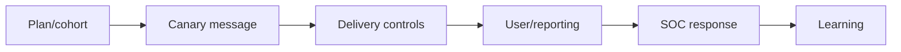

# Phishing & Spear-Phishing Methodology

Authorized phishing tests mail authentication, filtering, detonation, link/file controls, identity cues, user verification, reporting, SOC triage, and containment.



Use benign landing pages, no real credential collection, clear stop contacts, and rapid debrief. Metrics include delivery, control disposition, reporting rate/time, containment, and process gaps—not public click-rate shaming. Mastery lab: design broad and spear cohorts with equivalent safety and measurable controls.

## Parent Learning Order
Phishing & Spear-Phishing Methodology -> Smishing, QR & Collaboration-Platform Testing

## Campaign design

> *Your simulation achieved a 2% click rate. Is that a good result?*
>
> Hold your answer — the section below is the response.

Define the threat behavior before drafting content. Broad phishing tests common delivery and reporting controls; spear-phishing tests whether business context and role targeting defeat them. Use controlled domains, authenticated mail where approved, unique campaign identifiers, a harmless destination, and an expiration mechanism. Seed indicators with the white cell so an accidental incident escalation can be deconflicted securely.

```text
Hypothesis: external file-share invitations bypass normal link inspection
Cohort: randomized, privacy-approved sample
Action ceiling: landing-page visit; no credential fields
Expected telemetry: gateway verdict, DNS, proxy, user report, SOC case
```

Analyze the full control chain: SPF/DKIM/DMARC alignment, reputation, content inspection, attachment detonation, URL rewriting, browser isolation, identity warnings, endpoint controls, reporting, triage, and containment. A blocked message is preventive-control evidence; a reported message is human-detection evidence. Preserve both. During debrief, teach the specific verification cue and reporting route. Remediate root causes such as weak supplier workflows or missing external labels, then retest with different language and timing.

## Summary

You should now be able to:

- Why can an email "pass SPF" and still be a spoof of your CEO?
- Given a captured header, which three domains do you compare, and what does misalignment prove?
- A vendor's legitimate mail is DMARC-failing after you enforce `p=reject`. Explain the alignment/forwarding cause and how you'd fix delivery without weakening anti-spoofing.

---
> 🔼 Up: [[Phishing & Messaging Security Testing]]
