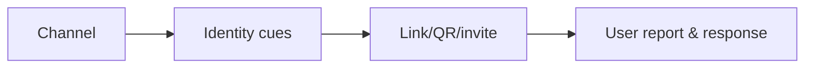

# Smishing, QR & Collaboration-Platform Testing

SMS, QR, chat, file-sharing, and collaboration invitations move trust outside traditional email controls.



Use company-owned numbers/accounts and benign canaries. Test sender verification, link preview, external labels, QR scanning policy, app-consent workflow, reporting, and SOC visibility. Mastery lab: compare the same safe scenario across email, SMS, and chat and identify control gaps.

## Parent Learning Order
Phishing & Spear-Phishing Methodology -> Smishing, QR & Collaboration-Platform Testing

## Channel analysis

Each channel removes different defensive context. SMS compresses sender identity and URL visibility. QR codes move destination inspection to a second device. Collaboration platforms inherit trust from existing teams and may permit external tenants, application consent, file previews, or notification-based urgency.

Build a matrix for sender provenance, destination visibility, authentication, content scanning, external-party labeling, reporting path, retention, and SOC telemetry. Use the same harmless business scenario across channels to expose control asymmetry.

```text
Channel      Sender cue        Destination cue      Report path
SMS          phone number      shortened preview    forward to security number
QR poster    physical context  hidden until scan    service desk / QR report
Team chat    display name      rich preview          built-in report action
```

The canary destination should collect only an opaque exercise identifier, never credentials or device fingerprinting beyond the approved metric. Test revocation of malicious invitations and app grants, not just message deletion. Remediation may include managed QR scanning, external-tenant restrictions, safe-link inspection, clear external labels, one-tap reporting, and correlation across mail, mobile, identity, and collaboration logs.

## Summary

You should now be able to:

- Why is a QR code a more dangerous phishing carrier than a hyperlink in an email?
- Given `xn--pple-43d.com`, how do you determine what it renders as, and why does that matter?
- Chat-platform invites (Teams/Slack) bypass email gateways entirely. Describe the trust cue attackers abuse there and the control that restores it.

---
> 🔼 Up: [[Phishing & Messaging Security Testing]]
