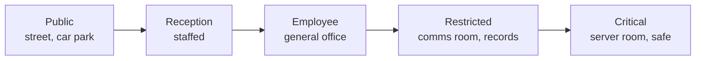

# 🚪 Tailgating, Facility & Visitor Process Testing

> [!abstract] Note of [[Physical Social Engineering]]
> A badge reader answers one question — is this credential valid — and then opens a door that any number of people can walk through. This note covers the gap between authenticating a credential and admitting a person, the zone transitions where that gap is actually closed, why ordinary courtesy is the mechanism attackers use, and how to test a facility process without ever putting a human being at risk.

## Parent Learning Order
Tailgating, Facility & Visitor Process Testing -> Removable Media & BadUSB Exercise Governance

## A Door Authenticates a Badge, Not a Person

> *The badge reader is working perfectly and the door is locked. How do you get in?*
>
> Hold your answer — the section below is the response.

You do not attack the door. You walk in behind someone who opened it, carrying two coffees so your hands are visibly full.

The reader performed its function exactly as designed: it validated a credential and released a latch. What it cannot do is count. One authorisation opens the door for an interval, and every person who crosses the threshold in that interval is admitted on the strength of a badge that belonged to one of them. **Tailgating** is following through on someone else's authorisation without their cooperation; **piggybacking** is the same crossing with their active help, usually because they held the door open. The second is far more common, and it is the polite one.

**The deliberate break:** physical access control is pictured as a strength problem — better locks, better readers, better doors.

The reader is rarely the weak component, and improving it changes nothing. The unenforced property is **one person per authorisation**, and a standard door cannot enforce it at all: it has no way to know how many bodies passed. This is exactly why mantraps, turnstiles, optical beam counters and anti-passback exist — every one of them is a mechanism for making the door able to count, or for making a second entry on the same credential impossible. An organisation with excellent readers on every door and no counting mechanism anywhere has bought authentication and no admission control, which is a different product from the one it thinks it owns.

**How you'd spot it:** stand where the badge queue forms at the start of a shift and watch the ratio of badge presentations to bodies crossing. In a building with no counting mechanism the ratio is visibly below one. The other tell is cultural rather than mechanical: watch whether anyone asks. In a building where challenge is normal, an unfamiliar face without a visible badge gets a friendly "are you being looked after?" within a minute; where it is not, a high-visibility vest and a purposeful walk are sufficient for hours.

## The Zones, and What Actually Guards Each Transition

Physical security is a sequence of transitions, and the useful question at each one is *which control is responsible here* — because the answer is frequently "none, by assumption."



| Transition | Control that should own it | How it commonly fails |
| --- | --- | --- |
| Public → Reception | Receptionist validation, sponsor confirmation | Nobody is at the desk during lunch cover |
| Reception → Employee | Badge issue against a booked visit, escort assigned | Badge printed from a name given verbally |
| Employee → Restricted | Zone-scoped badge, anti-passback, challenge culture | Every employee badge opens every door |
| Restricted → Critical | Two-person rule, logged access, camera coverage | Door wedged open during maintenance |
| Any → Any (exit) | Anti-passback, badge return, expiry | Visitor badges never expire and are never collected |

**A badge is an identifier, not an entitlement to every zone.** The most common structural finding in facility testing is that badge *scoping* is nominal — the system supports zone restrictions and every badge is enrolled in every zone, so the reader on the comms-room door is performing the same check as the reader on the front entrance.

Test the lifecycle events too, because they fail quietly: lost-badge revocation actually taking effect, visitor badge expiry, contractor sponsorship ending when the contract does, delivery custody, and what the after-hours procedure becomes when reception is unstaffed.

## Courtesy Is the Mechanism, Not a Character Flaw

Holding a door for the person behind you is correct behaviour in every other context in life, learned early and reinforced constantly. An access-control model that depends on staff overriding it is depending on something that will not hold, and blaming individuals for it misreads the situation in the same way that blaming a click misreads a phishing result.

> [!tip] The analogy, and where it breaks
> A badge door works like a ticket barrier at a station: valid ticket, one gate cycle. The analogy breaks where the station has already solved the problem the office has not — the barrier is a turnstile that physically admits one body per ticket, and it is staffed by someone whose job is to watch for people jumping it. The office has the ticket check and neither of the other two.

The remedy is structural: give the door a counting mechanism where the zone justifies it, and make challenge socially normal so that asking is a courtesy rather than an accusation. A programme that thanks staff for challenging a tester, publicly and by name, changes the ratio far faster than a poster campaign about tailgating.

## Running It Bounded

```text
Exercise:      SE-TEST-160  (authorised, ref. memo; p.nowak informed as white cell)
Scenario:      scheduled courier, synthetic package
Entry point:   loading reception
Canary:        marked test shelf immediately before the restricted door —
               reaching it is the objective; the door is never opened
Pass:          order verified against the delivery log, temporary badge issued,
               escort maintained to the shelf and back
Stop:          any emergency activity · any confrontation · uncontrolled access ·
               a challenge that the operator would have to pressure to overcome
Operator:      carries an authorisation letter and reveals on first challenge
Recorded:      control events and timings — never employee names
```

The canary shelf is what keeps the exercise safe: the objective is reaching a marked location, not entering the restricted zone, so total success is a tester standing in a corridor. The operator carries the authorisation letter and produces it the moment they are challenged; the exercise ends at the challenge because the challenge is the finding.

Operators do not defeat locks, wedge or block doors, photograph sensitive material, enter occupied private areas, or apply pressure to a member of staff who has already challenged them. Pressuring past a successful challenge converts a good result into a bad one and teaches the person that challenging causes friction.

## Life Safety Overrides the Exercise

This is the one rule with no exception and no judgement call attached. Emergency exits, fire routes, medical and childcare areas, and occupied sensitive spaces are out of scope entirely. Nothing is propped, wedged, blocked, or disabled. Any genuine emergency ends the exercise immediately, in favour of the emergency.

The reason is blunt: a facility test that impedes an evacuation route has created a risk to life in exchange for a report. There is no finding worth that trade, and an operator who is uncertain whether a given action touches life safety has already met the abort condition.

## Debrief Positively, Record Processes

Debrief challenged staff the same day and warmly — a person who stopped a tester did the thing the programme wants and should hear so immediately, before the story reaches them from anywhere else. Report control events and timings rather than names: "the loading reception issued a temporary badge without checking the delivery log" is a finding that can be fixed; "the receptionist on Tuesday let someone in" is a personnel matter that fixes nothing and costs the programme its next report.

## Summary

You should now be able to:

- Explain what a badge reader authenticates and what it cannot enforce, and distinguish tailgating from piggybacking.
- Name the mechanisms that give a door the ability to count — mantrap, turnstile, anti-passback — and explain where each layer fails in practice.
- Map a facility as zone transitions, identify the control that owns each one, and recognise nominal badge scoping and unexpiring visitor badges as structural findings.
- Design a bounded facility test with a canary destination short of the restricted zone, state the operator's constraints and abort conditions, and explain why life safety is not weighed against the exercise objective.

---
> 🔼 Up: [[Physical Social Engineering]]
