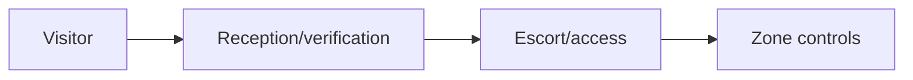

# Tailgating, Facility & Visitor Process Testing

Test reception, visitor sponsorship, badges, escorts, turnstiles, delivery/vendor workflows, secure-zone challenge culture, lost badges, and incident reporting.



Life safety overrides the exercise. Exclude emergency exits, medical/childcare areas, occupied sensitive spaces, and forced entry. Use visible authorization and white-team monitoring. Mastery lab: exercise one visitor and one delivery scenario with a canary destination and immediate debrief.

## Parent Learning Order
Tailgating, Facility & Visitor Process Testing -> Removable Media & BadUSB Exercise Governance

## Zone-based assessment

Map public, reception, employee, restricted, and critical zones. For each transition, identify the responsible control: receptionist validation, sponsor confirmation, badge issuance, anti-passback, turnstile, escort, guard challenge, camera coverage, or locked cabinet. A badge is an identifier, not proof that its holder belongs in every zone.

```text
Scenario: scheduled courier with synthetic package
Entry: loading reception
Canary destination: marked test shelf before restricted door
Pass: order verified, temporary badge issued, escort maintained
Stop: emergency activity, confrontation, uncontrolled access
```

Operators carry an authorization letter and immediate reveal mechanism. They do not defeat locks, block doors, photograph sensitive material, enter occupied private areas, or pressure staff after a challenge. Record control events and timings rather than employee names. Validate lost-badge revocation, visitor expiration, contractor sponsorship, delivery custody, and after-hours procedures. Debrief challenged staff positively; the desired culture makes polite verification normal and gives employees a fast escalation route.

## Runnable Lab (one machine, Python)

Physical access is a policy decision made at a door. This lab encodes the zone rule — a secure zone requires badge scan **and** escort **and** pre-registration — and runs it against four arrivals, so you can see exactly which control each attack defeats.

**Step 1 — the access gate (`tailgate.py`).**

```python
def gate(v):
    if v["zone"]=="public": return "ALLOW (public zone)"
    ok = v["badge_scanned"] and v["escort"] and v["preregistered"]
    return "ALLOW" if ok else "DENY (secure zone needs scan+escort+preregistration)"
```

**Step 2 — run it against four arrivals.**

```console
$ python3 tailgate.py
delivery courier         secure  -> DENY (secure zone needs scan+escort+preregistration)
vendor (booked)          secure  -> ALLOW
tailgater behind staff   secure  -> DENY (secure zone needs scan+escort+preregistration)
visitor                  public  -> ALLOW (public zone)
```

**Step 3 — the deliberate break.** The policy *says* DENY for the tailgater — but tailgating works precisely because a human holds the door and skips the scan. The control exists; the failure is people bypassing it. That is what a physical test measures.

**Step 4 — cleanup:** simulation only — no cleanup required.

**What you should now be able to do:** express a facility's access rule as an explicit conjunction, and explain why every physical control ultimately depends on staff not overriding it out of politeness.

## Crook → Operator → Root Checkpoint

- **Crook:** What is tailgating, and which single control does it defeat?
- **Operator:** Design a bounded, safe test of a reception desk's visitor-verification process that measures the *process*, not one receptionist.
- **Root:** Explain defence-in-depth for physical zones (mantrap, anti-passback, escort enforcement) and where each layer fails.

---
> 🔼 Up: [[Physical Social Engineering]]
