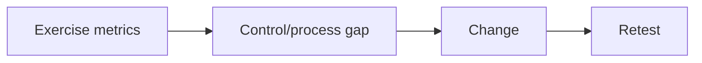

# Human-Risk Metrics & Program Improvement

Metrics should measure systems: delivery-control performance, report rate/time, verification-process use, SOC triage, containment, repeat themes, and remediation—not shame individuals.



Segment only where privacy and sample size allow. Click rate without delivery, difficulty, cohort, and reporting context is misleading. Mastery lab: build a dashboard that connects each metric to an owner, action, target, and retest date.

## Parent Learning Order
Social Engineering Safety & Ethics -> Human-Risk Metrics & Program Improvement

## A defensible measurement model

Separate the exercise funnel into attempted, delivered, blocked, opened, interacted, independently verified, reported, triaged, and contained. Denominators matter: interaction among delivered messages is different from interaction among all attempted messages. Report medians and distributions for time metrics; a single average hides delayed response.

| Metric | What it reveals | Misuse to avoid |
|---|---|---|
| Preventive-control rate | Mail, identity, or endpoint blocking | Treating non-delivery as user success |
| Median report time | Human sensing speed | Ignoring late but useful reports |
| Verification adherence | Process resilience | Ranking named individuals |
| Triage and containment time | Operational readiness | Excluding after-hours exercises |

Use minimum cohort sizes, role-based aggregation, fixed retention, and access controls. Track scenario difficulty, channel, exposure duration, and control changes so trends are comparable. Every metric must connect to an owner and intervention—technical control, process redesign, training, or playbook update. Retest the threat hypothesis rather than repeating an identical lure. Improvement means fewer unsafe process outcomes and faster collective response, not simply a lower click percentage.

## Worked Example: The Denominator Decides the Story

A phishing exercise produces the same raw numbers no matter who reports them; what
changes the conclusion is which denominator the "click rate" is computed against.
Running the same campaign figures two ways shows how a reassuring number and an
alarming one come from identical data.

```python
attempted, delivered, clicked, reported = 5000, 3200, 480, 210
print(f"click rate / ATTEMPTED : {100*clicked/attempted:.1f}%")
print(f"click rate / DELIVERED : {100*clicked/delivered:.1f}%")
print(f"report rate / DELIVERED: {100*reported/delivered:.1f}%")
print(f"report:click ratio     : {reported/clicked:.2f}")
```

```shell-session
$ python3 metrics.py
attempted=5000 delivered=3200 clicked=480 reported=210
click rate / ATTEMPTED : 9.6%   (looks reassuring)
click rate / DELIVERED : 15.0%   (the real human-failure rate)
report rate / DELIVERED: 6.6%   (the resilience signal)
report:click ratio     : 0.44   (>1 is the goal)
```

The first two lines are the same 480 clicks. Divided by everything *attempted*, the
click rate is a comfortable 9.6%; divided by what was actually *delivered* to an
inbox, it is 15%. The gap is the 1,800 messages the mail gateway blocked — and
folding those into the denominator credits the *technical control* to the *humans*,
making people look better than they are. The delivered denominator is the honest
one for a human-risk metric, because a person can only fail to resist a message they
received.

The report metric matters more than the click metric, and the last line says why.
A report:click ratio of 0.44 means fewer people reported the phish than fell for
it — the population has no working immune response. The goal is a ratio above 1,
where reporting outpaces clicking, because a reported phish is a defended one:
detection and response begin. A program that optimises only the click rate can drive
it down while the report rate stays flat and never learn that its users still cannot
recognise or escalate an attack.

This is the measurement discipline the note argues for. Every rate needs its
denominator stated, time metrics need medians and distributions rather than a
single average that hides the slow responders, and the metric that predicts
resilience — reporting — must be tracked alongside the metric that measures failure.
A dashboard that shows click rate alone, against an unstated denominator, is not
measuring human risk; it is producing a number that can be made to say anything.

## Summary

You should now be able to:

- Why is "compromise rate" more meaningful than "click rate"?
- Given the numbers above, what single program change would you prioritise, and what retest proves it worked?
- Explain how to trend human-risk metrics over time without gaming (e.g. easier lures inflating improvement) and how to tie them to real incident reduction.

---
> 🔼 Up: [[Social Engineering Exercise Governance & Metrics]]
