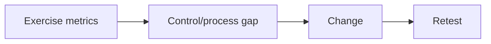

# Human-Risk Metrics & Program Improvement

Metrics should measure systems: delivery-control performance, report rate/time, verification-process use, SOC triage, containment, repeat themes, and remediation—not shame individuals.



Segment only where privacy and sample size allow. Click rate without delivery, difficulty, cohort, and reporting context is misleading. Mastery lab: build a dashboard that connects each metric to an owner, action, target, and retest date.

## Parent Learning Order
Social Engineering Safety & Ethics -> Human-Risk Metrics & Program Improvement

## A defensible measurement model

Separate the exercise funnel into attempted, delivered, blocked, opened, interacted, independently verified, reported, triaged, and contained. Denominators matter: interaction among delivered messages is different from interaction among all attempted messages. Report medians and distributions for time metrics; a single average hides delayed response.

| Metric | What it reveals | Misuse to avoid |
|---|---|---|
| Preventive-control rate | Mail, identity, or endpoint blocking | Treating non-delivery as user success |
| Median report time | Human sensing speed | Ignoring late but useful reports |
| Verification adherence | Process resilience | Ranking named individuals |
| Triage and containment time | Operational readiness | Excluding after-hours exercises |

Use minimum cohort sizes, role-based aggregation, fixed retention, and access controls. Track scenario difficulty, channel, exposure duration, and control changes so trends are comparable. Every metric must connect to an owner and intervention—technical control, process redesign, training, or playbook update. Retest the threat hypothesis rather than repeating an identical lure. Improvement means fewer unsafe process outcomes and faster collective response, not simply a lower click percentage.

## Runnable Lab (one machine, Python)

The wrong metric (click rate) drives blame; the right metrics (compromise rate, report rate, resilience ratio) drive improvement. This lab computes all of them from a small campaign result set.

**Step 1 — the metrics computer (`metrics.py`).**

```python
import csv, io
data="""user,delivered,clicked,submitted,reported,report_time_min
u01,1,1,1,0,
u02,1,0,0,1,4
u03,1,1,0,1,9
u04,1,0,0,1,2
u05,1,1,1,0,
u06,1,0,0,0,"""
rows=list(csv.DictReader(io.StringIO(data))); n=len(rows)
clk=sum(int(r['clicked']) for r in rows); sub=sum(int(r['submitted']) for r in rows)
rep=sum(int(r['reported']) for r in rows)
print(f"compromise_rate = {sub/n:.0%}   report_rate = {rep/n:.0%}   resilience = {rep/clk:.2f}")
```

**Step 2 — run it.**

```console
$ python3 metrics.py
cohort=6
click_rate      = 50%  (3/6)
compromise_rate = 33%  (2/6)   <- the number that matters
report_rate     = 50%  (3/6)   <- resilience signal
median_report   = 4 min
resilience_ratio= 1.00  (reporters per clicker; >1 is healthy)
```

**Step 3 — the deliberate contrast.** Click rate (50%) looks alarming, but **compromise rate** (33%, those who actually submitted credentials) and **report rate** (50%) tell the real story: half the cohort clicked, but half also *reported*, and a clicker who reports is a working control, not a failure.

**Step 4 — cleanup:** read-only computation — no cleanup required.

**What you should now be able to do:** compute compromise/report/resilience metrics, and explain why click rate alone is a misleading (and blame-inducing) program metric.

## Crook → Operator → Root Checkpoint

- **Crook:** Why is "compromise rate" more meaningful than "click rate"?
- **Operator:** Given the numbers above, what single program change would you prioritise, and what retest proves it worked?
- **Root:** Explain how to trend human-risk metrics over time without gaming (e.g. easier lures inflating improvement) and how to tie them to real incident reduction.

---
> 🔼 Up: [[Social Engineering Exercise Governance & Metrics]]
