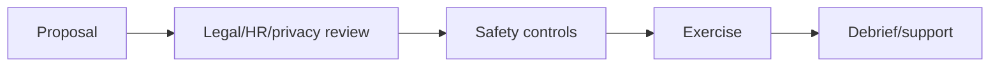

# Social Engineering Safety & Ethics

Define informed organizational authorization, minimal deception, protected groups, prohibited personal themes, no real credential collection, privacy, secure data, stop authority, support, debrief, and non-punitive use.



Prohibit medical/family distress, threats, harassment, discrimination, real financial loss, uncontrolled public embarrassment, and targeting unrelated personal accounts. Mastery lab: risk-assess five scenarios and redesign or reject unsafe ones.

## Parent Learning Order
Social Engineering Safety & Ethics -> Human-Risk Metrics & Program Improvement

## Safety case

> *The client authorised a phishing exercise. Does that make every pretext acceptable?*
>
> Hold your answer — the section below is the response.

Treat every exercise as a documented safety case. Identify participants and bystanders, plausible harms, existing safeguards, residual risk, decision owner, stop authority, support route, and post-exercise review. Authorization by a manager does not override employment law, privacy obligations, union agreements, accessibility needs, or human dignity.

Use data minimization by design: synthetic credentials, opaque participant IDs, aggregate reporting, narrow retention, encryption, and role-limited access. Operators must know how to respond if a participant reveals abuse, self-harm, fraud, medical information, or another real emergency; the exercise stops and the established safeguarding process takes precedence.

```text
Risk: recipient believes employment is threatened
Likelihood: medium    Severity: high
Decision: reject scenario
Replacement: routine document-sharing invitation with harmless canary
```

Debrief quickly and non-punitively. Explain the control being tested, how data will be used, and where support is available. Delete raw identifiers on schedule. Ethical mastery is the ability to produce reliable security evidence with the least deception and harm—not the ability to make a scenario maximally convincing.

## Summary

You should now be able to:

- Why must legal, HR, and privacy sign off *before* a phishing simulation, not after?
- Write the abort criteria for a vishing exercise — what conditions force an immediate stop?
- Explain why measuring individuals (naming who clicked) damages a security program, and what to measure instead.

---
> 🔼 Up: [[Social Engineering Exercise Governance & Metrics]]
