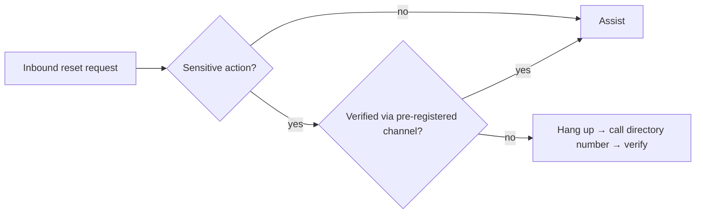

# Help Desk Identity Verification

> [!warning] Authorized simulation only
> Test only scoped help-desk processes with synthetic identities and canary accounts. Never collect real credentials, and stop at a process outcome — the finding is *whether the process holds*, not access to a real account.

## Parent Learning Order
Help Desk Identity Verification -> MFA Recovery Process Testing -> Vishing & Executive Impersonation Testing

## Why the Help Desk Is a Target

> *The help desk asked for your employee ID and date of birth before resetting the password. Is that verification?*
>
> Hold your answer — the section below is the response.

The IT help desk exists to *restore access* — reset passwords, unlock accounts, re-enrol MFA. That mission is in direct tension with security: the same action that helps a locked-out employee also hands an attacker the keys, *if* the agent cannot reliably tell them apart. The attacker's whole game is to impersonate a legitimate user convincingly enough to trigger a reset.

The weak link is **knowledge-based verification (KBA)** — "what's your employee ID / manager / date of birth / last four of your SSN?" Every one of those is often discoverable through OSINT, data breaches, or a plausible pretext. KBA authenticates *knowledge of a fact*, and facts leak.

## Weak vs. Strong Verification

| Verification method | Why it fails / holds |
|---|---|
| Employee ID, DOB, manager name | **Weak** — OSINT/breach-recoverable public facts |
| "Last four of SSN" | **Weak** — breached at scale; shared across services |
| Caller ID / internal number | **Weak** — spoofable; not identity |
| Callback to the number in the HR directory | **Strong** — proves control of a pre-registered channel |
| Live video + badge on a known device | **Strong** — binds request to an enrolled factor |
| One-time code to an *already-enrolled* device | **Strong** — but useless during "I lost my device" (see MFA Recovery) |

The principle: verification must test **possession or control of something pre-registered**, not recall of a fact. A directory callback flips the trust direction — instead of trusting an inbound claim, the help desk reaches out to a channel it already trusts.

**The deliberate break:** a verification script with several steps feels strong because it has several steps. Employee ID, then date of birth, then the manager's name — three questions answered correctly reads as a thorough check.

Stacking knowledge questions does not move the check out of the knowledge category, and the three answers are very often available from the *same* source. A breach dump or a well-read public profile supplies all three together, which makes them one compromised factor presented three times rather than three independent checks. Factors are additive across categories — something known, something held, something inherent — and inside a single category they are correlated to the point of redundancy. A ten-question KBA script is still a KBA script.

**How you'd spot it:** listen to what an agent does when they are unsure. Adding a fourth question escalates inside the category that has already failed, and it is the reflex a well-prepared caller is counting on, because a caller who has done the reading answers the fourth question too. The competent response to doubt is to change channel — end the call and dial the directory number — not to ask more.



## Worked Example: When "Verification" Authenticates a Fact, Not a Person

A help-desk verification policy can be tested without a single phone call, by
asking one question of each method: can an *attacker* satisfy it with what they can
plausibly obtain? A short evaluator, given a realistic attacker capability set,
answers it for five common methods.

```python
attacker_has = {"employee_id", "dob", "manager", "ssn_last4", "spoofed_caller_id"}
methods = {
    "Employee ID + DOB":          ({"employee_id", "dob"},          "knowledge"),
    "Last four of SSN":           ({"ssn_last4"},                   "knowledge"),
    "Caller ID matches directory":({"spoofed_caller_id"},           "knowledge"),
    "Callback to HR-directory #": ({"control_registered_phone"},    "possession"),
    "Live video + enrolled badge":({"possess_enrolled_device"},     "possession"),
}
for name, (needs, kind) in methods.items():
    print(name, "ATTACKER PASSES" if needs <= attacker_has else "blocked", kind)
```

```shell-session
$ python3 helpdesk.py
Employee ID + DOB              [knowledge (KBA)   ] -> ATTACKER PASSES
Last four of SSN               [knowledge (KBA)   ] -> ATTACKER PASSES
Caller ID matches directory    [knowledge (KBA)   ] -> ATTACKER PASSES
Callback to HR-directory #     [channel/possession] -> attacker blocked
Live video + enrolled badge    [channel/possession] -> attacker blocked
```

The split is total and it falls on one line: every knowledge-based method passes
the attacker, and every possession-based method blocks them. That is not a
coincidence of this attacker's capabilities — it is the definition of the two
categories. Knowledge-based verification authenticates *knowing a fact*, and facts
about employees leak through OSINT, breaches and pretext. An employee ID, a date of
birth, a manager's name, the last four of an SSN — all are recoverable, and caller
ID is simply spoofable.

Possession-based verification authenticates *control of a pre-registered channel or
device* — a callback to the number already in the HR directory, or a live factor
bound to an enrolled device. The attacker cannot satisfy those without actually
compromising the channel, which is a far higher bar than looking up a fact.

This is the finding a vishing engagement against the help desk exists to produce:
not "an agent was fooled" but "the verification policy relies on knowledge, and
knowledge does not authenticate identity." The remediation is categorical — move
the reset-triggering step onto a possession factor — rather than a plea for agents
to be more careful, because the careful agent following a knowledge-based policy
still hands over the account.

## Summary

You should now be able to:

- Explain why "what's your employee ID and manager's name?" is a weak identity check.
- Design a scoped test of a help desk's reset process using a canary account, stating what proves a pass and what must never be done.
- Explain why a directory callback resists even a perfect-OSINT attacker, and where it still fails (e.g. a compromised or attacker-updated directory number).

---
> 🔼 Up: [[Voice, Help Desk & Identity Verification]]
