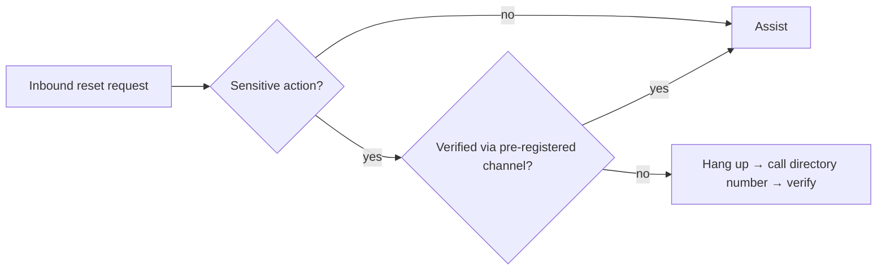

# Help Desk Identity Verification

> [!warning] Authorized simulation only
> Test only scoped help-desk processes with synthetic identities and canary accounts. Never collect real credentials, and stop at a process outcome — the finding is *whether the process holds*, not access to a real account.

## Parent Learning Order
Help Desk Identity Verification -> MFA Recovery Process Testing -> Vishing & Executive Impersonation Testing

## Crook — Why the Help Desk Is a Target

The IT help desk exists to *restore access* — reset passwords, unlock accounts, re-enrol MFA. That mission is in direct tension with security: the same action that helps a locked-out employee also hands an attacker the keys, *if* the agent cannot reliably tell them apart. The attacker's whole game is to impersonate a legitimate user convincingly enough to trigger a reset.

The weak link is **knowledge-based verification (KBA)** — "what's your employee ID / manager / date of birth / last four of your SSN?" Every one of those is often discoverable through OSINT, data breaches, or a plausible pretext. KBA authenticates *knowledge of a fact*, and facts leak.

## Operator — Weak vs. Strong Verification

| Verification method | Why it fails / holds |
|---|---|
| Employee ID, DOB, manager name | **Weak** — OSINT/breach-recoverable public facts |
| "Last four of SSN" | **Weak** — breached at scale; shared across services |
| Caller ID / internal number | **Weak** — spoofable; not identity |
| Callback to the number in the HR directory | **Strong** — proves control of a pre-registered channel |
| Live video + badge on a known device | **Strong** — binds request to an enrolled factor |
| One-time code to an *already-enrolled* device | **Strong** — but useless during "I lost my device" (see MFA Recovery) |

The principle: verification must test **possession or control of something pre-registered**, not recall of a fact. A directory callback flips the trust direction — instead of trusting an inbound claim, the help desk reaches out to a channel it already trusts.



## Root — Runnable Lab (one machine, Python)

This lab encodes the control — a sensitive action (password reset) is safe only when verified out-of-band via a directory-known number — and runs the *same* request with and without that verification.

**Step 1 — the verification gate (`verify.py`).**

```python
def decide(req):
    sensitive = req["action"] in {"password_reset","mfa_reset","bank_change"}
    ob = req.get("out_of_band_callback") and req.get("directory_number")
    return "ALLOW" if (not sensitive or ob) else "BLOCK (requires independent callback verification)"
```

**Step 2 — run it.**

```console
$ python3 verify.py
help desk caller   password_reset -> BLOCK (requires independent callback verification)
help desk caller   password_reset -> ALLOW
```

**Step 3 — the deliberate contrast (the lesson).** Identical action, opposite outcome. The *only* difference between the BLOCK and the ALLOW is whether the agent hung up and called back a pre-registered directory number. No amount of correctly-answered KBA moves the first case to ALLOW — because KBA proves knowledge, not control.

**Step 4 — cleanup:** decision simulation only — no cleanup required.

**What you should now be able to do:** classify verification methods as knowledge-based (weak) vs. possession/control-based (strong), and describe the directory-callback control that defeats a well-researched impersonator.

## Crook → Operator → Root Checkpoint

- **Crook:** Why is "what's your employee ID and manager's name?" a weak identity check?
- **Operator:** Design a scoped test of a help desk's reset process using a canary account — what proves a pass, and what must you never do?
- **Root:** Explain why a directory callback resists even a perfect-OSINT attacker, and where it still fails (e.g. a compromised or attacker-updated directory number).

---
> 🔼 Up: [[Voice, Help Desk & Identity Verification]]
