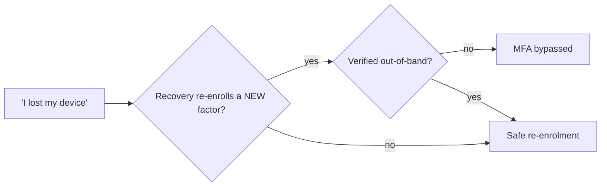

# MFA Recovery Process Testing

> [!warning] Authorized simulation only
> Test recovery flows only against scoped, synthetic accounts. The finding is *whether recovery re-enrolls an attacker*, proven with a canary — never a takeover of a real account.

## Parent Learning Order
Help Desk Identity Verification -> MFA Recovery Process Testing -> Vishing & Executive Impersonation Testing

## Crook — Recovery Is the Back Door to MFA

Multi-factor authentication is only as strong as the process that runs when a user says **"I lost my device."** Every MFA deployment needs a recovery path — and that path, by design, must let someone in *without* the second factor. If recovery is weaker than the front door, an attacker simply doesn't attack the front door; they trigger recovery.

This is why account takeover so often ignores the password and the authenticator entirely: the attacker targets **recovery codes, SMS/email reset, help-desk MFA re-enrolment, or a SIM swap.** Each is a legitimate feature; each can bypass the very MFA it supports.

## Operator — The Recovery Attack Surface

| Recovery path | Bypass risk |
|---|---|
| SMS one-time code | **SIM swap** — attacker ports the number and receives the code |
| Email reset link | Only as strong as the email account's own MFA (often weaker) |
| Printed backup codes | Phishable, screenshot-able, often stored in the mailbox being reset |
| Help-desk MFA re-enrolment | Reduces to **help-desk identity verification** — KBA is not enough |
| Security questions | OSINT-answerable; a knowledge check, not possession |

The rule mirrors the front door: **recovery must verify possession or control of a pre-registered channel**, and re-enrolment of a *new* factor is itself a sensitive action requiring out-of-band verification. A recovery flow that trusts an inbound claim (a phone call, a "lost device" web form with only KBA) is an MFA bypass with paperwork.



## Root — Runnable Lab (one machine, Python)

The same verification gate that protects password resets must protect MFA re-enrolment — otherwise recovery is the weakest door. This lab shows an MFA reset passing *only* when out-of-band verification is present.

**Step 1 — the gate (`verify.py`).**

```python
def decide(req):
    sensitive = req["action"] in {"password_reset","mfa_reset","bank_change"}
    ob = req.get("out_of_band_callback") and req.get("directory_number")
    return "ALLOW" if (not sensitive or ob) else "BLOCK (requires independent callback verification)"
```

**Step 2 — run it (the `mfa_reset` case is verified out-of-band).**

```console
$ python3 verify.py
'exec' inbound     payment        -> BLOCK (requires independent callback verification)
user               mfa_reset      -> ALLOW
```

**Step 3 — the deliberate insight.** `mfa_reset` is ALLOW here *because* the request carried an out-of-band callback. Flip that flag to `False` and it BLOCKs — an attacker who only controls an inbound channel (a spoofed call, a SIM-swapped number for SMS) cannot re-enrol. Treating re-enrolment as sensitive is what closes the back door.

**Step 4 — cleanup:** decision simulation only — no cleanup required.

**What you should now be able to do:** enumerate the recovery paths that bypass MFA, explain the SIM-swap risk of SMS recovery, and state why re-enrolling a new factor must itself require out-of-band verification.

## Crook → Operator → Root Checkpoint

- **Crook:** If an account has MFA, why would an attacker attack "forgot my device" instead of the login?
- **Operator:** Design a canary-based test proving whether your help desk will re-enrol MFA for an unverified caller.
- **Root:** Rank SMS, email, backup codes, and help-desk re-enrolment by residual risk, and justify the ordering with the specific bypass each enables.

---
> 🔼 Up: [[Voice, Help Desk & Identity Verification]]
