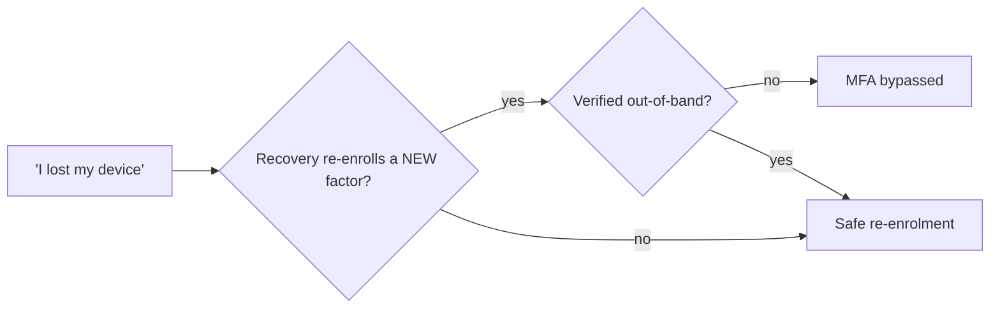

# MFA Recovery Process Testing

> [!warning] Authorized simulation only
> Test recovery flows only against scoped, synthetic accounts. The finding is *whether recovery re-enrolls an attacker*, proven with a canary — never a takeover of a real account.

## Parent Learning Order
Help Desk Identity Verification -> MFA Recovery Process Testing -> Vishing & Executive Impersonation Testing

## Recovery Is the Back Door to MFA

> *Your organisation enforces phishing-resistant MFA on every account. What is the strongest factor an attacker actually has to defeat?*
>
> Hold your answer — the section below is the response.

Whatever the recovery path accepts, which is frequently an SMS code or a help-desk knowledge check. The enforced factor determines the front door; the attacker chooses which door to use.

Multi-factor authentication is only as strong as the process that runs when a user says **"I lost my device."** Every MFA deployment needs a recovery path — and that path, by design, must let someone in *without* the second factor. If recovery is weaker than the front door, an attacker simply doesn't attack the front door; they trigger recovery.

This is why account takeover so often ignores the password and the authenticator entirely: the attacker targets **recovery codes, SMS/email reset, help-desk MFA re-enrolment, or a SIM swap.** Each is a legitimate feature; each can bypass the very MFA it supports.

## The Recovery Attack Surface

| Recovery path | Bypass risk |
|---|---|
| SMS one-time code | **SIM swap** — attacker ports the number and receives the code |
| Email reset link | Only as strong as the email account's own MFA (often weaker) |
| Printed backup codes | Phishable, screenshot-able, often stored in the mailbox being reset |
| Help-desk MFA re-enrolment | Reduces to **help-desk identity verification** — KBA is not enough |
| Security questions | OSINT-answerable; a knowledge check, not possession |

The rule mirrors the front door: **recovery must verify possession or control of a pre-registered channel**, and re-enrolment of a *new* factor is itself a sensitive action requiring out-of-band verification. A recovery flow that trusts an inbound claim (a phone call, a "lost device" web form with only KBA) is an MFA bypass with paperwork.

**The deliberate break:** MFA strength is described as a property of the enrolled factor — "we are on FIDO2, so we are phishing-resistant."

The strength of an authentication system is the **minimum** over every path that can produce a session, not the maximum over the paths anyone chose to advertise. Recovery produces a session. A FIDO2 deployment whose recovery path is an SMS code is an SMS deployment with a fast lane for people who still have their key, and the security level of the whole system is the level of that SMS path. Enrolling a stronger factor raises the ceiling and does nothing to the floor, which is where an attacker works.

**How you'd spot it:** ask what happens when a user loses their security key, and follow the answer to its end. If it terminates in help-desk re-enrolment gated by knowledge questions, the deployment's real assurance level is that of the knowledge questions, whatever the enrolment dashboard reports. In an inventory, the tell is a login path documented in detail beside a recovery path documented as a sentence.



## Worked Example: Attacking the Back Door Instead of the Front

MFA account-takeover rarely touches the password or the authenticator. It targets
recovery, because recovery must — by design — let someone in *without* the second
factor. Modelling an attacker's capabilities against the available recovery paths
shows how much of MFA the recovery process quietly undoes.

```python
cap = {"sim_swap", "osint_facts", "phish_email_otp"}     # what the attacker can do
paths = {
    "SMS one-time code":      "sim_swap",
    "Email reset link":       "phish_email_otp",
    "Security questions":     "osint_facts",
    "Printed backup codes":   "steal_physical_code",      # attacker cannot
    "Help-desk re-enrolment": "osint_facts",              # reduces to KBA
}
for p, need in paths.items():
    print(p, "BYPASSES MFA" if need in cap else "holds")
```

```shell-session
$ python3 mfarec.py
SMS one-time code          -> BYPASSES MFA
Email reset link           -> BYPASSES MFA
Security questions         -> BYPASSES MFA
Printed backup codes       -> holds
Help-desk re-enrolment     -> BYPASSES MFA

4/5 recovery paths defeat MFA without ever touching the 2nd factor
```

Four of five. An organisation can deploy hardware security keys at the front door
and still lose the account through any of these, because each recovery path is a
legitimate feature that exists precisely to bypass the factor the attacker cannot
otherwise beat. The SMS code falls to a SIM swap; the email link is only as strong
as an email account whose own MFA is usually weaker; the security questions are a
knowledge check the OSINT already answered; and help-desk re-enrolment reduces to
the help-desk's identity verification, which — as the sibling leaf shows — is itself
usually knowledge-based.

The single path that holds, printed backup codes, holds only because this attacker
cannot physically steal them; a phishing lure that asks the user to type one, or a
mailbox where they were saved, would flip it too.

The testing lesson is that an MFA assessment which stops at the login screen has
tested the strongest part of the system. The account's real strength is the
*weakest enabled recovery path*, and the engagement's job is to enumerate every one
and find the floor. The remediation follows: recovery must be raised to the
assurance of the primary factor — possession-bound, rate-limited, and alerting —
because an attacker always attacks the floor, never the ceiling.

## Summary

You should now be able to:

- Explain why an attacker targets "forgot my device" rather than the login on an account protected by MFA.
- Design a canary-based test proving whether your help desk will re-enrol MFA for an unverified caller.
- Rank SMS, email, backup codes, and help-desk re-enrolment by residual risk, and justify the ordering with the specific bypass each enables.

---
> 🔼 Up: [[Voice, Help Desk & Identity Verification]]
