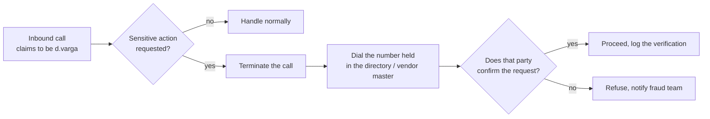
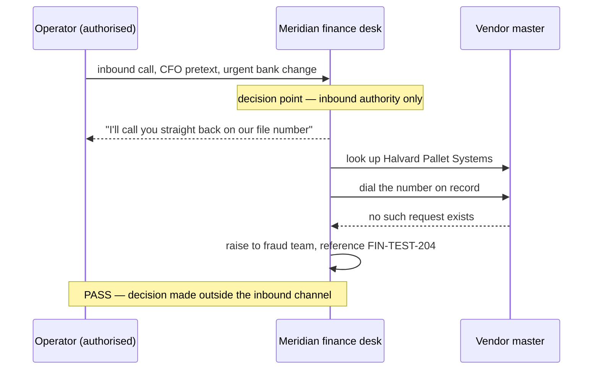

# ☎️ Vishing & Executive Impersonation Testing

> [!abstract] Note of [[Voice, Help Desk & Identity Verification]]
> A phone call carries no authentication of any kind, yet in most organisations it routinely authorises actions that an email would never be trusted to authorise. This note covers why the voice channel ended up with weaker controls than the text channels beside it, how an authorised vishing test is built so it measures a process instead of trapping a person, and what evidence proves afterwards that the control actually held.

## Parent Learning Order
Help Desk Identity Verification -> MFA Recovery Process Testing -> Vishing & Executive Impersonation Testing

## A Voice Carries No Authentication

> *The caller ID shows the CFO's mobile number and the voice sounds like her. How many facts have you verified?*
>
> Hold your answer — the section below is the response.

None. Every cue in that sentence is asserted by the caller and checked by nobody.

Caller ID is not an authentication field. The originating carrier populates it, and on a VoIP origination the caller populates it directly — it travels as a claim, not as a proof. Voice familiarity fares no better: recognising a voice is pattern-matching against memory, and synthetic speech trained on a few minutes of conference audio clears that bar comfortably. Neither cue binds the audio arriving in the earpiece to the person it claims to be.

| Cue the listener treats as identity | What it actually proves |
| --- | --- |
| Caller ID shows `d.varga`'s mobile | Somebody filled in a field. It is asserted by the originating network, not verified end to end. |
| The voice sounds like `d.varga` | The audio resembles a remembered voice. Nothing binds the audio to the speaker. |
| The caller knows she is travelling this week | The caller read something. Meridian Freight publishes conference attendance. |
| The caller names `Halvard Pallet Systems` | The vendor appears in a public case study on the Meridian site. |
| The caller answers a number **you** dialled from the directory | This one binds — and it is the only one that does. |

**Prerequisites:** the identity-verification vocabulary from [[Help Desk Identity Verification]] — claim, factor, and binding.

**The deliberate break:** the phone feels like the *high-trust* channel. Email arrives wrapped in warning banners, external-sender labels and quarantine notices; a phone call arrives with none of that, and people read the absence of warnings as a signal that nothing is wrong.

It is exactly inverted. The email path has SPF, DKIM and DMARC checking the sending domain, attachment detonation, link rewriting, an external-sender banner and a one-click reporting button. The voice path has none of these. The call is trusted *more* precisely because nothing inspected it — the quiet is the absence of controls, not the absence of threat. An attacker choosing a channel is choosing which set of defences to face, and the phone is the channel where that set is empty.

**How you'd spot it:** look at where the organisation's detection engineering actually points. A mail gateway dashboard with per-campaign statistics beside a phone system with no logging beyond call-detail records is the shape of this assumption made concrete. Ask the finance team how they report a suspicious *call*; if the answer is a shrug, the reporting path exists for one channel only.

## Why Callback Is the Only Control That Survives

Every voice control that inspects the *content* of a call fails against a competent caller, because the caller controls the content. The one control that holds changes who does the dialling.

An inbound call proves nothing about its origin. An outbound call to a number the organisation already holds reaches whoever controls that number — and the attacker does not. This is why callback verification survives voice cloning entirely: it never evaluates the voice. Cloning defeats recognition, and callback does not use recognition.

> [!tip] The analogy, and where it breaks
> Callback is the same reflex as hanging up on a caller claiming to be your bank and dialling the number printed on the back of your card. The analogy breaks in the place that matters most: the number on the card was printed by the bank and cannot be edited, whereas the number an employee "knows" for a supplier usually lives in a contact record that an earlier email may have updated. Callback is only as strong as the independence of the number source, so the control is *dial the number in the vendor master*, never *dial the number in the request*.



The bracketed step — terminate, then dial out — is the whole control. A caller who offers to "stay on the line while you check" is defeating it, because the line was never released; some PBX configurations hold the inbound channel open when the recipient hangs up briefly, which is why the procedure specifies a new call from a different handset or after a confirmed clear.

## The Call Card That Constrains the Operator

An authorised vishing test is dangerous to run informally, so the operator works from a written card that fixes in advance what may be said and what ends the call. It exists to protect the person receiving the call as much as to structure the test.

```text
Exercise:      SE-TEST-114  (authorised, ref. memo 2026-03-02)
Claim:         urgent bank-detail correction for Halvard Pallet Systems
Impersonating: d.varga, CFO   (role only — no personal detail used)
Target:        finance shared line, not a named individual
Canary:        ticket FIN-TEST-204, no real payment instrument
Secure path:   recipient terminates → dials vendor master number → verifies owner
Pass:          request refused, or independently validated before any action
Fail:          workflow advances on inbound voice authority alone
Forbidden:     passwords, MFA codes, real payment data, remote-access install,
               distress themes, health, family emergency, employment threats
Abort:         recipient shows distress · real money moves · scope ambiguity
Max duration:  6 minutes
```

Three of those lines carry more weight than they appear to. **Target the shared line, not a named individual**, because the finding is about the process and a named target invites blame. **No real payment instrument** — the canary ticket references a transaction that cannot settle, so a total control failure still moves no money. **Abort on distress** is not a courtesy; a test that frightens someone has produced a worse outcome than the finding is worth.

## Running It, and Reading the Result



The result is not "the finance desk passed." The result is a statement about the process at a specific decision point, and it holds only for the conditions tested: one caller, one pretext, one time of day, one member of staff on shift. Repeating the test with a different script matters, because a team that has memorised the wording of the last exercise will recognise the words rather than apply the control — and memorised wording looks identical to resilience in the metrics.

## Measuring the Process, Never the Person

The metrics that improve an organisation are all process metrics.

| Measure | What an improvement means |
| --- | --- |
| Proportion of sensitive requests verified by callback | The control is being applied, not merely documented |
| Median time to the first verification step | Verification is fast enough to survive real time pressure |
| Escalations raised to a supervisor | Refusal is socially safe on the floor |
| Reports reaching the fraud team, and how fast | A reporting path for voice exists and is used |
| Repeat result under a *different* script | The control generalises past memorised wording |

Individual pass/fail rates are deliberately absent. Publishing them produces under-reporting — a person who fears appearing on a list stops raising the calls they were unsure about, and those borderline reports are the most valuable telemetry the programme has. Debrief the process owner before the participants, keep the results aggregate, and describe findings in terms of the workflow that permitted the action.

## Authorisation and Hard Boundaries

Voice testing touches people directly and in real time, which puts it under tighter constraint than most technical testing. It runs only under written authorisation naming the scope, the window, the operators and the abort authority. Recording is subject to consent law that varies by jurisdiction and by party, and the exercise's legal review settles that before the first call rather than after it.

Operators do not imitate distress, do not invoke health, family emergency, immigration status, redundancy or any protected characteristic, and do not collect a real secret even when it is volunteered — a password read aloud to an operator is discarded and reported, never recorded as evidence. Cloning a real person's voice needs its own explicit consent from that person; impersonating a *role* rather than reproducing an individual's voice achieves the same test with far less at stake. When any of these boundaries becomes ambiguous mid-call, the abort condition has already been met.

## Summary

You should now be able to:

- Explain why caller ID and voice familiarity are claims rather than proofs, and identify the one cue in a voice interaction that binds to a known party.
- Describe why the voice channel accumulated weaker controls than email despite carrying higher-value requests, and how to check whether an organisation has a reporting path for suspicious calls at all.
- Build a call card for an authorised vishing exercise — claim, canary, secure path, forbidden topics and abort conditions — and explain why the target is a shared line rather than a named person.
- Explain why callback verification is unaffected by voice cloning, where its independence assumption fails, and why process metrics rather than individual pass rates are what the exercise reports.

---
> 🔼 Up: [[Voice, Help Desk & Identity Verification]]
